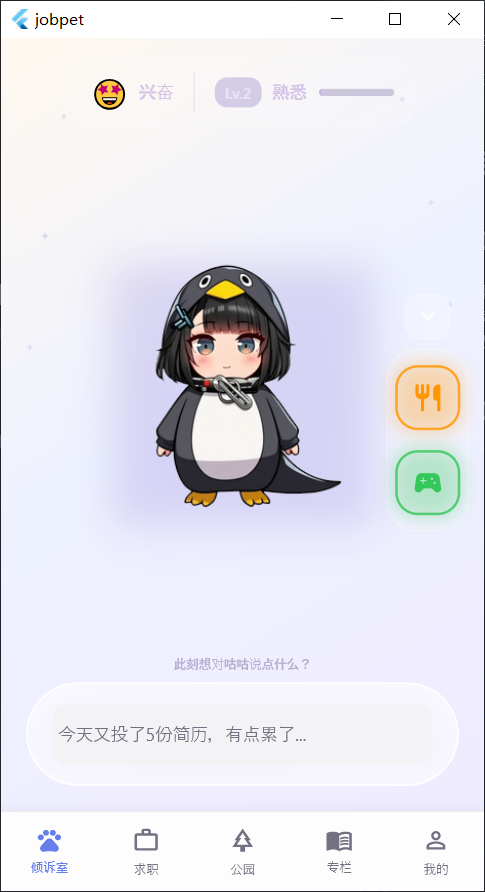
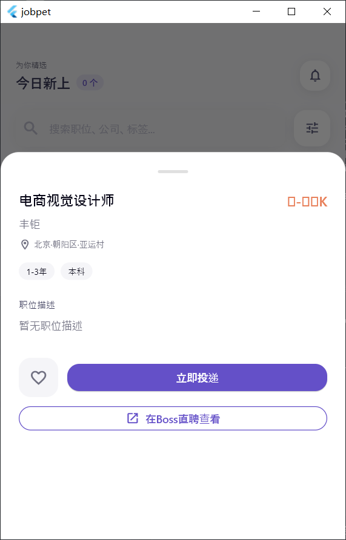
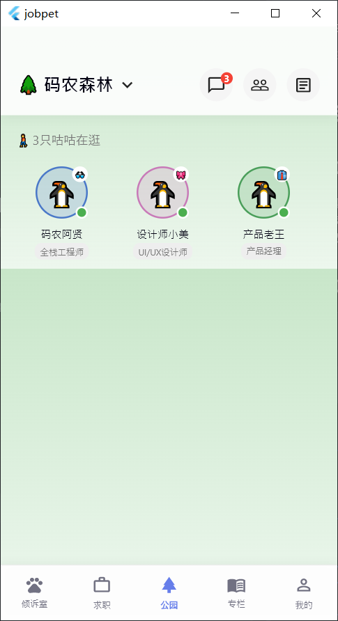
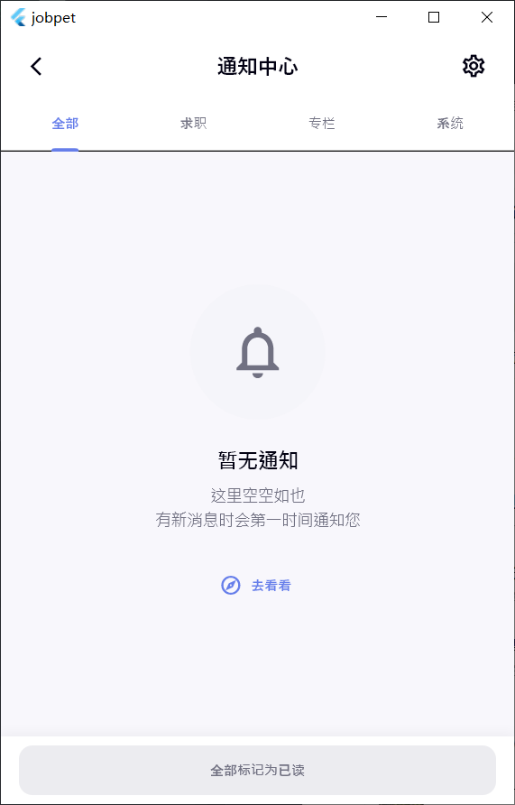
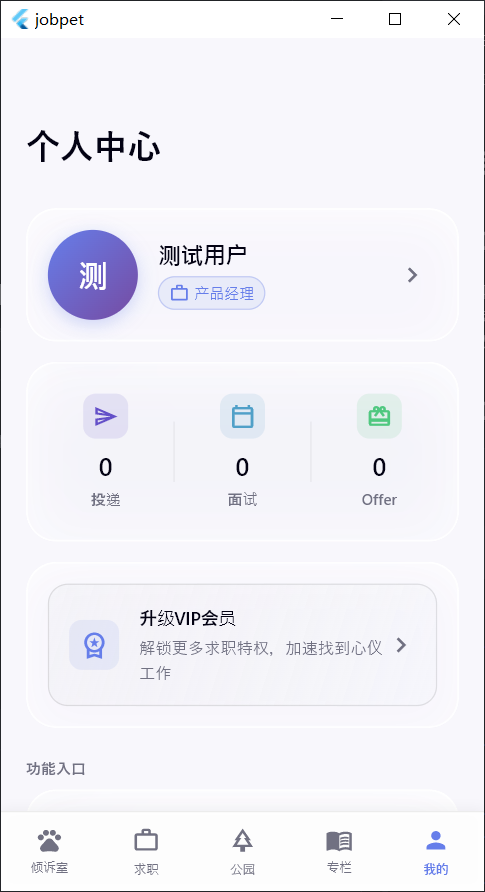
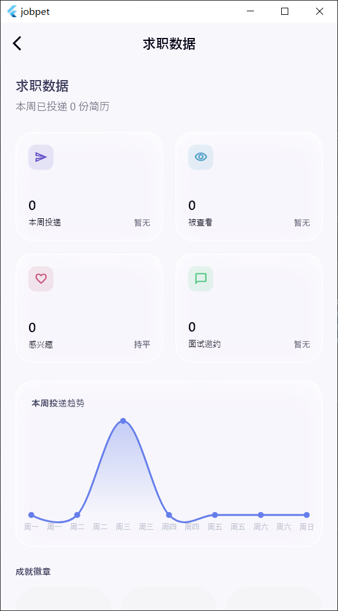

# 职宠小窝 (GuguPet)

## 项目简介

职宠小窝是一款轻拟人的电子宠物求职陪伴APP，旨在为求职者提供情感支持和求职辅助。通过与虚拟宠物的互动，缓解求职压力，提供求职建议和激励。

## 项目结构

```
GuguPet/
├── app/                 # Flutter应用端代码
├── crawler/             # Python职位爬虫系统
├── miniprogram/         # 微信小程序代码
└── images/				 # REAMDE.md中的一些展示图片
```

### 核心目录说明

- **app/**：基于Flutter开发的移动端应用，包含完整的宠物陪伴、求职辅助等功能
- **crawler/**：基于Python + DrissionPage开发的职位爬虫系统，支持多平台职位数据采集
- **miniprogram/**：基于Taro + React开发的微信小程序，提供基础的宠物互动功能

## 技术栈

### Flutter应用端

| 技术/框架             | 版本      | 用途          |
| ----------------- | ------- | ----------- |
| Flutter           | ^3.10.4 | 跨平台移动应用开发框架 |
| Provider          | ^6.1.1  | 状态管理        |
| Sqflite           | ^2.3.2  | 本地数据库       |
| Dio               | ^5.4.0  | 网络请求        |
| Lottie            | ^3.1.0  | 动画效果        |
| SharedPreferences | ^2.2.2  | 本地存储        |
| FL Chart          | ^0.66.0 | 数据可视化       |
| Flutter SVG       | ^2.0.9  | SVG图标支持     |

### 微信小程序端

| 技术/框架      | 版本       | 用途     |
| ---------- | -------- | ------ |
| Taro       | ^4.1.11  | 跨端开发框架 |
| React      | ^18.3.1  | UI框架   |
| Zustand    | ^5.0.3   | 状态管理   |
| Dayjs      | ^1.11.13 | 日期处理   |
| TypeScript | ^5.7.3   | 类型安全   |

### 职位爬虫系统

| 技术/框架        | 版本     | 用途       |
| ------------ | ------ | -------- |
| Python       | 3.10+  | 核心开发语言   |
| DrissionPage | Latest | 浏览器自动化   |
| SQLite       | 3.x    | 数据存储     |
| cryptography | 41.0+  | Cookie加密 |
| requests     | 2.x    | HTTP请求   |

## 环境要求

### Flutter应用端

- Flutter SDK 3.10.4+
- Dart SDK 3.10.0+
- Android Studio 2022.3+
- Xcode 14.0+ (macOS)

### 微信小程序端

- Node.js 18.0.0+
- npm 9.0.0+
- 微信开发者工具 Stable 1.06+

### 职位爬虫系统

- Python 3.10+
- Chrome/Edge浏览器
- Windows/macOS/Linux

## 安装与运行

### Flutter应用端

1. 克隆项目
   ```bash
   git clone <repository-url>
   cd GuguPet/app
   ```
2. 获取依赖
   ```bash
   flutter pub get
   ```
3. 运行应用
   - Android: `flutter run`
   - iOS: `flutter run` (需要macOS环境)
   - Web: `flutter run -d chrome`

### 微信小程序端

1. 进入小程序目录
   ```bash
   cd GuguPet/miniprogram
   ```
2. 安装依赖
   ```bash
   npm install
   ```
3. 开发模式运行
   ```bash
   npm run dev:weapp
   ```
4. 构建生产版本
   ```bash
   npm run build:weapp
   ```
5. 在微信开发者工具中打开 `GuguPet/miniprogram` 目录预览效果

### 职位爬虫系统

1. 进入爬虫目录
   ```bash
   cd GuguPet/crawler
   ```
2. 安装依赖
   ```bash
   pip install -r requirements.txt
   ```
3. 配置代理（可选）
   编辑 `config/settings.py`，配置代理池和加密密钥
4. 运行爬虫
   ```bash
   python main.py boss
   ```

## 功能模块

### 1. 宠物陪伴

- 宠物互动（喂食、玩耍、清洁）
- 宠物成长系统
- 情感状态反馈
- 3D宠物动画展示

### 2. 求职辅助

- 求职进度追踪
- 简历优化建议
- 面试模拟练习
- 职位推荐

### 3. 情感支持

- 心情倾诉功能
- 智能回复系统
- 激励语录推送
- 成就系统

### 4. 社交功能

- 宠物乐园互动
- 求职经验分享
- 互助社区

### 5. 数据统计

- 求职数据可视化
- 情绪变化分析
- 互动频率统计

## 应用界面展示

### 倾诉室 - 宠物陪伴
与虚拟宠物咕咕互动，倾诉求职烦恼，获得情感支持和鼓励。



### 职位 - 求职辅助
浏览精选职位，支持按类别筛选，查看职位详情和公司评分。




### 公园 - 社交互动
在码农森林中与其他用户互动，查看好友动态，结识求职伙伴。






### 专栏 - 知识付费
提供求职技能、政策补贴、职场成长等干货内容，助力职业发展。


### 个人中心 - 求职管理
管理个人求职进度，查看投递、面试、Offer统计，升级VIP解锁更多特权。





## 开发规范

### 代码规范

1. **Flutter应用端**
   - 遵循官方Flutter代码风格指南
   - 使用Dart格式化工具 `dart format .`
   - 代码注释覆盖率不低于30%
2. **微信小程序端**
   - 遵循React和TypeScript最佳实践
   - 使用ESLint和Prettier进行代码检查和格式化
   - 组件命名采用大驼峰式，文件命名采用短横线分隔

### 文档规范

1. 所有新功能开发前必须编写需求文档
2. 系统设计变更必须同步更新相关文档
3. API接口必须有详细的文档说明
4. 文档格式统一使用Markdown

### Git提交规范

```
<type>(<scope>): <subject>

<body>

<footer>
```

- **type**：feat(新功能)、fix(修复bug)、docs(文档更新)、style(代码格式)、refactor(重构)、test(测试)、chore(构建/工具)
- **scope**：模块名称或功能点
- **subject**：简明的提交描述
- **body**：详细的提交说明
- **footer**：关联的Issue或PR

## 贡献指南

1. Fork本仓库
2. 创建特性分支 (`git checkout -b feature/AmazingFeature`)
3. 提交更改 (`git commit -m 'feat: Add some AmazingFeature'`)
4. 推送到分支 (`git push origin feature/AmazingFeature`)
5. 打开Pull Request

## 许可证

本项目采用MIT许可证，详情请查看LICENSE文件。

## ⚠️ 爬虫系统合规声明

### 【重要提示】

本项目的爬虫系统（crawler目录）仅用于**个人学习和研究目的**，使用者必须遵守以下原则：

### 1. 合规性原则

- ✅ 自动检查并遵守目标网站的 `robots.txt` 规则
- ✅ 设置合理的请求频率限制（默认每分钟≤10次，每小时≤500次）
- ✅ 使用自适应延迟机制，避免对目标服务器造成过大压力
- ✅ 遇到验证码时暂停爬取，等待人工处理

### 2. 数据使用原则

- ✅ 仅采集公开的职位信息，不涉及用户隐私数据
- ✅ 采集的数据仅用于个人求职辅助，不用于商业用途
- ✅ 不对采集的数据进行二次分发或出售
- ✅ 数据仅存储在本地，不上传到任何服务器

### 3. 技术规范

- ✅ 使用合法的浏览器自动化工具（DrissionPage）
- ✅ 不绕过网站的安全验证机制
- ✅ 使用真实浏览器User-Agent，模拟正常用户行为
- ✅ Cookie数据加密存储，保护隐私安全

### 4. 法律依据

本爬虫系统的设计和使用遵循以下法律法规：

- 《中华人民共和国网络安全法》
- 《中华人民共和国数据安全法》
- 《中华人民共和国个人信息保护法》
- 《互联网信息服务管理办法》

### 5. 免责声明

- ⚠️ 使用者应自行确保爬取行为符合目标网站的服务条款
- ⚠️ 因不当使用造成的法律责任由使用者自行承担
- ⚠️ 本系统开发者不对任何滥用行为承担责任
- ⚠️ 使用本系统即表示您已阅读并同意以上条款

### 6. 使用前必读

在使用爬虫系统前，请确保：

1. 已阅读并理解目标网站的服务条款和 `robots.txt` 规则
2. 已配置合理的爬取频率和延迟参数（参考 `config/settings.py`）
3. 仅用于个人学习和研究目的
4. 了解相关法律法规，确保使用行为合法合规

### 7. 目标网站参考

| 网站     | robots.txt                           | 建议爬取时间 | 建议间隔 |
| ------ | ------------------------------------ | ------ | ---- |
| Boss直聘 | <https://www.zhipin.com/robots.txt>  | 非高峰时段  | ≥5秒  |
| 智联招聘   | <https://www.zhaopin.com/robots.txt> | 非高峰时段  | ≥5秒  |
| 前程无忧   | <https://www.51job.com/robots.txt>   | 非高峰时段  | ≥5秒  |

---

**请合法合规使用本系统，共同维护良好的网络环境！**

## 更新日志

### v1.2.0 (2026-03-24)

- ✅ 爬虫系统安全增强完成
  - IP代理池：支持HTTP/HTTPS/SOCKS5代理，自动切换和失效检测
  - Cookie加密存储：Fernet对称加密保护敏感数据
  - 验证码处理：自动检测滑块/图形验证码，支持人工等待
  - 请求头伪装：UA池扩展到20+，完整请求头模板
  - robots.txt合规检查：自动遵守网站爬取规则
  - 流量控制：分钟/小时级限制，自适应延迟
  - 浏览器指纹随机化：分辨率/语言/时区随机
  - 异常告警：Webhook通知，错误率监控
- 新增模块：proxy\_pool, secure\_storage, captcha\_handler, robots\_checker, rate\_limiter, alerter
- 更新设计文档：添加安全增强章节

### v1.1.0 (2026-03-24)

- ✅ 阶段一完成：基础功能完善 (100%)
  - 数据层建设：SQLite + DAO + 数据迁移
  - 个人中心：用户信息、求职意向、VIP状态、设置页面
  - 职位模块：详情页、收藏/申请、高级筛选、推荐算法
- ✅ 阶段三完成：社交与扩展 (94%)
  - 专栏模块：详情页、购买流程、收藏功能
  - 通知系统：通知中心、本地推送、远程推送接口
- 新增依赖：flutter\_html, flutter\_local\_notifications, timezone
- 修复多项代码问题和警告

### v1.0.0 (2026-03-19)

- 初始版本发布
- 完成Flutter应用端核心功能
- 完成微信小程序基础功能
- 编写项目文档

## 致谢

感谢所有为项目贡献代码和建议的开发者们！
