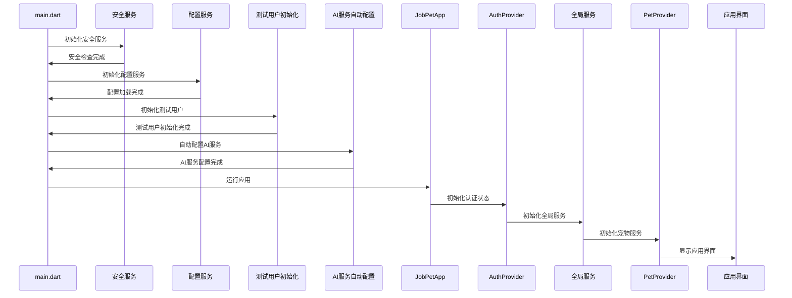
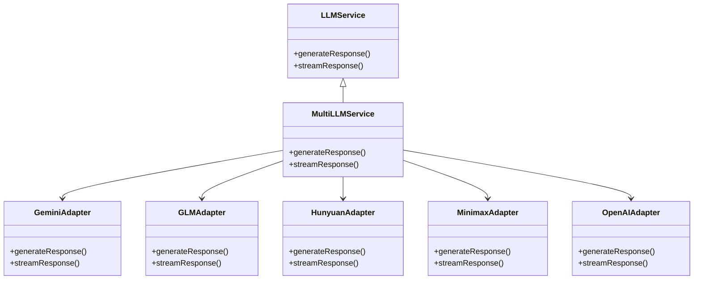

# App端技术实现分析与技术选型思路

## 一、当前技术栈分析

### 1. 核心框架与语言

| 技术 | 版本 | 用途 | 选择理由 |
|------|------|------|----------|
| Flutter | 最新稳定版 | 跨平台移动开发框架 | 一次开发，多端运行（Android、iOS、Web、Windows、Linux、macOS），性能接近原生，热重载提升开发效率 |
| Dart | 3.x | 开发语言 | 类型安全，JIT/AOT编译，性能优异，与Flutter深度集成 |

### 2. 核心依赖库

| 类别 | 技术 | 版本 | 用途 |
|------|------|------|------|
| 状态管理 | Provider | 6.1.1 | 轻量级状态管理，基于InheritedWidget，易于理解和使用 |
| 本地数据库 | SQFlite | 2.3.2 | 本地数据持久化，支持SQLite，跨平台兼容 |
| 网络请求 | Dio | 5.4.0 | 强大的HTTP客户端，支持拦截器、取消请求、FormData等 |
| 动画库 | Lottie | 3.1.0 | 高性能动画效果，支持AE导出的JSON动画 |
| AI服务 | Google Generative AI SDK | 0.4.6 | 支持多种LLM模型，包括Gemini、GLM、混元、Minimax、OpenAI等 |
| 安全存储 | Flutter Secure Storage | 9.0.0 | 安全存储敏感数据，如API密钥、用户凭证等 |

### 3. 架构设计

#### 分层架构

```
├── core/           # 核心配置、依赖注入、服务、主题、工具类
├── data/           # 数据层，包含本地数据源和数据模型
├── features/       # 功能模块，按业务功能划分
├── pages/          # 页面级组件
├── routes/         # 路由管理
├── services/       # 应用服务
└── shared/         # 共享组件和服务
```

#### 依赖注入

- 使用 `ServiceProvider` 和 `RepositoryProvider` 实现全局服务和仓库的单例管理
- 确保服务实例的唯一性和生命周期管理
- 支持用户切换时的服务重建

#### 状态管理

- 基于Provider的状态管理方案
- 各功能模块有独立的Provider（如PetProvider、ParkProvider、ConfideProvider等）
- 支持跨模块状态共享

#### 数据层

- 本地数据源与模型分离
- 使用SQFlite进行本地数据存储
- 支持数据库迁移
- 仓库模式封装数据访问逻辑

## 二、App端实现方式分析

### 1. 跨平台支持

- 基于Flutter框架，实现一次开发，多端运行
- 支持Android、iOS、Web、Windows、Linux、macOS六大平台
- 统一的代码base，降低维护成本

### 2. 应用启动流程



### 3. 主要功能模块实现

#### 宠物互动模块

- 宠物模型与情感状态管理
- 互动动画和响应
- 宠物外观定制
- 状态管理：PetProvider

#### 公园社交模块

- 社交动态、好友管理
- 虚拟互动功能
- 公园解锁服务
- 状态管理：ParkProvider、FriendProvider、PostProvider

#### 求职服务模块

- 职位列表、详情
- 职位收藏、投递记录
- 职位推荐
- 状态管理：JobsProvider、JobDetailProvider等

#### 倾诉聊天模块

- AI对话功能
- 多模型LLM支持
- 聊天历史记录
- 状态管理：ConfideProvider

### 4. AI集成实现

- 支持多种LLM模型，可通过配置切换
- 实现了AI自动配置服务
- 多模型LLM服务，支持流式响应
- 模型适配器模式，方便扩展新模型



### 5. 安全机制实现

- 设备安全性检查
- 敏感数据加密存储
- 安全服务初始化
- VIP功能保护

## 三、技术选型思路

### 1. 跨平台框架选择考量

#### 主要跨平台框架对比

| 框架 | 语言 | 性能 | 跨平台支持 | 生态 | 学习曲线 |
|------|------|------|------------|------|----------|
| Flutter | Dart | 接近原生 | Android、iOS、Web、Windows、Linux、macOS | 丰富 | 中等 |
| React Native | JavaScript/TypeScript | 较好 | Android、iOS | 丰富 | 中等 |
| NativeScript | JavaScript/TypeScript | 较好 | Android、iOS | 中等 | 中等 |
| Xamarin | C# | 较好 | Android、iOS、Windows | 中等 | 较高 |

#### 选择Flutter的理由

1. **性能优势**：Flutter使用Skia渲染引擎，性能接近原生应用
2. **跨平台覆盖广**：支持六大平台，一次开发，多端运行
3. **热重载**：提升开发效率，便于调试
4. **UI一致性**：统一的UI组件库，确保各平台UI一致性
5. **Dart语言优势**：类型安全，JIT/AOT编译，性能优异
6. **生态系统**：日益丰富的第三方库和插件
7. **Google支持**：持续更新和维护

### 2. 状态管理方案选择

#### 主流状态管理方案对比

| 方案 | 复杂度 | 学习曲线 | 性能 | 适用场景 |
|------|--------|----------|------|----------|
| Provider | 低 | 低 | 高 | 中小型应用，快速开发 |
| Bloc | 中 | 中 | 高 | 大型应用，复杂状态管理 |
| GetX | 低 | 低 | 高 | 中小型应用，快速开发 |
| Riverpod | 中 | 中 | 高 | 大型应用，复杂状态管理 |
| MobX | 中 | 中 | 高 | 响应式状态管理 |

#### 选择Provider的理由

1. **简单易用**：基于InheritedWidget，学习曲线平缓
2. **性能优秀**：避免不必要的重建
3. **官方推荐**：Flutter团队推荐的状态管理方案
4. **生态成熟**：大量的第三方库支持
5. **适合当前应用规模**：当前应用规模适中，Provider足以满足需求

### 3. 本地数据库选择

#### 主流本地数据库对比

| 数据库 | 类型 | 性能 | 跨平台支持 | 学习曲线 |
|--------|------|------|------------|----------|
| SQFlite | SQL | 高 | Android、iOS、Windows、Linux | 低 |
| Hive | NoSQL | 高 | 所有Flutter支持的平台 | 低 |
| Moor | SQL | 高 | Android、iOS、Web | 中 |
| ObjectBox | NoSQL | 极高 | Android、iOS | 低 |

#### 选择SQFlite的理由

1. **成熟稳定**：广泛应用于Flutter项目
2. **SQL支持**：熟悉的SQL语法，便于开发和维护
3. **跨平台支持**：支持主要平台
4. **性能优秀**：适合本地数据存储需求
5. **生态丰富**：大量的第三方库和工具支持

### 4. AI服务集成思路

#### AI服务选择考量

1. **模型多样性**：支持多种LLM模型，满足不同需求
2. **可扩展性**：便于添加新的模型支持
3. **性能**：支持流式响应，提升用户体验
4. **成本**：合理的API调用成本
5. **稳定性**：可靠的服务提供商

#### 适配器模式设计

- 使用适配器模式封装不同AI模型的调用逻辑
- 统一的API接口，便于上层应用调用
- 支持动态切换模型
- 便于扩展新的模型支持

## 四、技术选型建议

### 1. 现有技术栈优化建议

#### 状态管理优化

- 对于复杂页面，考虑使用Riverpod替代Provider，提供更好的可测试性和可组合性
- 引入状态管理最佳实践，避免状态泄露和不必要的重建

#### 性能优化

- 优化列表渲染，使用ListView.builder等懒加载组件
- 优化图片加载，使用缓存策略
- 优化动画性能，避免在动画中进行复杂计算

#### 架构优化

- 引入Clean Architecture或DDD（领域驱动设计）思想，进一步分离关注点
- 加强模块化设计，提高代码复用性和可维护性

### 2. 未来技术选型方向

#### 跨平台框架演进

- 持续关注Flutter的最新特性和性能优化
- 评估Flutter 3.0+的新特性，如Impeller渲染引擎、Web性能优化等

#### AI技术集成

- 探索本地AI模型部署，减少对云端API的依赖
- 优化AI对话体验，提升响应速度和准确性
- 引入更多AI能力，如图像识别、语音识别等

#### 安全技术

- 加强数据加密，保护用户隐私
- 引入生物识别认证，提升应用安全性
- 加强设备安全性检测，防止恶意攻击

#### 新兴技术探索

- 探索WebAssembly在Flutter中的应用，提升Web端性能
- 评估Flutter Desktop的成熟度，优化桌面端体验
- 关注AI原生应用开发，探索新的交互方式

## 五、总结

当前App端采用Flutter框架，结合Provider状态管理、SQFlite本地数据库、Dio网络请求等技术栈，实现了跨平台支持、清晰的分层架构、丰富的功能模块和AI集成。技术选型思路基于项目需求、开发效率、性能表现和生态成熟度等因素，选择了适合当前项目规模和需求的技术方案。

未来的技术选型应继续关注Flutter生态的发展，优化现有架构和性能，探索新兴技术，如本地AI模型部署、WebAssembly应用、生物识别认证等，以提升应用的性能、安全性和用户体验。

通过合理的技术选型和架构设计，可以确保应用具有良好的可扩展性、可维护性和性能表现，为后续功能迭代和业务发展奠定坚实的基础。