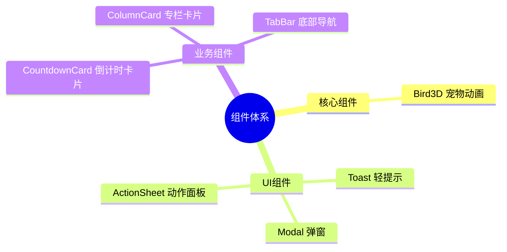
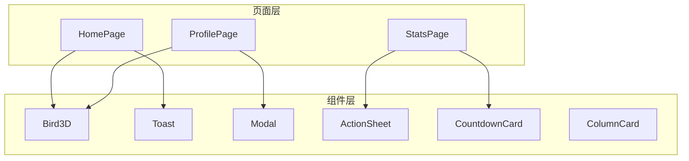

# 《职宠小窝》微信小程序 组件文档

**文档编号：** COMPONENTS-JOBPET-MP-001  
**版本号：** v1.0  
**编写日期：** 2026-03-17  
**文档状态：** 正式发布  

---

## 修订历史

| 版本 | 日期 | 修订人 | 修订内容 |
|------|------|--------|----------|
| v1.0 | 2026-03-17 | 架构师 | 初始版本 |

---

## 目录

1. [组件概览](#1-组件概览)
2. [核心组件](#2-核心组件)
3. [UI组件](#3-ui组件)
4. [业务组件](#4-业务组件)
5. [组件使用指南](#5-组件使用指南)

---

## 1. 组件概览

### 1.1 组件分类



### 1.2 组件列表

| 组件名 | 类型 | 文件路径 | 说明 |
|--------|------|----------|------|
| Bird3D | 核心组件 | components/Bird3D | 宠物动画组件 |
| Toast | UI组件 | components/Toast | 轻提示组件 |
| Modal | UI组件 | components/Modal | 弹窗组件 |
| ActionSheet | UI组件 | components/ActionSheet | 动作面板组件 |
| CountdownCard | 业务组件 | components/CountdownCard | 倒计时卡片组件 |
| ColumnCard | 业务组件 | components/ColumnCard | 专栏卡片组件 |
| TabBar | 业务组件 | components/TabBar | 底部导航组件 |

---

## 2. 核心组件

### 2.1 Bird3D - 宠物动画组件

**组件描述**：展示咕咕鸟宠物形象，支持动画状态切换。

**文件位置**：`components/Bird3D/index.tsx`

#### Props定义

```typescript
interface Bird3DProps {
  isHappy?: boolean      // 是否开心状态
  onHappyEnd?: () => void // 开心动画结束回调
}
```

#### 使用示例

```tsx
import Bird3D from '../../components/Bird3D'

// 基础用法
<Bird3D />

// 带状态控制
<Bird3D 
  isHappy={true} 
  onHappyEnd={() => console.log('动画结束')} 
/>
```

#### 动画状态

| 状态 | CSS类名 | 动画效果 | 时长 |
|------|---------|----------|------|
| 待机 | bird-idle | 轻微呼吸效果 | 循环 |
| 开心 | bird-happy | 跳跃+摇摆 | 1.8s |

#### 样式说明

```scss
.bird-container {
  position: relative;
  display: flex;
  flex-direction: column;
  align-items: center;
}

.bird-wrapper {
  // 宠物容器样式
}

.bird-idle {
  // 待机动画
  animation: idle 2s ease-in-out infinite;
}

.bird-happy {
  // 开心动画
  animation: happy 1.8s ease-in-out;
}

.side-bubble {
  // 侧边气泡
}
```

#### 完整代码

```tsx
import { View, Text } from '@tarojs/components'
import { useState, useEffect } from 'react'
import './index.scss'

interface Bird3DProps {
  isHappy?: boolean
  onHappyEnd?: () => void
}

export default function Bird3D({ isHappy = false, onHappyEnd }: Bird3DProps) {
  const [animationClass, setAnimationClass] = useState('bird-idle')

  useEffect(() => {
    if (isHappy) {
      setAnimationClass('bird-happy')
      const timer = setTimeout(() => {
        setAnimationClass('bird-idle')
        onHappyEnd?.()
      }, 1800)
      return () => clearTimeout(timer)
    }
  }, [isHappy, onHappyEnd])

  return (
    <View className="bird-container">
      <View className={`bird-shadow ${isHappy ? 'shadow-happy' : ''}`} />
      <View className={`bird-wrapper ${animationClass}`}>
        <View className="bird-emoji">🐧</View>
      </View>
      <View className="side-bubble">
        {isHappy ? '🥰' : '🫂'}
      </View>
    </View>
  )
}
```

---

## 3. UI组件

### 3.1 Toast - 轻提示组件

**组件描述**：用于显示短暂的消息提示。

**文件位置**：`components/Toast/index.tsx`

#### API

```typescript
// 初始化Toast（在App.tsx中调用）
initToast()

// 显示Toast
showToast(message: string, duration?: number)
```

#### 使用示例

```tsx
import { showToast, initToast } from '../../components/Toast'

// 初始化（App入口）
initToast()

// 显示提示
showToast('操作成功')
showToast('加载中...', 3000)
```

#### Props定义

```typescript
interface ToastProps {
  visible: boolean
  message: string
  duration?: number  // 默认2000ms
}
```

---

### 3.2 Modal - 弹窗组件

**组件描述**：用于显示确认对话框。

**文件位置**：`components/Modal/index.tsx`

#### Props定义

```typescript
interface ModalProps {
  visible: boolean           // 是否显示
  title?: string             // 标题
  content: string            // 内容
  confirmText?: string       // 确认按钮文字
  cancelText?: string        // 取消按钮文字
  showCancel?: boolean       // 是否显示取消按钮
  onConfirm?: () => void     // 确认回调
  onCancel?: () => void      // 取消回调
  onClose?: () => void       // 关闭回调
}
```

#### 使用示例

```tsx
import { Modal } from '../../components/Modal'

<Modal
  visible={showModal}
  title="提示"
  content="确定要删除吗？"
  confirmText="删除"
  cancelText="取消"
  showCancel={true}
  onConfirm={() => handleDelete()}
  onCancel={() => setShowModal(false)}
  onClose={() => setShowModal(false)}
/>
```

---

### 3.3 ActionSheet - 动作面板组件

**组件描述**：用于显示底部操作菜单。

**文件位置**：`components/ActionSheet/index.tsx`

#### Props定义

```typescript
interface ActionSheetOption {
  key: string
  label: string
  color?: string
  onClick?: () => void
}

interface ActionSheetProps {
  visible: boolean
  options: ActionSheetOption[]
  cancelText?: string
  onClose?: () => void
}
```

#### 使用示例

```tsx
import { ActionSheet, ActionSheetOption } from '../../components/ActionSheet'

const options: ActionSheetOption[] = [
  { 
    key: 'edit', 
    label: '编辑', 
    onClick: () => handleEdit() 
  },
  { 
    key: 'delete', 
    label: '删除', 
    color: '#FF6B6B',
    onClick: () => handleDelete() 
  },
]

<ActionSheet
  visible={showActionSheet}
  options={options}
  cancelText="取消"
  onClose={() => setShowActionSheet(false)}
/>
```

---

## 4. 业务组件

### 4.1 CountdownCard - 倒计时卡片组件

**组件描述**：展示倒计时信息的卡片组件。

**文件位置**：`components/CountdownCard/index.tsx`

#### Props定义

```typescript
interface CountdownCardProps {
  title: string              // 倒计时标题
  date: string               // 目标日期 (YYYY-MM-DD)
  color: ColorType           // 颜色类型
}

type ColorType = 'pink' | 'blue' | 'green' | 'purple'
```

#### 使用示例

```tsx
import { CountdownCard } from '../../components/CountdownCard'

<CountdownCard
  title="春招开始"
  date="2026-03-01"
  color="pink"
/>
```

#### 颜色映射

| 颜色类型 | 背景色 | 文字色 | 适用场景 |
|----------|--------|--------|----------|
| pink | #FFE2EE | #C05A78 | 春招 |
| blue | #E2EEFF | #4A68C8 | 答辩 |
| green | #E2FFE8 | #3A8A50 | 入职 |
| purple | #F0E8FF | #7040C0 | 毕业 |

---

### 4.2 ColumnCard - 专栏卡片组件

**组件描述**：展示付费专栏信息的卡片组件。

**文件位置**：`components/ColumnCard/index.tsx`

#### Props定义

```typescript
interface ColumnCardProps {
  id: string                 // 专栏ID
  title: string              // 专栏标题
  description: string        // 专栏描述
  price: number              // 价格（分）
  author: string             // 作者
  readCount: number          // 阅读量
  image: string              // 封面图
  isPurchased?: boolean      // 是否已购买
  onClick?: () => void       // 点击回调
}
```

#### 使用示例

```tsx
import { ColumnCard } from '../../components/ColumnCard'

<ColumnCard
  id="column_001"
  title="毕业补贴领取指南"
  description="全国31省市补贴政策汇总"
  price={990}
  author="咕咕团队"
  readCount={1234}
  image="/assets/columns/subsidy.png"
  isPurchased={false}
  onClick={() => handleColumnClick('column_001')}
/>
```

---

### 4.3 TabBar - 底部导航组件

**组件描述**：底部Tab导航栏组件。

**文件位置**：`components/TabBar/index.tsx`

#### Props定义

```typescript
interface TabBarProps {
  current: number            // 当前选中索引
  onChange?: (index: number) => void  // 切换回调
}
```

#### 使用示例

```tsx
import TabBar from '../../components/TabBar'

<TabBar 
  current={currentTab} 
  onChange={(index) => setCurrentTab(index)} 
/>
```

#### Tab项配置

| 索引 | 文字 | 图标 | 页面路径 |
|------|------|------|----------|
| 0 | 倾诉室 | 🏠 | pages/home/index |
| 1 | 看板 | 📊 | subpackages/stats/pages/index |
| 2 | 专栏 | 📚 | subpackages/knowledge/pages/index |
| 3 | 我的 | 👤 | pages/profile/index |

---

## 5. 组件使用指南

### 5.1 组件导入

```typescript
// 方式一：统一导入
import { Toast, Modal, ActionSheet, CountdownCard, ColumnCard, Bird3D } from '../../components'

// 方式二：单独导入
import Bird3D from '../../components/Bird3D'
import { showToast } from '../../components/Toast'
```

### 5.2 组件开发规范

#### 命名规范

```typescript
// 组件名：大驼峰
export default function CountdownCard() {}

// Props接口：组件名 + Props
interface CountdownCardProps {}

// 样式类名：小写+连字符
className="countdown-card"
className="countdown-card-title"
```

#### 文件结构

```
ComponentName/
├── index.tsx      # 组件实现
├── index.scss     # 组件样式
└── index.config.ts # 页面配置（如需要）
```

#### 组件模板

```tsx
import { View, Text } from '@tarojs/components'
import { PropsWithChildren } from 'react'
import './index.scss'

interface ComponentNameProps extends PropsWithChildren {
  // props定义
}

export default function ComponentName({ 
  children,
  ...props 
}: ComponentNameProps) {
  return (
    <View className="component-name">
      {children}
    </View>
  )
}
```

### 5.3 样式规范

#### 颜色变量

```scss
// 使用配置中的颜色
@import '../../config/colors.json';

.component {
  background-color: $primary;
  color: $text-primary;
}
```

#### 响应式设计

```tsx
import { useScreen } from '../../hooks'

function Component() {
  const { getResponsiveFontSize, safeAreaPadding } = useScreen()
  
  return (
    <View style={{ 
      fontSize: getResponsiveFontSize(16),
      paddingBottom: safeAreaPadding.bottom 
    }}>
      {/* content */}
    </View>
  )
}
```

### 5.4 组件测试

```typescript
// 测试用例示例
describe('Bird3D', () => {
  it('should render correctly', () => {
    const { container } = render(<Bird3D />)
    expect(container).toBeTruthy()
  })

  it('should trigger onHappyEnd after animation', () => {
    const onHappyEnd = jest.fn()
    render(<Bird3D isHappy={true} onHappyEnd={onHappyEnd} />)
    
    jest.advanceTimersByTime(1800)
    expect(onHappyEnd).toHaveBeenCalled()
  })
})
```

---

## 附录

### A. 组件依赖关系



### B. 组件更新日志

| 版本 | 日期 | 更新内容 |
|------|------|----------|
| v1.0 | 2026-03-17 | 初始版本，包含7个核心组件 |

---

**文档结束**

*本文档为《职宠小窝》微信小程序组件文档v1.0版，如有变更请及时更新版本号。*
