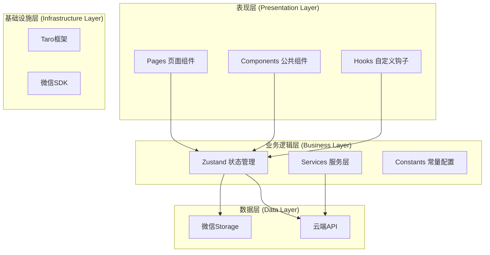
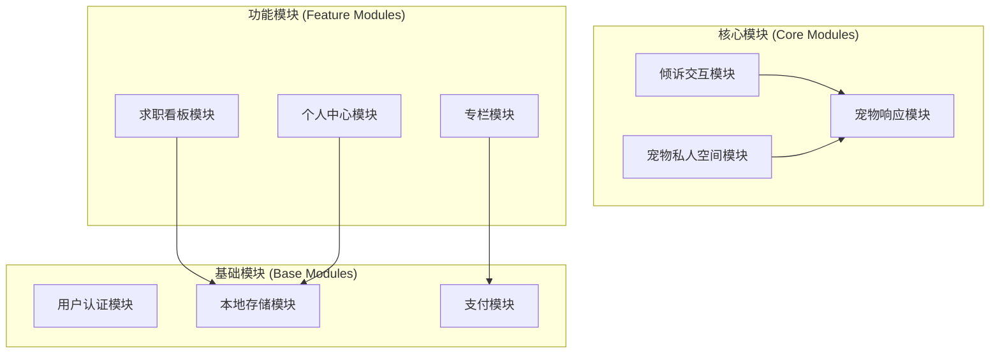
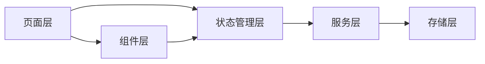
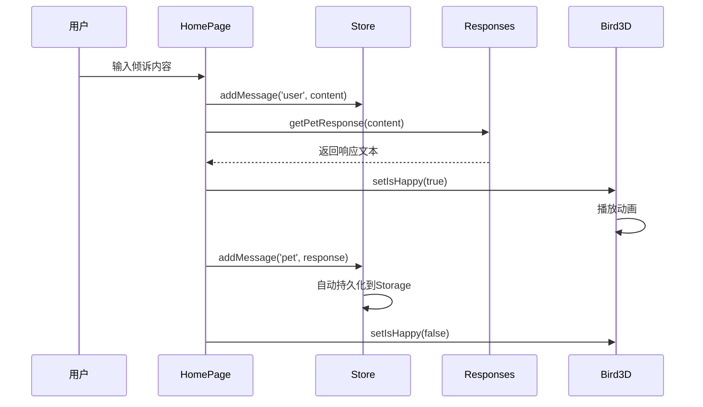
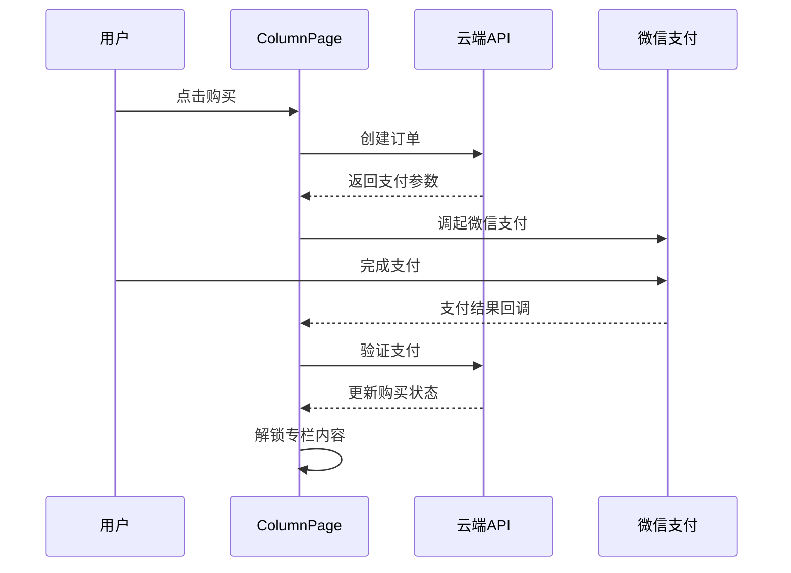
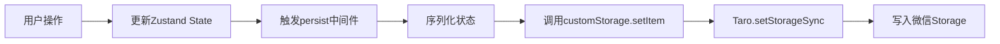
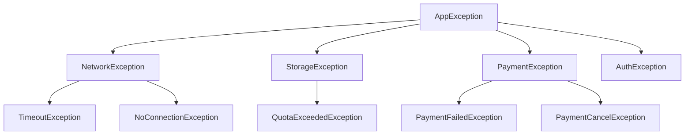
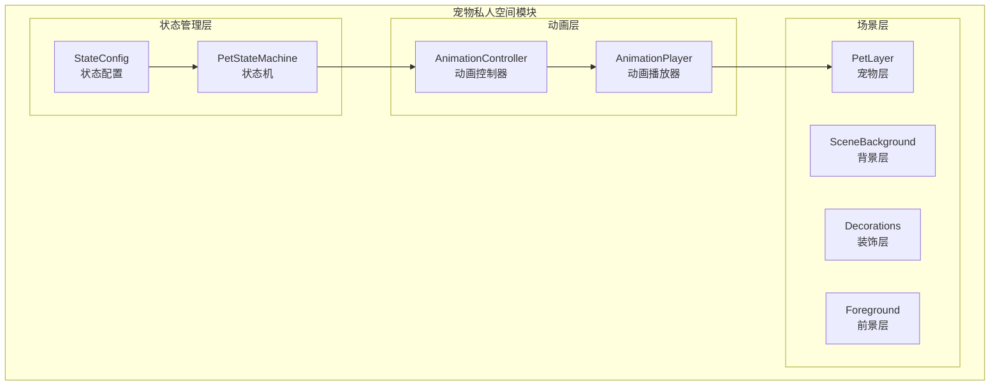

# 《职宠小窝》微信小程序 技术设计文档

**文档编号：** DDD-JOBPET-MP-001  
**版本号：** v1.0  
**编写日期：** 2026-03-17  
**文档状态：** 正式发布  

---

## 修订历史

| 版本 | 日期 | 修订人 | 修订内容 |
|------|------|--------|----------|
| v1.0 | 2026-03-17 | 架构师 | 初始版本 |
| v1.1 | 2026-03-17 | 架构师 | 新增宠物私人空间模块架构设计 |

---

## 目录

1. [系统架构设计](#1-系统架构设计)
2. [模块详细设计](#2-模块详细设计)
3. [核心类设计](#3-核心类设计)
4. [数据流设计](#4-数据流设计)
5. [状态管理设计](#5-状态管理设计)
6. [异常处理设计](#6-异常处理设计)
7. [性能优化设计](#7-性能优化设计)

---

## 1. 系统架构设计

### 1.1 整体架构



### 1.2 技术栈分层

| 层级 | 技术选型 | 说明 |
|------|----------|------|
| 表现层 | Taro 4.x + React 18 | 跨平台UI框架 |
| 状态管理 | Zustand 5.x | 轻量级状态管理 |
| 样式方案 | Sass | CSS预处理器 |
| 数据存储 | 微信Storage | 本地持久化 |
| 网络请求 | Taro.request | 封装请求 |

### 1.3 项目目录结构

```
miniprogram/src/
├── app.config.ts              # 应用配置
├── app.scss                   # 全局样式
├── app.tsx                    # 应用入口
│
├── pages/                     # 主包页面
│   ├── home/                  # 倾诉室页面
│   │   ├── index.config.ts    # 页面配置
│   │   ├── index.scss         # 页面样式
│   │   └── index.tsx          # 页面组件
│   └── profile/               # 个人中心页面
│       ├── index.config.ts
│       ├── index.scss
│       └── index.tsx
│
├── subpackages/               # 分包页面
│   ├── stats/                 # 求职看板分包
│   │   └── pages/
│   │       └── index/
│   └── knowledge/             # 专栏分包
│       └── pages/
│           └── index/
│
├── components/                # 公共组件
│   ├── Bird3D/               # 宠物动画组件
│   │   ├── index.scss
│   │   └── index.tsx
│   ├── Toast/                # 轻提示组件
│   ├── Modal/                # 弹窗组件
│   ├── ActionSheet/          # 动作面板组件
│   ├── CountdownCard/        # 倒计时卡片组件
│   ├── ColumnCard/           # 专栏卡片组件
│   ├── TabBar/               # 底部导航组件
│   └── index.ts              # 统一导出
│
├── config/                    # 配置文件
│   ├── index.ts              # 配置统一导出
│   ├── colors.json           # 颜色配置
│   ├── texts.json            # 文案配置
│   ├── ui.json               # UI配置
│   ├── menu.json             # 菜单配置
│   ├── countdown.json        # 倒计时配置
│   ├── columns.json          # 专栏配置
│   └── stats.json            # 统计配置
│
├── constants/                 # 常量定义
│   ├── responses.ts          # 宠物响应配置
│   └── theme.ts              # 主题配置
│
├── services/                  # 服务层
│   └── storage.ts            # 存储服务
│
├── store/                     # 状态管理
│   └── index.ts              # Zustand Store
│
├── hooks/                     # 自定义Hooks
│   ├── index.ts              # 统一导出
│   └── useScreen.ts          # 屏幕适配Hook
│
└── utils/                     # 工具函数
    ├── index.ts              # 统一导出
    └── screen.ts             # 屏幕工具
```

---

## 2. 模块详细设计

### 2.1 模块划分



### 2.2 模块依赖关系



---

## 3. 核心类设计

### 3.1 状态管理设计

#### 3.1.1 Store状态结构

```typescript
interface AppState {
  // 用户状态
  user: User | null
  setUser: (user: User | null) => void

  // 宠物状态
  pet: Pet
  setPetMood: (mood: Pet['mood']) => void

  // 倒计时状态
  countdowns: Countdown[]
  addCountdown: (countdown: Countdown) => void
  removeCountdown: (id: string) => void
  updateCountdown: (id: string, updates: Partial<Countdown>) => void

  // 消息状态
  messages: Message[]
  addMessage: (role: 'user' | 'pet', content: string) => void
  clearMessages: () => void
}

interface User {
  id: string
  name: string
  avatar?: string
}

interface Pet {
  mood: 'idle' | 'happy' | 'sad' | 'thinking'
  name: string
}

interface Countdown {
  id: string
  title: string
  date: string
  color: 'pink' | 'blue' | 'green' | 'purple'
}

interface Message {
  id: string
  role: 'user' | 'pet'
  content: string
  timestamp: number
}
```

#### 3.1.2 Store实现

```typescript
import { create } from 'zustand'
import { persist, createJSONStorage } from 'zustand/middleware'
import { storage } from '../services/storage'

const customStorage = {
  getItem: (name: string): string | null => {
    try {
      const value = storage.get(name)
      return value ? JSON.stringify(value) : null
    } catch {
      return null
    }
  },
  setItem: (name: string, value: string): void => {
    try {
      storage.set(name, JSON.stringify(value))
    } catch {
      // ignore
    }
  },
  removeItem: (name: string): void => {
    try {
      storage.remove(name)
    } catch {
      // ignore
    }
  },
}

export const useStore = create<AppState>()(
  persist(
    (set) => ({
      user: null,
      setUser: (user) => set({ user }),

      pet: {
        mood: 'idle',
        name: '咕咕',
      },
      setPetMood: (mood) => set((state) => ({ pet: { ...state.pet, mood } })),

      countdowns: [],
      addCountdown: (countdown) =>
        set((state) => ({
          countdowns: [...state.countdowns, countdown],
        })),
      removeCountdown: (id) =>
        set((state) => ({
          countdowns: state.countdowns.filter((c) => c.id !== id),
        })),
      updateCountdown: (id, updates) =>
        set((state) => ({
          countdowns: state.countdowns.map((c) =>
            c.id === id ? { ...c, ...updates } : c
          ),
        })),

      messages: [],
      addMessage: (role, content) =>
        set((state) => ({
          messages: [
            ...state.messages,
            { id: Date.now().toString(), role, content, timestamp: Date.now() },
          ],
        })),
      clearMessages: () => set({ messages: [] }),
    }),
    {
      name: 'gugupet-storage',
      storage: createJSONStorage(() => customStorage),
    }
  )
)
```

---

### 3.2 宠物响应模块

#### 3.2.1 响应规则配置

```typescript
export const petResponses = [
  { 
    pattern: /累|疲|倦|撑|崩|烦|难|苦|压力/, 
    text: '累了就歇歇，你已经很努力了 🤍 轻轻抱抱你~' 
  },
  { 
    pattern: /面试|hr|HR|笔试|offer|Offer|OFFER/, 
    text: '面试官看到你一定会心动的！咕咕为你加油 ✨' 
  },
  { 
    pattern: /拒|没过|挂|凉|凉凉|拒绝|失败/, 
    text: '他们眼光有问题！你是最棒的，咕咕最喜欢你 🫂' 
  },
  { 
    pattern: /开心|高兴|棒|好消息|发|拿到|通过|过了/, 
    text: '太好了！咕咕也为你感到超级开心~ 🎉🎊' 
  },
  { 
    pattern: /不知道|迷茫|迷失|找不到|方向/, 
    text: '迷茫也没关系，每一步都算数的，我一直陪着你 🌟' 
  },
]

export const defaultResponses = [
  '嗯嗯，我都听到了，说出来感觉好一点了吗？ 🐧',
  '你已经很棒了，不管怎样咕咕都支持你 ✨',
  '今天的委屈，明天变成铠甲，加油！',
  '咕咕在这里，轻轻抱抱你 🤍',
]

export function getPetResponse(userText: string): string {
  for (const response of petResponses) {
    if (response.pattern.test(userText)) {
      return response.text
    }
  }
  return defaultResponses[Math.floor(Math.random() * defaultResponses.length)]
}
```

---

### 3.3 存储服务模块

```typescript
import Taro from '@tarojs/taro'

export const storage = {
  // 获取存储数据
  get<T>(key: string): T | null {
    try {
      const value = Taro.getStorageSync(key)
      return value ? JSON.parse(value) : null
    } catch {
      return null
    }
  },

  // 设置存储数据
  set<T>(key: string, value: T): void {
    try {
      Taro.setStorageSync(key, JSON.stringify(value))
    } catch {
      // ignore
    }
  },

  // 移除存储数据
  remove(key: string): void {
    try {
      Taro.removeStorageSync(key)
    } catch {
      // ignore
    }
  },

  // 清除所有存储
  clear(): void {
    try {
      Taro.clearStorageSync()
    } catch {
      // ignore
    }
  },
}

export const router = {
  // 页面跳转
  navigateTo(url: string, params?: Record<string, any>) {
    const queryString = params
      ? '?' + Object.entries(params)
          .map(([k, v]) => `${k}=${encodeURIComponent(v)}`)
          .join('&')
      : ''
    Taro.navigateTo({ url: url + queryString })
  },

  // 返回上一页
  navigateBack(delta = 1) {
    Taro.navigateBack({ delta })
  },

  // 切换Tab页
  switchTab(url: string) {
    Taro.switchTab({ url })
  },

  // 重启到指定页面
  reLaunch(url: string) {
    Taro.reLaunch({ url })
  },
}
```

---

## 4. 数据流设计

### 4.1 倾诉交互数据流



### 4.2 专栏购买数据流



### 4.3 状态持久化流程



---

## 5. 状态管理设计

### 5.1 状态分类

| 状态类型 | 存储位置 | 持久化 | 说明 |
|----------|----------|--------|------|
| 用户信息 | Zustand | ✅ | 微信登录信息 |
| 宠物状态 | Zustand | ✅ | 宠物心情等 |
| 对话记录 | Zustand | ✅ | 历史消息 |
| 倒计时 | Zustand | ✅ | 用户添加的倒计时 |
| UI状态 | 组件内部 | ❌ | 临时UI状态 |

### 5.2 状态更新模式

```typescript
// 直接更新
setPetMood('happy')

// 基于当前状态更新
addCountdown({ id: '1', title: '春招', date: '2026-03-20', color: 'pink' })

// 条件更新
removeCountdown(id)
```

---

## 6. 异常处理设计

### 6.1 异常分类



### 6.2 异常处理策略

| 异常类型 | 处理策略 | 用户提示 |
|----------|----------|----------|
| 网络超时 | 自动重试3次 | "网络不稳定，请稍后重试" |
| 存储已满 | 清理旧数据 | "存储空间不足，请清理" |
| 支付失败 | 提示重试 | "支付失败，请重试" |
| 登录过期 | 重新登录 | "登录已过期，请重新登录" |

### 6.3 全局异常处理

```typescript
class GlobalErrorHandler {
  static handle(error: any) {
    if (error.errMsg?.includes('request:fail')) {
      Toast.show('网络连接失败，请检查网络')
    } else if (error.errMsg?.includes('storage')) {
      Toast.show('存储空间不足')
    } else if (error.errMsg?.includes('pay')) {
      Toast.show('支付失败，请重试')
    } else {
      Toast.show('发生未知错误')
    }
    
    // 上报错误日志
    console.error('[Error]', error)
  }
}
```

---

## 7. 性能优化设计

### 7.1 分包加载策略

```typescript
export default defineAppConfig({
  pages: [
    'pages/home/index',      // 主包：倾诉室
    'pages/profile/index',   // 主包：个人中心
  ],
  subpackages: [
    {
      root: 'subpackages/stats',
      pages: ['pages/index'],  // 分包：求职看板
    },
    {
      root: 'subpackages/knowledge',
      pages: ['pages/index'],  // 分包：专栏
    },
  ],
})
```

### 7.2 性能优化策略

| 优化维度 | 优化策略 | 实现方式 |
|----------|----------|----------|
| 包体积 | 分包加载 | 主包仅包含核心功能 |
| 启动速度 | 按需加载 | 分包预下载 |
| 渲染性能 | 虚拟列表 | 长列表优化 |
| 动画性能 | CSS动画 | 避免JS动画 |
| 存储优化 | 数据压缩 | JSON序列化 |

### 7.3 缓存策略

```typescript
const cacheStrategy = {
  // 专栏内容：打包在小程序内，无需网络请求
  columns: 'bundle',
  
  // 用户数据：本地存储
  userData: 'local',
  
  // 购买状态：云端同步+本地缓存
  purchaseStatus: 'cloud+local',
}
```

---

## 8. 宠物私人空间模块设计（V1.1新增）

### 8.1 模块架构



### 8.2 状态机设计

#### 8.2.1 状态枚举

```typescript
// 宠物状态枚举定义
enum PetState {
  // === 待机状态（随机触发） ===
  IDLE_SLEEPING = 'sleeping',      // 睡觉
  IDLE_READING = 'reading',        // 看书
  IDLE_EATING = 'eating',          // 吃东西
  IDLE_PLAYING = 'playing',        // 玩耍
  IDLE_WALKING = 'walking',        // 散步
  IDLE_DREAMING = 'dreaming',      // 发呆/做梦
  
  // === 过渡状态（动画序列） ===
  NOTICING_USER = 'noticing',      // 发现用户
  TURNING_HEAD = 'turning',        // 转头
  APPROACHING = 'approaching',     // 走向用户
  
  // === 交互状态 ===
  READY_TO_LISTEN = 'ready',       // 准备倾听
  LISTENING = 'listening',         // 倾听中
  RESPONDING = 'responding',       // 回应中
  HAPPY = 'happy',                 // 开心
  SAD = 'sad',                     // 难过
}

// 状态类型分类
enum StateCategory {
  IDLE = 'idle',           // 待机状态
  TRANSITION = 'transition', // 过渡状态
  INTERACTION = 'interaction', // 交互状态
}
```

#### 8.2.2 状态机类设计

```typescript
// 状态机类
class PetStateMachine {
  private currentState: PetState;
  private previousState: PetState | null;
  private stateHistory: PetState[];
  private listeners: StateChangeListener[];
  
  // 状态转换表
  private transitionTable: Map<PetState, PetState[]> = new Map([
    [PetState.IDLE_SLEEPING, [PetState.NOTICING_USER]],
    [PetState.IDLE_READING, [PetState.NOTICING_USER]],
    [PetState.IDLE_EATING, [PetState.NOTICING_USER]],
    [PetState.IDLE_PLAYING, [PetState.NOTICING_USER]],
    [PetState.IDLE_WALKING, [PetState.NOTICING_USER]],
    [PetState.IDLE_DREAMING, [PetState.NOTICING_USER]],
    [PetState.NOTICING_USER, [PetState.TURNING_HEAD]],
    [PetState.TURNING_HEAD, [PetState.APPROACHING]],
    [PetState.APPROACHING, [PetState.READY_TO_LISTEN]],
    [PetState.READY_TO_LISTEN, [PetState.LISTENING]],
    [PetState.LISTENING, [PetState.RESPONDING]],
    [PetState.RESPONDING, [PetState.HAPPY, PetState.SAD]],
    [PetState.HAPPY, [PetState.READY_TO_LISTEN]],
    [PetState.SAD, [PetState.READY_TO_LISTEN]],
  ]);
  
  // 状态转换
  transitionTo(newState: PetState): boolean {
    const allowedStates = this.transitionTable.get(this.currentState);
    if (allowedStates?.includes(newState)) {
      this.previousState = this.currentState;
      this.currentState = newState;
      this.notifyListeners();
      return true;
    }
    return false;
  }
  
  // 获取当前状态
  getCurrentState(): PetState {
    return this.currentState;
  }
  
  // 添加状态监听器
  addListener(listener: StateChangeListener): void {
    this.listeners.push(listener);
  }
  
  // 通知监听器
  private notifyListeners(): void {
    this.listeners.forEach(listener => {
      listener(this.previousState, this.currentState);
    });
  }
}

// 状态变化监听器类型
type StateChangeListener = (from: PetState | null, to: PetState) => void;
```

### 8.3 场景系统设计

#### 8.3.1 场景数据结构

```typescript
// 场景配置接口
interface PetSpaceScene {
  id: string;
  name: string;
  background: SceneBackground;
  decorations: Decoration[];
  walkableArea: WalkableArea;
  centerPosition: Position;
}

// 场景背景
interface SceneBackground {
  gradient: string;          // CSS渐变
  image?: string;            // 背景图片URL
}

// 装饰物
interface Decoration {
  id: string;
  type: 'furniture' | 'plant' | 'toy' | 'food';
  position: Position;
  size: Size;
  image: string;
  zIndex: number;
  interactive?: boolean;
}

// 可行走区域
interface WalkableArea {
  x: [number, number];       // X范围 [min, max]
  y: [number, number];       // Y范围 [min, max]
}

// 位置和尺寸
interface Position {
  x: number;                 // 百分比位置 0-1
  y: number;
}

interface Size {
  width: number;             // 像素尺寸
  height: number;
}
```

#### 8.3.2 场景渲染层级

```scss
// 场景容器
.pet-space-container {
  position: relative;
  width: 100%;
  height: 100%;
  overflow: hidden;
}

// 背景层 (z-index: 1)
.scene-background {
  position: absolute;
  top: 0;
  left: 0;
  width: 100%;
  height: 100%;
  z-index: 1;
}

// 装饰层 (z-index: 2)
.scene-decoration {
  position: absolute;
  z-index: 2;
}

// 宠物层 (z-index: 3)
.pet-layer {
  position: absolute;
  z-index: 3;
  transform-style: preserve-3d;
  perspective: 1000px;
}

// 前景特效层 (z-index: 4)
.scene-foreground {
  position: absolute;
  top: 0;
  left: 0;
  width: 100%;
  height: 100%;
  z-index: 4;
  pointer-events: none;
}

// UI层 (z-index: 5)
.scene-ui {
  position: absolute;
  top: 0;
  left: 0;
  width: 100%;
  height: 100%;
  z-index: 5;
}
```

### 8.4 动画控制器设计

```typescript
// 动画控制器类
class PetAnimationController {
  private currentAnimation: Animation | null;
  private animationQueue: AnimationSequence[];
  private isPlaying: boolean;
  
  // 播放待机动画
  playIdleAnimation(state: PetIdleState): void {
    this.stopCurrentAnimation();
    
    const pet = document.querySelector('.pet-layer');
    if (!pet) return;
    
    // 设置位置
    pet.style.left = `${state.position.x * 100}%`;
    pet.style.top = `${state.position.y * 100}%`;
    
    // 添加动画类
    pet.classList.add(state.animation.main);
    if (state.animation.secondary) {
      pet.classList.add(state.animation.secondary);
    }
  }
  
  // 播放进入动画序列
  async playEnterSequence(fromState: PetIdleState): Promise<void> {
    const sequence: AnimationSequence[] = [
      { id: 'notice', duration: 400 },
      { id: 'turn', duration: 500 },
      { id: 'approach', duration: 800 },
      { id: 'ready', duration: 300 },
    ];
    
    for (const step of sequence) {
      await this.playStep(step);
    }
  }
  
  // 播放单步动画
  private playStep(step: AnimationSequence): Promise<void> {
    return new Promise(resolve => {
      const pet = document.querySelector('.pet-layer');
      pet?.classList.add(`phase-${step.id}`);
      
      setTimeout(() => {
        pet?.classList.remove(`phase-${step.id}`);
        resolve();
      }, step.duration);
    });
  }
  
  // 停止当前动画
  stopCurrentAnimation(): void {
    const pet = document.querySelector('.pet-layer');
    if (pet) {
      pet.className = 'pet-layer';
    }
    this.isPlaying = false;
  }
}

// 动画序列接口
interface AnimationSequence {
  id: string;
  duration: number;
  easing?: string;
}
```

### 8.5 状态管理扩展

```typescript
// 扩展 Zustand Store
interface PetSpaceState {
  // 宠物空间状态
  petSpace: {
    currentScene: PetSpaceScene;
    currentState: PetState;
    currentIdleState: PetIdleState | null;
    position: Position;
    isAnimating: boolean;
  };
  
  // 动作
  setPetState: (state: PetState) => void;
  setIdleState: (state: PetIdleState) => void;
  setPetPosition: (x: number, y: number) => void;
  setAnimating: (animating: boolean) => void;
  playEnterSequence: () => Promise<void>;
}

// Store 扩展实现
export const usePetSpaceStore = create<PetSpaceState>()(
  persist(
    (set, get) => ({
      petSpace: {
        currentScene: DEFAULT_SCENE,
        currentState: PetState.IDLE_SLEEPING,
        currentIdleState: null,
        position: { x: 0.5, y: 0.5 },
        isAnimating: false,
      },
      
      setPetState: (state) =>
        set((s) => ({
          petSpace: { ...s.petSpace, currentState: state },
        })),
      
      setIdleState: (idleState) =>
        set((s) => ({
          petSpace: { ...s.petSpace, currentIdleState: idleState },
        })),
      
      setPetPosition: (x, y) =>
        set((s) => ({
          petSpace: { ...s.petSpace, position: { x, y } },
        })),
      
      setAnimating: (animating) =>
        set((s) => ({
          petSpace: { ...s.petSpace, isAnimating: animating },
        })),
      
      playEnterSequence: async () => {
        const { petSpace, setPetState, setAnimating } = get();
        if (petSpace.currentIdleState) {
          setAnimating(true);
          // 执行动画序列...
          setAnimating(false);
        }
      },
    }),
    { name: 'pet-space-storage' }
  )
);
```

### 8.6 组件结构

```typescript
// 宠物空间组件结构
interface PetSpaceComponents {
  // 场景容器组件
  PetSpaceContainer: {
    props: {
      scene?: PetSpaceScene;
      onEnterComplete?: () => void;
    };
    children: [
      'SceneBackground',    // 背景层
      'Decorations',        // 装饰层
      'Pet',                // 宠物层
      'ForegroundEffects',  // 前景层
      'PetSpaceUI',         // UI层
    ];
  };
  
  // 宠物组件
  Pet: {
    props: {
      state: PetState;
      position: Position;
      animation?: AnimationConfig;
    };
    hooks: ['usePetAnimation'];
  };
  
  // 状态机组件
  PetStateMachine: {
    props: {
      initialState?: PetIdleState;
    };
    methods: [
      'transitionTo',
      'playEnterSequence',
      'getRandomIdleState',
    ];
  };
}
```

### 8.7 性能优化策略

| 优化维度 | 策略 | 实现方式 |
|----------|------|----------|
| 动画性能 | CSS动画优先 | 使用CSS keyframes代替JS动画 |
| 渲染优化 | 图层合并 | 静态装饰物合并为单张图片 |
| 内存优化 | 对象池 | 复用粒子对象 |
| 设备适配 | 性能分级 | 根据设备性能调整动画复杂度 |

---

## 附录

### A. 设计模式应用

| 模式 | 应用场景 | 说明 |
|------|----------|------|
| 单例模式 | Zustand Store | 全局唯一状态 |
| 工厂模式 | getPetResponse | 根据输入创建响应 |
| 观察者模式 | Zustand订阅 | 状态变化通知 |
| 策略模式 | 响应匹配 | 不同关键词匹配策略 |

### B. 代码规范

1. **命名规范**
   - 组件名：大驼峰（PascalCase）
   - 变量/方法：小驼峰（camelCase）
   - 常量：小驼峰（camelCase）
   - 文件名：小驼峰（camelCase）

2. **文件组织**
   - 每个组件独立目录
   - 样式文件与组件同级
   - 配置文件集中管理

3. **注释规范**
   - 公开API必须有文档注释
   - 复杂逻辑必须有行内注释
   - 使用中文注释

---

**文档结束**

*本文档为《职宠小窝》微信小程序技术设计文档v1.0版，如有变更请及时更新版本号。*
