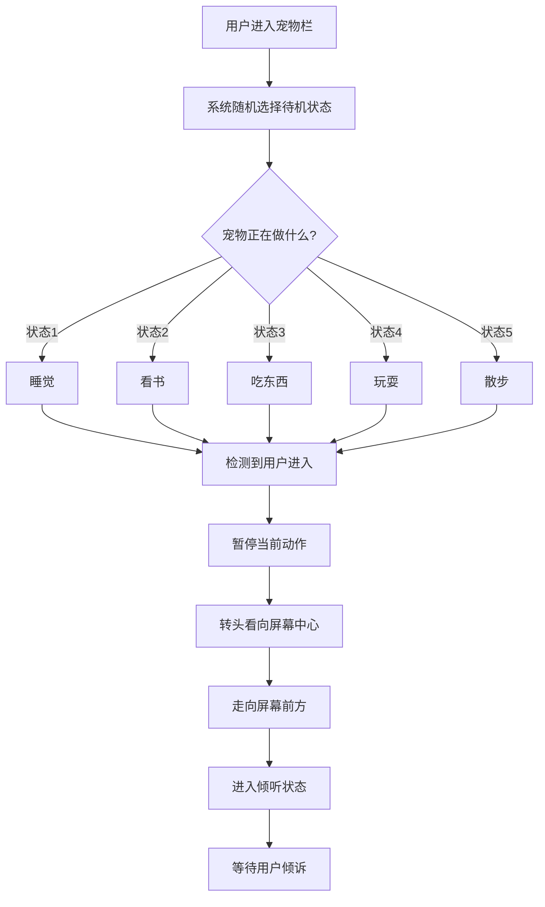
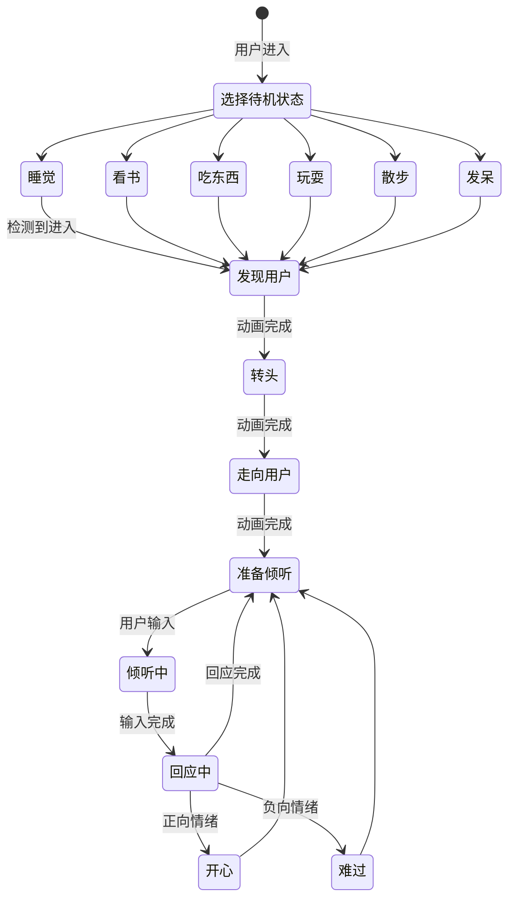
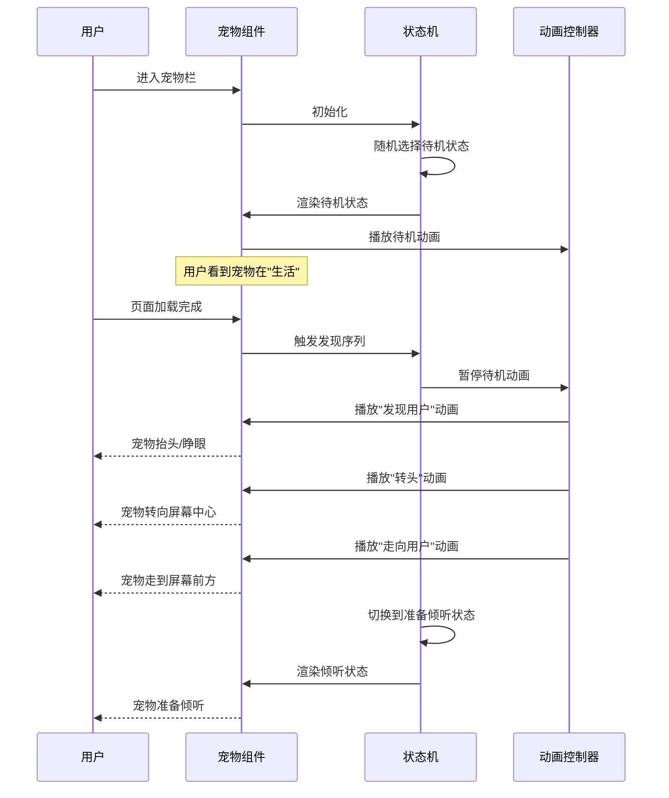
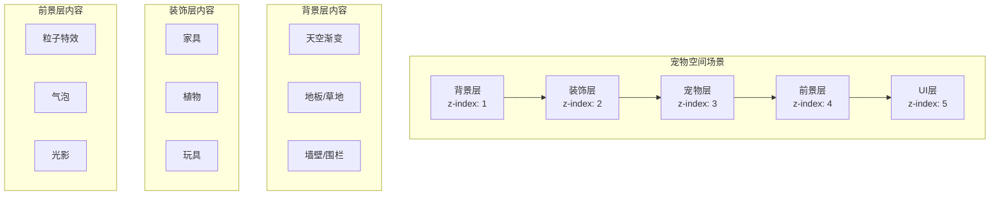
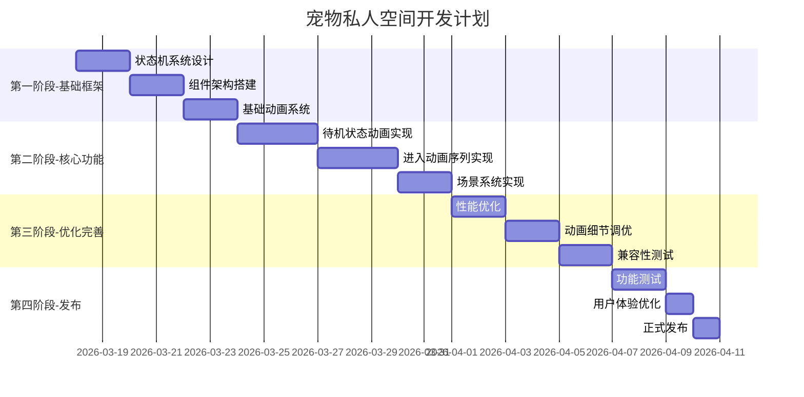

# 《职宠小窝》小程序 - 宠物私人空间设计文档

**文档编号：** PET_SPACE-MINI-001  
**版本号：** v1.0  
**编写日期：** 2026-03-17  
**文档状态：** 正式发布  

---

## 修订历史

| 版本 | 日期 | 修订人 | 修订内容 |
|------|------|--------|----------|
| v1.0 | 2026-03-17 | 架构师 | 初始版本 |

---

## 目录

1. [功能概述](#1-功能概述)
2. [核心设计](#2-核心设计)
3. [场景系统设计](#3-场景系统设计)
4. [动画实现方案](#4-动画实现方案)
5. [技术实现要点](#5-技术实现要点)
6. [资源需求清单](#6-资源需求清单)
7. [实施计划](#7-实施计划)

---

## 1. 功能概述

### 1.1 功能定位

宠物私人空间是宠物的一个独立生活场景，用户进入宠物栏时，宠物处于某种待机状态（如看书、睡觉、吃东西等），仿佛在过着自己的生活。当用户进入时，宠物会"发现"用户，然后走向屏幕前准备倾听。

### 1.2 核心价值

| 价值维度 | 描述 |
|----------|------|
| **情感连接** | 宠物有自己的"生活"，增强真实感和陪伴感 |
| **沉浸体验** | 每次进入都有不同的场景，增加新鲜感 |
| **仪式感** | 宠物"发现用户"的动画序列，增强互动仪式感 |

### 1.3 功能流程



---

## 2. 核心设计

### 2.1 宠物状态机设计

#### 2.1.1 状态枚举定义

```typescript
// 宠物状态枚举
enum PetState {
  // === 待机状态（随机触发） ===
  IDLE_SLEEPING = 'sleeping',      // 睡觉
  IDLE_READING = 'reading',        // 看书
  IDLE_EATING = 'eating',          // 吃东西
  IDLE_PLAYING = 'playing',        // 玩耍
  IDLE_WALKING = 'walking',        // 散步
  IDLE_DREAMING = 'dreaming',      // 发呆/做梦
  
  // === 过渡状态（动画序列） ===
  NOTICING_USER = 'noticing',      // 发现用户
  TURNING_HEAD = 'turning',        // 转头
  APPROACHING = 'approaching',     // 走向用户
  
  // === 交互状态 ===
  READY_TO_LISTEN = 'ready',       // 准备倾听
  LISTENING = 'listening',         // 倾听中
  RESPONDING = 'responding',       // 回应中
  HAPPY = 'happy',                 // 开心
  SAD = 'sad',                     // 难过
}

// 状态类型分类
enum StateCategory {
  IDLE = 'idle',           // 待机状态
  TRANSITION = 'transition', // 过渡状态
  INTERACTION = 'interaction', // 交互状态
}
```

#### 2.1.2 状态机流转图



### 2.2 待机状态池设计

#### 2.2.1 待机状态配置表

| 状态ID | 状态名称 | 触发权重 | 持续时间 | 位置范围 | 动画类型 |
|--------|----------|----------|----------|----------|----------|
| `sleeping` | 睡觉 | 20% | 10-30秒 | 左下角 | 呼吸+Z字飘出 |
| `reading` | 看书 | 18% | 8-20秒 | 书桌位置 | 翻页+点头 |
| `eating` | 吃东西 | 15% | 5-15秒 | 餐桌位置 | 咀嚼+满足表情 |
| `playing` | 玩耍 | 15% | 6-18秒 | 中央区域 | 跳跃+追逐 |
| `walking` | 散步 | 12% | 8-25秒 | 移动路径 | 行走+东张西望 |
| `dreaming` | 发呆 | 20% | 5-15秒 | 随机位置 | 发呆+气泡幻想 |

#### 2.2.2 待机状态数据结构

```typescript
// 待机状态配置接口
interface PetIdleState {
  id: string;                    // 状态唯一标识
  name: string;                  // 状态名称
  weight: number;                // 触发权重 (0-100)
  duration: {                    // 持续时间范围
    min: number;                 // 最小时间(秒)
    max: number;                 // 最大时间(秒)
  };
  position: {                    // 在场景中的位置
    x: number;                   // X坐标百分比 (0-1)
    y: number;                   // Y坐标百分比 (0-1)
    randomOffset?: number;       // 随机偏移范围
  };
  animation: {                   // 动画配置
    main: string;                // 主动画CSS类名
    secondary?: string;          // 次要动画(如气泡)
    loop: boolean;               // 是否循环
  };
  interruptible: boolean;        // 是否可被打断
  transitionDelay: number;       // 过渡到发现状态的延迟(毫秒)
}

// 待机状态池配置
const IDLE_STATES: PetIdleState[] = [
  {
    id: 'sleeping',
    name: '睡觉',
    weight: 20,
    duration: { min: 10, max: 30 },
    position: { x: 0.15, y: 0.75, randomOffset: 0.05 },
    animation: {
      main: 'pet-sleeping',
      secondary: 'sleep-bubble',
      loop: true,
    },
    interruptible: true,
    transitionDelay: 300,
  },
  {
    id: 'reading',
    name: '看书',
    weight: 18,
    duration: { min: 8, max: 20 },
    position: { x: 0.7, y: 0.6, randomOffset: 0.03 },
    animation: {
      main: 'pet-reading',
      secondary: 'book-flip',
      loop: true,
    },
    interruptible: true,
    transitionDelay: 200,
  },
  {
    id: 'eating',
    name: '吃东西',
    weight: 15,
    duration: { min: 5, max: 15 },
    position: { x: 0.5, y: 0.7, randomOffset: 0.04 },
    animation: {
      main: 'pet-eating',
      loop: true,
    },
    interruptible: true,
    transitionDelay: 400,
  },
  {
    id: 'playing',
    name: '玩耍',
    weight: 15,
    duration: { min: 6, max: 18 },
    position: { x: 0.5, y: 0.5, randomOffset: 0.1 },
    animation: {
      main: 'pet-playing',
      secondary: 'toy-bounce',
      loop: true,
    },
    interruptible: true,
    transitionDelay: 100,
  },
  {
    id: 'walking',
    name: '散步',
    weight: 12,
    duration: { min: 8, max: 25 },
    position: { x: 0.3, y: 0.65, randomOffset: 0.15 },
    animation: {
      main: 'pet-walking',
      loop: true,
    },
    interruptible: true,
    transitionDelay: 200,
  },
  {
    id: 'dreaming',
    name: '发呆',
    weight: 20,
    duration: { min: 5, max: 15 },
    position: { x: 0.5, y: 0.5, randomOffset: 0.08 },
    animation: {
      main: 'pet-dreaming',
      secondary: 'thought-bubble',
      loop: true,
    },
    interruptible: true,
    transitionDelay: 150,
  },
];
```

### 2.3 进入动画序列设计

#### 2.3.1 动画序列流程



#### 2.3.2 动画序列配置

```typescript
// 进入动画序列配置
interface AnimationSequence {
  id: string;
  name: string;
  duration: number;           // 持续时间(毫秒)
  easing: string;             // 缓动函数
  transform: {                // CSS变换
    translateX?: number;      // X位移
    translateY?: number;      // Y位移
    rotateY?: number;         // Y轴旋转(转头)
    scale?: number;           // 缩放
  };
  delay?: number;             // 延迟时间
}

// 完整的进入动画序列
const ENTER_SEQUENCE: AnimationSequence[] = [
  {
    id: 'notice',
    name: '发现用户',
    duration: 400,
    easing: 'ease-out',
    transform: {
      scale: 1.05,            // 轻微放大(惊讶)
    },
    delay: 200,
  },
  {
    id: 'turn_head',
    name: '转头',
    duration: 500,
    easing: 'ease-in-out',
    transform: {
      rotateY: 0,             // 转向屏幕中心(0度)
    },
  },
  {
    id: 'approach',
    name: '走向用户',
    duration: 800,
    easing: 'cubic-bezier(0.4, 0, 0.2, 1)',
    transform: {
      translateX: 0,          // 移动到屏幕中心X
      translateY: -50,        // 向上移动(走近)
      scale: 1.1,             // 变大(靠近)
    },
  },
  {
    id: 'ready',
    name: '准备倾听',
    duration: 300,
    easing: 'ease-out',
    transform: {
      scale: 1.0,             // 恢复正常大小
    },
  },
];

// 动画序列总时长
const TOTAL_ENTER_DURATION = ENTER_SEQUENCE.reduce(
  (sum, seq) => sum + seq.duration + (seq.delay || 0),
  0
); // 约2秒
```

---

## 3. 场景系统设计

### 3.1 场景结构



### 3.2 场景配置

```typescript
// 场景配置接口
interface PetSpaceScene {
  id: string;
  name: string;
  background: {                // 背景配置
    gradient: string;          // 渐变色
    image?: string;            // 背景图片
  };
  decorations: Decoration[];   // 装饰物列表
  walkableArea: {              // 可行走区域
    x: [number, number];       // X范围
    y: [number, number];       // Y范围
  };
  centerPosition: {            // 屏幕中心位置
    x: number;
    y: number;
  };
}

// 装饰物配置
interface Decoration {
  id: string;
  type: 'furniture' | 'plant' | 'toy' | 'food';
  position: { x: number; y: number };
  size: { width: number; height: number };
  image: string;
  zIndex: number;
  interactive?: boolean;       // 是否可交互
}

// 默认场景配置
const DEFAULT_SCENE: PetSpaceScene = {
  id: 'cozy_room',
  name: '温馨小窝',
  background: {
    gradient: 'linear-gradient(180deg, #E8F4FC 0%, #F5E6D3 50%, #D4C4A8 100%)',
  },
  decorations: [
    {
      id: 'bed',
      type: 'furniture',
      position: { x: 0.15, y: 0.75 },
      size: { width: 80, height: 50 },
      image: 'assets/decorations/bed.png',
      zIndex: 2,
    },
    {
      id: 'bookshelf',
      type: 'furniture',
      position: { x: 0.75, y: 0.55 },
      size: { width: 60, height: 100 },
      image: 'assets/decorations/bookshelf.png',
      zIndex: 2,
    },
    {
      id: 'food_bowl',
      type: 'food',
      position: { x: 0.5, y: 0.72 },
      size: { width: 40, height: 25 },
      image: 'assets/decorations/food_bowl.png',
      zIndex: 2,
    },
    {
      id: 'plant',
      type: 'plant',
      position: { x: 0.9, y: 0.65 },
      size: { width: 35, height: 60 },
      image: 'assets/decorations/plant.png',
      zIndex: 2,
    },
  ],
  walkableArea: {
    x: [0.1, 0.9],
    y: [0.5, 0.85],
  },
  centerPosition: {
    x: 0.5,
    y: 0.55,
  },
};
```

### 3.3 场景渲染层级

```scss
// 场景容器
.pet-space-container {
  position: relative;
  width: 100%;
  height: 100%;
  overflow: hidden;
}

// 背景层
.scene-background {
  position: absolute;
  top: 0;
  left: 0;
  width: 100%;
  height: 100%;
  z-index: 1;
}

// 装饰层
.scene-decoration {
  position: absolute;
  z-index: 2;
  
  &.furniture { z-index: 2; }
  &.plant { z-index: 2; }
  &.toy { z-index: 2; }
}

// 宠物层
.pet-layer {
  position: absolute;
  z-index: 3;
  transform-style: preserve-3d;
  perspective: 1000px;
}

// 前景特效层
.scene-foreground {
  position: absolute;
  top: 0;
  left: 0;
  width: 100%;
  height: 100%;
  z-index: 4;
  pointer-events: none;
}

// UI层
.scene-ui {
  position: absolute;
  top: 0;
  left: 0;
  width: 100%;
  height: 100%;
  z-index: 5;
}
```

---

## 4. 动画实现方案

### 4.1 CSS 3D动画实现

#### 4.1.1 待机动画CSS

```scss
// === 睡觉动画 ===
.pet-sleeping {
  animation: pet-breathe 3s ease-in-out infinite;
  
  .sleep-bubble {
    animation: float-up 2s ease-in-out infinite;
    
    &::before {
      content: 'Z';
      animation: z-float 1.5s ease-in-out infinite;
    }
  }
}

@keyframes pet-breathe {
  0%, 100% { transform: scaleY(1) translateY(0); }
  50% { transform: scaleY(0.98) translateY(2px); }
}

@keyframes float-up {
  0%, 100% { transform: translateY(0); opacity: 0.8; }
  50% { transform: translateY(-10px); opacity: 1; }
}

// === 看书动画 ===
.pet-reading {
  animation: reading-sway 4s ease-in-out infinite;
  
  .book {
    animation: book-flip 5s ease-in-out infinite;
  }
}

@keyframes reading-sway {
  0%, 100% { transform: rotateZ(-2deg); }
  50% { transform: rotateZ(2deg); }
}

@keyframes book-flip {
  0%, 45% { transform: rotateY(0deg); }
  50%, 95% { transform: rotateY(-10deg); }
  100% { transform: rotateY(0deg); }
}

// === 吃东西动画 ===
.pet-eating {
  animation: eating-bounce 0.5s ease-in-out infinite;
  
  .mouth {
    animation: chew 0.3s ease-in-out infinite;
  }
}

@keyframes eating-bounce {
  0%, 100% { transform: translateY(0); }
  50% { transform: translateY(-3px); }
}

@keyframes chew {
  0%, 100% { transform: scaleY(1); }
  50% { transform: scaleY(0.8); }
}

// === 玩耍动画 ===
.pet-playing {
  animation: play-jump 1s ease-in-out infinite;
  
  .toy {
    animation: toy-bounce 0.8s ease-in-out infinite;
  }
}

@keyframes play-jump {
  0%, 100% { transform: translateY(0) scale(1); }
  50% { transform: translateY(-20px) scale(1.05); }
}

// === 散步动画 ===
.pet-walking {
  animation: walk-cycle 0.6s steps(2) infinite;
  
  .legs {
    animation: leg-move 0.3s ease-in-out infinite alternate;
  }
}

@keyframes walk-cycle {
  0% { transform: translateX(0); }
  100% { transform: translateX(100px); }
}

// === 发呆动画 ===
.pet-dreaming {
  animation: dream-float 4s ease-in-out infinite;
  
  .thought-bubble {
    animation: bubble-pop 3s ease-in-out infinite;
  }
}

@keyframes dream-float {
  0%, 100% { transform: translateY(0); }
  50% { transform: translateY(-5px); }
}

@keyframes bubble-pop {
  0%, 70% { transform: scale(0); opacity: 0; }
  80% { transform: scale(1.2); opacity: 1; }
  100% { transform: scale(1); opacity: 0.8; }
}
```

#### 4.1.2 进入动画序列CSS

```scss
// === 发现用户动画 ===
.pet-noticing {
  animation: notice-start 0.4s ease-out forwards;
}

@keyframes notice-start {
  0% { transform: scale(1); }
  50% { transform: scale(1.08); }
  100% { transform: scale(1.05); }
}

// === 转头动画 ===
.pet-turning {
  animation: turn-to-center 0.5s ease-in-out forwards;
}

@keyframes turn-to-center {
  0% { transform: rotateY(var(--current-rotation, -30deg)); }
  100% { transform: rotateY(0deg); }
}

// === 走向用户动画 ===
.pet-approaching {
  animation: approach-user 0.8s cubic-bezier(0.4, 0, 0.2, 1) forwards;
}

@keyframes approach-user {
  0% {
    transform: translate(var(--start-x, 0), var(--start-y, 0)) scale(1);
  }
  60% {
    transform: translate(calc(var(--target-x, 0) * 0.7), calc(var(--target-y, 0) * 0.7)) scale(1.08);
  }
  100% {
    transform: translate(var(--target-x, 0), var(--target-y, 0)) scale(1.1);
  }
}

// === 准备倾听动画 ===
.pet-ready {
  animation: ready-listen 0.3s ease-out forwards;
}

@keyframes ready-listen {
  0% { transform: scale(1.1); }
  100% { transform: scale(1); }
}

// === 组合动画序列 ===
.enter-sequence {
  // 第一阶段：发现
  &.phase-notice {
    animation: notice-start 0.4s ease-out forwards;
  }
  
  // 第二阶段：转头
  &.phase-turn {
    animation: turn-to-center 0.5s ease-in-out 0.4s forwards;
  }
  
  // 第三阶段：走向
  &.phase-approach {
    animation: approach-user 0.8s cubic-bezier(0.4, 0, 0.2, 1) 0.9s forwards;
  }
  
  // 第四阶段：准备
  &.phase-ready {
    animation: ready-listen 0.3s ease-out 1.7s forwards;
  }
}
```

### 4.2 JavaScript动画控制

```typescript
// 动画控制器类
class PetAnimationController {
  private currentState: PetState;
  private currentAnimation: Animation | null;
  private sequenceQueue: AnimationSequence[];
  
  // 播放待机动画
  playIdleAnimation(state: PetIdleState): void {
    this.stopCurrentAnimation();
    
    const pet = document.querySelector('.pet-layer');
    if (!pet) return;
    
    // 设置初始位置
    pet.style.left = `${state.position.x * 100}%`;
    pet.style.top = `${state.position.y * 100}%`;
    
    // 添加动画类
    pet.classList.add(state.animation.main);
    if (state.animation.secondary) {
      pet.classList.add(state.animation.secondary);
    }
    
    this.currentState = state.id as PetState;
  }
  
  // 播放进入动画序列
  async playEnterSequence(fromState: PetIdleState): Promise<void> {
    this.stopCurrentAnimation();
    
    const pet = document.querySelector('.pet-layer') as HTMLElement;
    if (!pet) return;
    
    // 获取当前位置
    const startX = fromState.position.x;
    const startY = fromState.position.y;
    const targetX = 0.5;  // 屏幕中心
    const targetY = 0.45;
    
    // 设置CSS变量
    pet.style.setProperty('--start-x', `${(targetX - startX) * 100}%`);
    pet.style.setProperty('--start-y', `${(targetY - startY) * 100}%`);
    pet.style.setProperty('--target-x', '0%');
    pet.style.setProperty('--target-y', `${(targetY - startY) * 100}%`);
    
    // 计算当前朝向
    const currentRotation = startX < 0.5 ? -30 : 30;
    pet.style.setProperty('--current-rotation', `${currentRotation}deg`);
    
    // 添加序列动画类
    pet.classList.add('enter-sequence');
    
    // 等待动画完成
    await this.waitForAnimation(TOTAL_ENTER_DURATION);
    
    // 移除序列类，添加准备倾听类
    pet.classList.remove('enter-sequence');
    pet.classList.add('pet-ready');
    
    this.currentState = PetState.READY_TO_LISTEN;
  }
  
  // 停止当前动画
  stopCurrentAnimation(): void {
    if (this.currentAnimation) {
      this.currentAnimation.cancel();
      this.currentAnimation = null;
    }
    
    const pet = document.querySelector('.pet-layer');
    if (pet) {
      pet.className = 'pet-layer';
    }
  }
  
  // 等待动画完成
  private waitForAnimation(duration: number): Promise<void> {
    return new Promise(resolve => {
      setTimeout(resolve, duration);
    });
  }
}
```

### 4.3 性能优化方案

```typescript
// 设备性能检测
function detectDevicePerformance(): 'high' | 'medium' | 'low' {
  const systemInfo = Taro.getSystemInfoSync();
  const { benchmarkLevel, platform } = systemInfo as any;
  
  // iOS设备通常性能较好
  if (platform === 'ios') {
    return benchmarkLevel >= 15 ? 'high' : 'medium';
  }
  
  // Android设备根据benchmarkLevel判断
  if (benchmarkLevel >= 20) return 'high';
  if (benchmarkLevel >= 10) return 'medium';
  return 'low';
}

// 根据性能调整动画配置
function getAnimationConfig(performance: 'high' | 'medium' | 'low') {
  const configs = {
    high: {
      enableParallax: true,      // 视差效果
      enableParticles: true,     // 粒子特效
      enableShadows: true,       // 阴影效果
      fps: 60,                   // 帧率
      animationDetail: 'full',   // 动画细节
    },
    medium: {
      enableParallax: false,
      enableParticles: true,
      enableShadows: true,
      fps: 30,
      animationDetail: 'normal',
    },
    low: {
      enableParallax: false,
      enableParticles: false,
      enableShadows: false,
      fps: 24,
      animationDetail: 'simple',
    },
  };
  
  return configs[performance];
}

// 使用WXS加速动画计算
const wxsAnimation = `
  function calculatePosition(startX, startY, progress, targetX, targetY) {
    var x = startX + (targetX - startX) * progress;
    var y = startY + (targetY - startY) * progress;
    return { x: x, y: y };
  }
  
  function easeInOutCubic(t) {
    return t < 0.5 ? 4 * t * t * t : 1 - Math.pow(-2 * t + 2, 3) / 2;
  }
  
  module.exports = {
    calculatePosition: calculatePosition,
    easeInOutCubic: easeInOutCubic
  };
`;
```

---

## 5. 技术实现要点

### 5.1 组件架构

```typescript
// 组件结构
interface PetSpaceComponents {
  // 场景容器组件
  PetSpaceContainer: {
    props: {
      scene: PetSpaceScene;
      onEnterComplete?: () => void;
    };
    children: [SceneBackground, Decorations, Pet, ForegroundEffects];
  };
  
  // 宠物组件
  Pet: {
    props: {
      state: PetState;
      position: { x: number; y: number };
      animation: AnimationConfig;
    };
    state: {
      currentAnimation: string;
      isTransitioning: boolean;
    };
  };
  
  // 状态机组件
  PetStateMachine: {
    props: {
      initialState?: PetIdleState;
    };
    methods: {
      transitionTo: (state: PetState) => Promise<void>;
      playEnterSequence: () => Promise<void>;
      getIdleState: () => PetIdleState;
    };
  };
}
```

### 5.2 状态管理

```typescript
// 使用mobx-miniprogram管理状态
import { observable, action } from 'mobx-miniprogram';

export const petStore = observable({
  // 状态
  currentState: PetState.IDLE_SLEEPING,
  currentIdleState: null as PetIdleState | null,
  position: { x: 0.5, y: 0.5 },
  isAnimating: false,
  
  // 动作
  setCurrentState: action(function(state: PetState) {
    this.currentState = state;
  }),
  
  setCurrentIdleState: action(function(state: PetIdleState) {
    this.currentIdleState = state;
    this.currentState = state.id as PetState;
  }),
  
  setPosition: action(function(x: number, y: number) {
    this.position = { x, y };
  }),
  
  setAnimating: action(function(animating: boolean) {
    this.isAnimating = animating;
  }),
});
```

### 5.3 关键实现细节

#### 5.3.1 随机状态选择算法

```typescript
// 加权随机选择
function selectRandomIdleState(): PetIdleState {
  const totalWeight = IDLE_STATES.reduce((sum, state) => sum + state.weight, 0);
  let random = Math.random() * totalWeight;
  
  for (const state of IDLE_STATES) {
    random -= state.weight;
    if (random <= 0) {
      return state;
    }
  }
  
  return IDLE_STATES[0];
}

// 带冷却的状态选择（避免重复）
function selectIdleStateWithCooldown(
  lastState: PetIdleState | null,
  cooldownMs: number = 30000
): PetIdleState {
  const now = Date.now();
  
  // 过滤掉冷却中的状态
  const availableStates = IDLE_STATES.filter(state => {
    if (state.id === lastState?.id) {
      return now - (lastState.lastUsed || 0) > cooldownMs;
    }
    return true;
  });
  
  return selectRandomIdleState();
}
```

#### 5.3.2 位置计算与路径规划

```typescript
// 计算宠物从当前位置到目标位置的路径
function calculateWalkPath(
  start: { x: number; y: number },
  end: { x: number; y: number },
  steps: number = 10
): Array<{ x: number; y: number }> {
  const path: Array<{ x: number; y: number }> = [];
  
  for (let i = 0; i <= steps; i++) {
    const progress = i / steps;
    const easedProgress = easeInOutCubic(progress);
    
    path.push({
      x: start.x + (end.x - start.x) * easedProgress,
      y: start.y + (end.y - start.y) * easedProgress,
    });
  }
  
  return path;
}

// 缓动函数
function easeInOutCubic(t: number): number {
  return t < 0.5 ? 4 * t * t * t : 1 - Math.pow(-2 * t + 2, 3) / 2;
}
```

#### 5.3.3 转头角度计算

```typescript
// 根据宠物位置计算转头角度
function calculateTurnAngle(
  petPosition: { x: number; y: number },
  targetPosition: { x: number; y: number } = { x: 0.5, y: 0.5 }
): number {
  const dx = targetPosition.x - petPosition.x;
  
  // 宠物在左边，需要向右转（正角度）
  // 宠物在右边，需要向左转（负角度）
  const angle = Math.atan2(dx, 1) * (180 / Math.PI);
  
  // 限制角度范围
  return Math.max(-45, Math.min(45, angle));
}
```

---

## 6. 资源需求清单

### 6.1 动画资源

| 资源名称 | 格式 | 尺寸 | 帧数 | 用途 | 优先级 |
|----------|------|------|------|------|--------|
| pet_sleeping | Lottie/序列帧 | 200x200 | 60 | 睡觉动画 | P0 |
| pet_reading | Lottie/序列帧 | 200x200 | 60 | 看书动画 | P0 |
| pet_eating | Lottie/序列帧 | 200x200 | 30 | 吃东西动画 | P1 |
| pet_playing | Lottie/序列帧 | 200x200 | 30 | 玩耍动画 | P1 |
| pet_walking | Lottie/序列帧 | 200x200 | 24 | 散步动画 | P1 |
| pet_dreaming | Lottie/序列帧 | 200x200 | 60 | 发呆动画 | P1 |
| pet_noticing | Lottie/序列帧 | 200x200 | 20 | 发现用户 | P0 |
| pet_turning | Lottie/序列帧 | 200x200 | 25 | 转头动画 | P0 |
| pet_approaching | Lottie/序列帧 | 200x200 | 40 | 走向用户 | P0 |
| pet_ready | Lottie/序列帧 | 200x200 | 15 | 准备倾听 | P0 |

### 6.2 场景资源

| 资源名称 | 格式 | 尺寸 | 用途 | 优先级 |
|----------|------|------|------|--------|
| scene_bg_default | PNG/WebP | 750x1200 | 默认场景背景 | P0 |
| decoration_bed | PNG | 160x100 | 床铺装饰 | P0 |
| decoration_bookshelf | PNG | 120x200 | 书架装饰 | P1 |
| decoration_food_bowl | PNG | 80x50 | 食物碗装饰 | P1 |
| decoration_plant | PNG | 70x120 | 植物装饰 | P2 |
| decoration_toy | PNG | 60x60 | 玩具装饰 | P2 |

### 6.3 特效资源

| 资源名称 | 格式 | 用途 | 优先级 |
|----------|------|------|--------|
| effect_sleep_z | Lottie | 睡眠Z字特效 | P1 |
| effect_thought_bubble | Lottie | 思考气泡 | P1 |
| effect_stars | Lottie | 星星特效 | P2 |
| effect_hearts | Lottie | 爱心特效 | P2 |

---

## 7. 实施计划

### 7.1 开发阶段划分



### 7.2 详细任务分解

#### 第一阶段：基础框架（5天）

| 任务 | 工作内容 | 预计时间 | 负责人 |
|------|----------|----------|--------|
| 状态机系统 | 设计状态枚举、状态转换逻辑 | 1天 | 前端开发 |
| 状态管理 | mobx-miniprogram集成 | 1天 | 前端开发 |
| 组件架构 | PetSpaceContainer、Pet组件 | 1.5天 | 前端开发 |
| 动画控制器 | AnimationController类实现 | 1.5天 | 前端开发 |

#### 第二阶段：核心功能（8天）

| 任务 | 工作内容 | 预计时间 | 负责人 |
|------|----------|----------|--------|
| 待机动画 | 6种待机状态CSS动画 | 3天 | 前端+美术 |
| 进入序列 | 发现→转头→走向→准备 | 3天 | 前端开发 |
| 场景系统 | 背景、装饰物渲染 | 2天 | 前端+美术 |

#### 第三阶段：优化完善（6天）

| 任务 | 工作内容 | 预计时间 | 负责人 |
|------|----------|----------|--------|
| 性能优化 | 设备适配、帧率控制 | 2天 | 前端开发 |
| 动画调优 | 缓动曲线、时间调整 | 2天 | 前端开发 |
| 兼容测试 | 多机型测试、降级方案 | 2天 | 测试+前端 |

#### 第四阶段：发布（4天）

| 任务 | 工作内容 | 预计时间 | 负责人 |
|------|----------|----------|--------|
| 功能测试 | 完整功能测试 | 2天 | 测试 |
| UX优化 | 用户体验细节调整 | 1天 | 产品+前端 |
| 正式发布 | 代码合并、发布上线 | 1天 | 前端+运维 |

### 7.3 里程碑节点

| 里程碑 | 完成标准 | 预计日期 |
|--------|----------|----------|
| M1-基础框架完成 | 状态机可用、组件可渲染 | 2026-03-23 |
| M2-核心功能完成 | 所有动画可播放、场景可展示 | 2026-03-31 |
| M3-优化完成 | 性能达标、兼容性通过 | 2026-04-06 |
| M4-正式发布 | 功能完整、体验流畅 | 2026-04-10 |

---

## 附录

### A. 状态转换矩阵

| 当前状态 | 可转换状态 | 触发条件 |
|----------|------------|----------|
| 任意待机状态 | NOTICING_USER | 用户进入页面 |
| NOTICING_USER | TURNING_HEAD | 动画完成 |
| TURNING_HEAD | APPROACHING | 动画完成 |
| APPROACHING | READY_TO_LISTEN | 动画完成 |
| READY_TO_LISTEN | LISTENING | 用户输入 |
| LISTENING | RESPONDING | 输入完成 |
| RESPONDING | HAPPY/SAD | 根据情绪识别 |
| HAPPY/SAD | READY_TO_LISTEN | 动画完成 |

### B. 动画时长参考

| 动画类型 | 建议时长 | 说明 |
|----------|----------|------|
| 发现用户 | 300-500ms | 快速反应 |
| 转头 | 400-600ms | 自然转向 |
| 走向用户 | 600-1000ms | 平滑移动 |
| 准备倾听 | 200-400ms | 微调姿态 |
| 待机动画循环 | 2-4秒 | 舒适节奏 |

### C. 性能指标

| 指标 | 目标值 | 最低可接受值 |
|------|--------|--------------|
| 动画帧率 | 30fps | 24fps |
| 首次渲染时间 | <500ms | <1000ms |
| 状态切换延迟 | <100ms | <200ms |
| 内存占用增量 | <20MB | <50MB |

---

**文档结束**
