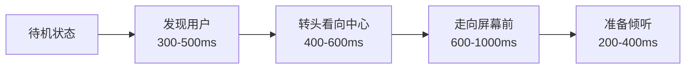
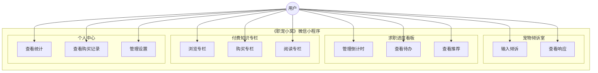
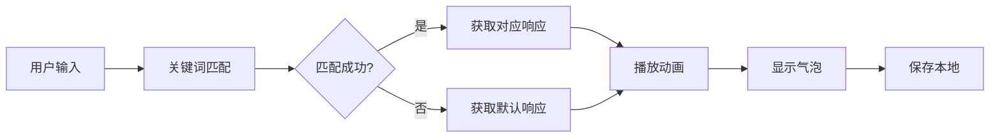
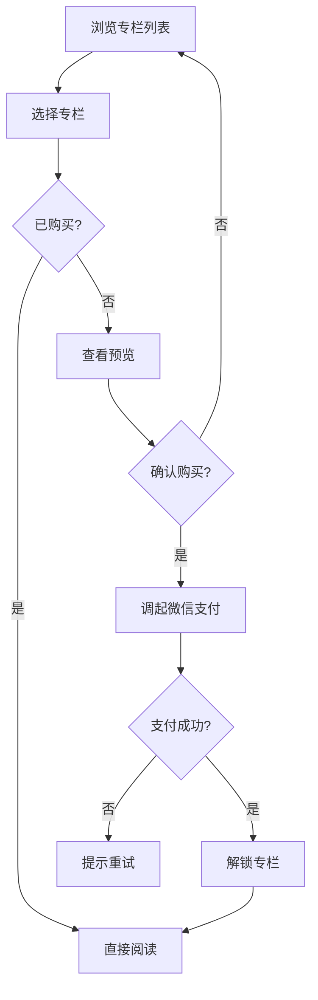
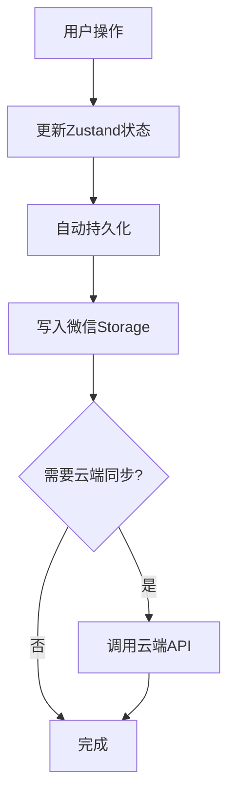

# 《职宠小窝》微信小程序 需求规格说明书

**文档编号：** SRS-JOBPET-MP-001  
**版本号：** v1.0  
**编写日期：** 2026-03-17  
**文档状态：** 正式发布  

---

## 修订历史

| 版本 | 日期 | 修订人 | 修订内容 |
|------|------|--------|----------|
| v1.0 | 2026-03-17 | 架构师 | 初始版本 |
| v1.1 | 2026-03-17 | 架构师 | 新增MP06宠物私人空间模块 |

---

## 目录

1. [引言](#1-引言)
2. [总体描述](#2-总体描述)
3. [功能需求](#3-功能需求)
4. [非功能需求](#4-非功能需求)
5. [用例图](#5-用例图)
6. [业务流程图](#6-业务流程图)
7. [附录](#7-附录)

---

## 1. 引言

### 1.1 目的

本文档旨在明确《职宠小窝》微信小程序的功能需求和非功能需求，为开发团队提供清晰的开发指导，为测试团队提供验收标准，为项目管理人员提供范围基准。

### 1.2 范围

本文档覆盖《职宠小窝》微信小程序的全部功能需求，包括：
- 宠物倾诉室（核心模块）
- 求职进度看板
- 付费知识专栏
- 个人中心

### 1.3 产品定位

微信小程序定位为**独立产品**，目标用户为**即将毕业/刚刚毕业的大学生**，与APP形成差异化：
- **小程序**：轻量化、快速体验、付费知识专栏
- **APP**：完整功能、云端同步、彼岸公园社交

### 1.4 定义与缩写

| 术语/缩写 | 定义 |
|-----------|------|
| 小程序 | 微信小程序 |
| Taro | 多端统一开发框架 |
| 咕咕鸟 | 产品核心宠物形象 |
| 专栏 | 付费知识内容模块 |

### 1.5 参考文献

1. 《职宠小窝》APP 产品全案（V3.1 迭代修订版）
2. 《职宠小窝付费专栏内容清单（优化版）》
3. IEEE 830-1998 软件需求规格说明推荐实践

---

## 2. 总体描述

### 2.1 产品视角

《职宠小窝》微信小程序是一款面向即将毕业/刚刚毕业大学生的治愈型陪伴应用，通过轻拟人电子宠物实现情感陪伴，并提供实用的毕业求职知识专栏服务。

### 2.2 产品定位

- **核心定位**：轻拟人电子宠物 + 自然语言倾诉 + 毕业求职知识专栏
- **Slogan**：倾诉即陪伴，毕业不迷茫
- **差异化优势**：
  - 与APP不同：无工作岗位聚合，专注付费知识专栏
  - 内容静态化：专栏内容打包在小程序内，减少网络依赖
  - 轻量化体验：快速启动，即用即走

### 2.3 用户特征

| 用户类型 | 年龄段 | 特征描述 | 核心需求 |
|----------|--------|----------|----------|
| 应届毕业生 | 21-25岁 | 即将毕业的大学生 | 情绪陪伴、毕业手续指导、求职知识 |
| 考公考研党 | 22-28岁 | 准备考公/考研的学生 | 压力释放、备考入门知识 |
| 职场新人 | 22-26岁 | 刚入职场的毕业生 | 劳动权益保护、五险一金知识 |

### 2.4 约束条件

#### 2.4.1 技术约束

| 约束项 | 约束内容 |
|--------|----------|
| 前端框架 | Taro 4.x + React 18 |
| 状态管理 | Zustand |
| 样式方案 | Sass |
| 本地存储 | 微信小程序Storage |
| 包体积限制 | 主包 ≤ 2MB，总包 ≤ 20MB |

#### 2.4.2 合规约束

| 约束项 | 约束内容 |
|--------|----------|
| 微信审核 | 符合微信小程序审核规范 |
| 支付合规 | 使用微信支付 |
| 内容审核 | 付费内容需通过审核 |
| 隐私保护 | 符合《个人信息保护法》要求 |

### 2.5 假设与依赖

| 假设/依赖 | 说明 |
|-----------|------|
| 微信平台稳定 | 微信小程序服务可用性 > 99.9% |
| 用户网络环境 | 用户设备具备网络连接能力（专栏购买时） |
| 内容更新周期 | 专栏内容每季度更新一次 |

---

## 3. 功能需求

### 3.1 功能模块总览

```
职宠小窝 微信小程序
├── MP01 宠物倾诉室（核心）
│   ├── MP01.01 自然语言输入
│   ├── MP01.02 简化意图识别
│   ├── MP01.03 宠物响应
│   └── MP01.04 本地对话记录
├── MP02 求职进度看板
│   ├── MP02.01 倒计时管理
│   ├── MP02.02 高频待办
│   ├── MP02.03 智能推荐
│   └── MP02.04 咕咕小贴士
├── MP03 付费知识专栏
│   ├── MP03.01 专栏列表展示
│   ├── MP03.02 专栏详情预览
│   ├── MP03.03 专栏购买
│   └── MP03.04 专栏阅读
├── MP04 个人中心
│   ├── MP04.01 用户信息展示
│   ├── MP04.02 求职统计
│   ├── MP04.03 购买记录
│   └── MP04.04 设置管理
├── MP05 基础服务
│   ├── MP05.01 微信登录
│   ├── MP05.02 微信支付
│   └── MP05.03 数据本地存储
└── MP06 宠物私人空间（V1.1新增）
    ├── MP06.01 待机状态系统
    ├── MP06.02 进入动画序列
    ├── MP06.03 场景系统
    └── MP06.04 状态机管理
```

---

### 3.2 MP01 宠物倾诉室

#### 3.2.1 MP01.01 自然语言输入

**功能描述**：用户通过文字向宠物倾诉求职相关的情绪和行为。

**输入方式**：
| 方式 | 说明 |
|------|------|
| 文字输入 | 键盘输入，无字数限制 |

**交互规范**：
- 输入框位于宠物下方
- 无发送按钮，点击"发送"或回车提交
- 支持多行输入

**需求ID**：MP01.01  
**优先级**：P0  
**验收标准**：
- [ ] 文字输入功能正常
- [ ] 输入后即时触发响应

---

#### 3.2.2 MP01.02 简化意图识别

**功能描述**：系统通过关键词规则匹配识别用户的情绪状态。

**可识别情绪类型（5类）**：

| 情绪类型 | 关键词示例 | 响应类型 |
|----------|------------|----------|
| 疲惫/压力 | 累、疲、倦、撑、崩、烦、难、苦、压力 | 安慰鼓励 |
| 面试相关 | 面试、hr、HR、笔试、offer、Offer | 积极鼓励 |
| 求职受挫 | 拒、没过、挂、凉、凉凉、拒绝、失败 | 温暖安慰 |
| 开心/成功 | 开心、高兴、棒、好消息、发、拿到、通过 | 分享喜悦 |
| 迷茫/困惑 | 不知道、迷茫、迷失、找不到、方向 | 引导陪伴 |

**需求ID**：MP01.02  
**优先级**：P0  
**验收标准**：
- [ ] 5类情绪识别准确率 > 80%
- [ ] 识别响应时间 < 100ms

---

#### 3.2.3 MP01.03 宠物响应

**功能描述**：宠物根据识别结果触发对应动作和气泡回应。

**宠物形象规范**：
- 风格：Q版轻拟人咕咕鸟（企鹅形象）
- 颜色：主色调紫色系
- 设计：无口设计，仅靠动作+表情表达情绪

**动作与气泡映射表**：

| 用户情绪 | 宠物动作 | 气泡内容示例 |
|----------|----------|--------------|
| 疲惫/压力 | 安静陪伴 | 累了就歇歇，你已经很努力了 🤍 |
| 面试相关 | 开心跳跃 | 面试官看到你一定会心动的！✨ |
| 求职受挫 | 温暖拥抱 | 他们眼光有问题！你是最棒的 🫂 |
| 开心/成功 | 撒花庆祝 | 太好了！咕咕也为你感到超级开心~ 🎉 |
| 迷茫/困惑 | 轻轻靠过来 | 迷茫也没关系，每一步都算数的 🌟 |
| 默认 | 点头 | 嗯嗯，我都听到了 🐧 |

**需求ID**：MP01.03  
**优先级**：P0  
**验收标准**：
- [ ] 动画流畅度 > 30fps
- [ ] 气泡显示位置正确

---

#### 3.2.4 MP01.04 本地对话记录

**功能描述**：系统将对话记录存储在本地。

**存储内容**：
| 字段 | 说明 |
|------|------|
| id | 消息唯一标识 |
| role | 角色（user/pet） |
| content | 消息内容 |
| timestamp | 时间戳 |

**存储策略**：
- 使用微信小程序Storage存储
- 通过Zustand持久化中间件自动同步
- 最大保存100条历史消息

**需求ID**：MP01.04  
**优先级**：P1  
**验收标准**：
- [ ] 对话记录持久化存储
- [ ] 应用重启后数据保留

---

### 3.3 MP02 求职进度看板

#### 3.3.1 MP02.01 倒计时管理

**功能描述**：用户可添加、查看、删除重要日期倒计时。

**倒计时类型**：
| 类型 | 颜色标识 | 说明 |
|------|----------|------|
| 春招 | 粉色 | 春季招聘相关 |
| 答辩 | 蓝色 | 毕业答辩 |
| 入职 | 绿色 | 入职日期 |
| 毕业 | 紫色 | 毕业典礼 |

**功能操作**：
- 添加倒计时（标题、日期、颜色）
- 查看倒计时列表
- 长按删除倒计时

**需求ID**：MP02.01  
**优先级**：P1  
**验收标准**：
- [ ] 倒计时计算正确
- [ ] 支持增删操作

---

#### 3.3.2 MP02.02 高频待办

**功能描述**：展示求职相关的高频待办事项。

**待办分类**：
- 简历相关
- 面试准备
- 材料准备
- 手续办理

**需求ID**：MP02.02  
**优先级**：P2  
**验收标准**：
- [ ] 待办列表展示正确
- [ ] 支持勾选完成

---

#### 3.3.3 MP02.03 智能推荐

**功能描述**：展示精选岗位推荐（静态数据）。

**展示内容**：
| 字段 | 说明 |
|------|------|
| 岗位名称 | 职位标题 |
| 公司名称 | 招聘企业 |
| 工作地点 | 城市信息 |

**需求ID**：MP02.03  
**优先级**：P2  
**验收标准**：
- [ ] 推荐列表展示正确
- [ ] 点击可查看详情

---

#### 3.3.4 MP02.04 咕咕小贴士

**功能描述**：轮播展示求职相关的温馨小贴士。

**展示方式**：
- 每5秒自动切换
- 随机展示贴士内容

**需求ID**：MP02.04  
**优先级**：P2  
**验收标准**：
- [ ] 轮播切换正常
- [ ] 内容展示正确

---

### 3.4 MP03 付费知识专栏

#### 3.4.1 MP03.01 专栏列表展示

**功能描述**：展示所有付费专栏的列表。

**专栏分类**：

| 分类 | 说明 | 专栏示例 |
|------|------|----------|
| 清单/流程 | 整理好的清单和步骤 | 毕业补贴领取指南、考公入门流程 |
| 模板 | 可直接套用的模板 | 简历模板、合同自查模板 |
| 避坑指南 | 防错避坑指南 | 劳动合同避坑、五险一金避坑 |

**专栏信息展示**：
| 字段 | 说明 |
|------|------|
| 标题 | 专栏名称 |
| 描述 | 专栏简介 |
| 价格 | 购买价格 |
| 作者 | 内容作者 |
| 阅读量 | 阅读统计 |
| 封面图 | 专栏封面 |

**需求ID**：MP03.01  
**优先级**：P0  
**验收标准**：
- [ ] 专栏列表展示完整
- [ ] 支持分类筛选

---

#### 3.4.2 MP03.02 专栏详情预览

**功能描述**：用户可预览专栏部分内容。

**预览规则**：
- 每个专栏提供部分内容免费预览
- 未购买用户显示购买引导
- 已购买用户直接进入阅读

**需求ID**：MP03.02  
**优先级**：P0  
**验收标准**：
- [ ] 预览内容展示正确
- [ ] 购买状态判断正确

---

#### 3.4.3 MP03.03 专栏购买

**功能描述**：用户通过微信支付购买专栏。

**定价方案**：
| 类型 | 价格 | 说明 |
|------|------|------|
| 单个专栏 | 9.9-19.9元 | 根据内容价值定价 |
| 组合套餐 | 24.9-29.9元 | 相关专栏打包 |
| 全部打包 | 49.9元 | 所有专栏 |

**支付流程**：
1. 用户选择专栏
2. 确认购买
3. 调起微信支付
4. 支付成功后解锁内容

**需求ID**：MP03.03  
**优先级**：P0  
**验收标准**：
- [ ] 微信支付流程正确
- [ ] 支付成功后立即解锁

---

#### 3.4.4 MP03.04 专栏阅读

**功能描述**：用户阅读已购买的专栏内容。

**阅读功能**：
- 图文混排展示
- 支持滚动阅读
- 记录阅读进度（本地）

**需求ID**：MP03.04  
**优先级**：P1  
**验收标准**：
- [ ] 内容展示正确
- [ ] 阅读体验流畅

---

### 3.5 MP04 个人中心

#### 3.5.1 MP04.01 用户信息展示

**功能描述**：展示用户基本信息和宠物状态。

**展示内容**：
| 字段 | 说明 |
|------|------|
| 头像 | 用户头像（微信头像） |
| 昵称 | 用户昵称（微信昵称） |
| 状态 | 当前求职状态 |

**需求ID**：MP04.01  
**优先级**：P1  
**验收标准**：
- [ ] 用户信息展示正确
- [ ] 支持微信授权获取

---

#### 3.5.2 MP04.02 求职统计

**功能描述**：展示用户的求职行为统计数据。

**统计维度**：
| 维度 | 统计内容 |
|------|----------|
| 求职天数 | 累计求职天数 |
| 投递数量 | 简历投递数 |
| 面试数量 | 面试次数 |

**需求ID**：MP04.02  
**优先级**：P1  
**验收标准**：
- [ ] 统计数据展示正确

---

#### 3.5.3 MP04.03 购买记录

**功能描述**：展示用户的专栏购买记录。

**展示内容**：
- 已购买专栏列表
- 购买时间
- 购买金额

**需求ID**：MP04.03  
**优先级**：P1  
**验收标准**：
- [ ] 购买记录展示正确

---

#### 3.5.4 MP04.04 设置管理

**功能描述**：用户可管理应用设置。

**设置项**：
| 设置项 | 说明 |
|--------|------|
| 深色模式 | 切换深色/浅色主题 |
| 清除数据 | 清除本地存储数据 |
| 关于我们 | 应用信息 |

**需求ID**：MP04.04  
**优先级**：P2  
**验收标准**：
- [ ] 设置功能正常

---

### 3.6 MP05 基础服务

#### 3.6.1 MP05.01 微信登录

**功能描述**：用户通过微信授权登录。

**登录流程**：
1. 用户点击登录
2. 调用wx.login获取code
3. 后端换取openid和session_key
4. 存储用户信息

**需求ID**：MP05.01  
**优先级**：P0  
**验收标准**：
- [ ] 登录流程正确
- [ ] 用户信息存储正确

---

#### 3.6.2 MP05.02 微信支付

**功能描述**：专栏购买支付功能。

**支付流程**：
1. 创建订单
2. 调起微信支付
3. 支付结果回调
4. 更新购买状态

**需求ID**：MP05.02  
**优先级**：P0  
**验收标准**：
- [ ] 支付流程正确
- [ ] 支付结果处理正确

---

#### 3.6.3 MP05.03 数据本地存储

**功能描述**：使用微信小程序Storage进行本地数据存储。

**存储内容**：
| 数据类型 | 存储方式 |
|----------|----------|
| 用户信息 | Zustand持久化 |
| 对话记录 | Zustand持久化 |
| 倒计时 | Zustand持久化 |
| 购买记录 | 云端同步+本地缓存 |

**需求ID**：MP05.03  
**优先级**：P0  
**验收标准**：
- [ ] 数据持久化正常
- [ ] 数据读取正确

---

### 3.7 MP06 宠物私人空间（V1.1新增）

#### 3.7.1 MP06.01 待机状态系统

**功能描述**：宠物在用户未进入时处于随机待机状态，模拟宠物自己的"生活"。

**待机状态类型**：

| 状态ID | 状态名称 | 触发权重 | 持续时间 | 位置描述 |
|--------|----------|----------|----------|----------|
| sleeping | 睡觉 | 20% | 10-30秒 | 左下角床铺位置 |
| reading | 看书 | 18% | 8-20秒 | 书桌位置 |
| eating | 吃东西 | 15% | 5-15秒 | 餐桌位置 |
| playing | 玩耍 | 15% | 6-18秒 | 中央区域 |
| walking | 散步 | 12% | 8-25秒 | 移动路径 |
| dreaming | 发呆 | 20% | 5-15秒 | 随机位置 |

**状态选择规则**：
- 加权随机选择，避免重复
- 同一状态冷却时间30秒

**需求ID**：MP06.01  
**优先级**：P0  
**验收标准**：
- [ ] 6种待机状态可正常展示
- [ ] 状态切换流畅
- [ ] 权重分布符合设计

---

#### 3.7.2 MP06.02 进入动画序列

**功能描述**：用户进入宠物栏时，宠物执行"发现用户→走向屏幕前"的动画序列。

**动画序列流程**：



**动画配置**：

| 阶段 | 动画名称 | 持续时间 | 视觉效果 |
|------|----------|----------|----------|
| 1 | 发现用户 | 300-500ms | 轻微放大、抬头 |
| 2 | 转头 | 400-600ms | 转向屏幕中心 |
| 3 | 走向用户 | 600-1000ms | 移动到屏幕中央偏上 |
| 4 | 准备倾听 | 200-400ms | 恢复正常姿态 |

**需求ID**：MP06.02  
**优先级**：P0  
**验收标准**：
- [ ] 动画序列完整执行
- [ ] 总时长约2秒
- [ ] 动画流畅无卡顿

---

#### 3.7.3 MP06.03 场景系统

**功能描述**：宠物私人空间的场景背景和装饰物系统。

**场景层级结构**：

| 层级 | z-index | 内容 |
|------|---------|------|
| 背景层 | 1 | 天空渐变、地板 |
| 装饰层 | 2 | 家具、植物、玩具 |
| 宠物层 | 3 | 宠物主体 |
| 前景层 | 4 | 粒子特效、气泡 |
| UI层 | 5 | 交互按钮 |

**默认场景配置**：
- 场景名称：温馨小窝
- 背景风格：暖色调渐变
- 装饰物：床铺、书架、食物碗、植物

**需求ID**：MP06.03  
**优先级**：P1  
**验收标准**：
- [ ] 场景渲染正确
- [ ] 层级关系正确
- [ ] 装饰物位置合理

---

#### 3.7.4 MP06.04 状态机管理

**功能描述**：管理宠物的状态流转和动画切换。

**状态枚举定义**：

```typescript
enum PetState {
  // 待机状态
  IDLE_SLEEPING = 'sleeping',
  IDLE_READING = 'reading',
  IDLE_EATING = 'eating',
  IDLE_PLAYING = 'playing',
  IDLE_WALKING = 'walking',
  IDLE_DREAMING = 'dreaming',
  
  // 过渡状态
  NOTICING_USER = 'noticing',
  TURNING_HEAD = 'turning',
  APPROACHING = 'approaching',
  
  // 交互状态
  READY_TO_LISTEN = 'ready',
  LISTENING = 'listening',
  RESPONDING = 'responding',
  HAPPY = 'happy',
  SAD = 'sad',
}
```

**状态转换规则**：

| 当前状态 | 可转换状态 | 触发条件 |
|----------|------------|----------|
| 任意待机状态 | NOTICING_USER | 用户进入页面 |
| NOTICING_USER | TURNING_HEAD | 动画完成 |
| TURNING_HEAD | APPROACHING | 动画完成 |
| APPROACHING | READY_TO_LISTEN | 动画完成 |
| READY_TO_LISTEN | LISTENING | 用户输入 |
| LISTENING | RESPONDING | 输入完成 |
| RESPONDING | HAPPY/SAD | 根据情绪识别 |

**需求ID**：MP06.04  
**优先级**：P0  
**验收标准**：
- [ ] 状态转换逻辑正确
- [ ] 无非法状态跳转
- [ ] 状态持久化正常

---

## 4. 非功能需求

### 4.1 性能需求

| 指标 | 要求 | 说明 |
|------|------|------|
| 小程序启动时间 | < 2s | 冷启动 |
| 页面加载时间 | < 500ms | 普通页面 |
| 动画帧率 | > 30fps | 宠物动画 |
| 包体积 | 主包 ≤ 2MB | 微信限制 |

### 4.2 安全需求

| 需求项 | 说明 |
|--------|------|
| 数据传输加密 | HTTPS |
| 支付安全 | 微信支付官方SDK |
| 内容安全 | 付费内容审核通过 |

### 4.3 可用性需求

| 指标 | 要求 |
|------|------|
| 系统可用性 | > 99% |
| 离线可用 | 核心功能支持离线使用 |

### 4.4 兼容性需求

| 平台 | 最低版本 |
|------|----------|
| 微信基础库 | 2.25.0+ |

**屏幕适配**：
- 支持主流屏幕尺寸
- 适配刘海屏、挖孔屏

---

## 5. 用例图

### 5.1 整体用例图



### 5.2 核心用例描述

#### UC-MP-01：倾诉交互

| 项目 | 内容 |
|------|------|
| 用例名称 | 倾诉交互 |
| 参与者 | 用户 |
| 前置条件 | 用户进入宠物倾诉室 |
| 主流程 | 1. 用户输入倾诉内容<br>2. 系统识别情绪<br>3. 宠物触发动作和气泡<br>4. 系统保存对话记录 |
| 后置条件 | 对话记录已保存 |
| 异常流程 | 无网络时仍可使用本地功能 |

#### UC-MP-02：专栏购买

| 项目 | 内容 |
|------|------|
| 用例名称 | 专栏购买 |
| 参与者 | 用户 |
| 前置条件 | 用户已登录微信 |
| 主流程 | 1. 用户浏览专栏列表<br>2. 选择专栏查看详情<br>3. 确认购买<br>4. 完成微信支付<br>5. 解锁专栏内容 |
| 后置条件 | 专栏已解锁 |
| 异常流程 | 支付失败时提示重试 |

---

## 6. 业务流程图

### 6.1 倾诉交互流程



### 6.2 专栏购买流程



### 6.3 数据存储流程



---

## 7. 附录

### 7.1 付费专栏清单

| 专栏名称 | 分类 | 价格 | 核心价值 |
|----------|------|------|----------|
| 毕业补贴领取指南 | 清单/流程 | ¥9.9 | 全国补贴政策汇总+申请模板 |
| 五险一金避坑手册 | 避坑指南 | ¥19.9 | 缴费速查表+计算器+误区解析 |
| 考公小白入门指南 | 清单/流程 | ¥19.9 | 报名流程+材料模板+避坑清单 |
| 毕业手续办理指南 | 清单/流程 | ¥19.9 | 毕业全流程+材料模板 |
| 劳动合同避坑指南 | 避坑指南 | ¥14.9 | 合同自查+维权指南 |
| 情绪陪伴成长计划 | 情绪陪伴 | ¥9.9 | 音频课程+打卡计划 |

### 7.2 小程序与APP功能对比

| 功能模块 | 小程序 | APP |
|----------|--------|-----|
| 宠物倾诉室 | ✅ 简化版 | ✅ 完整版 |
| 意图识别 | 关键词匹配 | AI引擎 |
| 宠物记忆 | ❌ | ✅ Pro功能 |
| 求职看板 | ✅ 基础版 | ✅ 完整版 |
| 岗位聚合 | ❌ | ✅ |
| 付费专栏 | ✅ | ❌ |
| 彼岸公园 | ❌ | ✅ |
| 云端同步 | 仅购买记录 | ✅ 完整同步 |
| 会员体系 | ❌ | ✅ |

### 7.3 术语表

| 术语 | 定义 |
|------|------|
| 咕咕鸟 | 产品核心宠物形象（企鹅） |
| 专栏 | 付费知识内容模块 |
| 倒计时 | 重要日期提醒功能 |
| Taro | 多端统一开发框架 |
| Zustand | 轻量级状态管理库 |

---

**文档结束**

*本文档为《职宠小窝》微信小程序需求规格说明书v1.0版，如有变更请及时更新版本号。*
