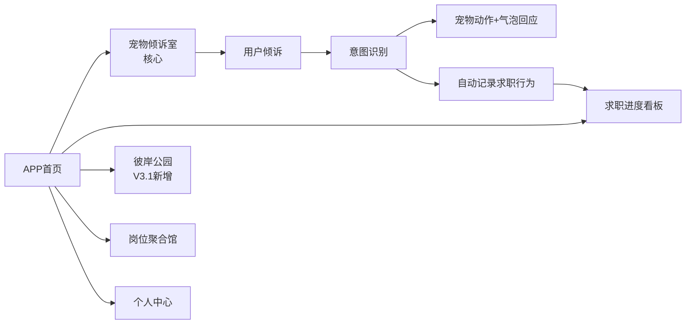
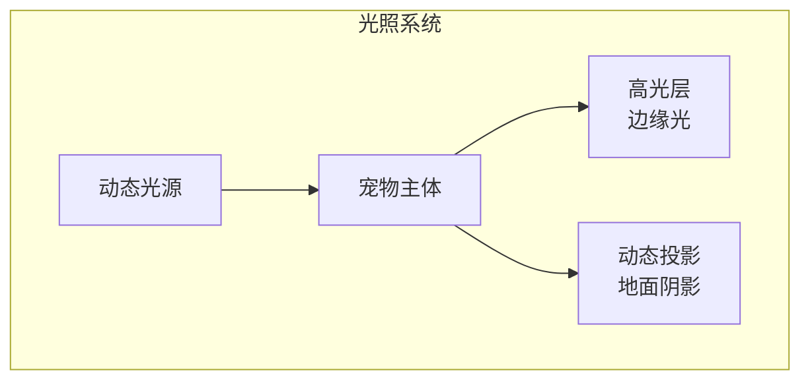
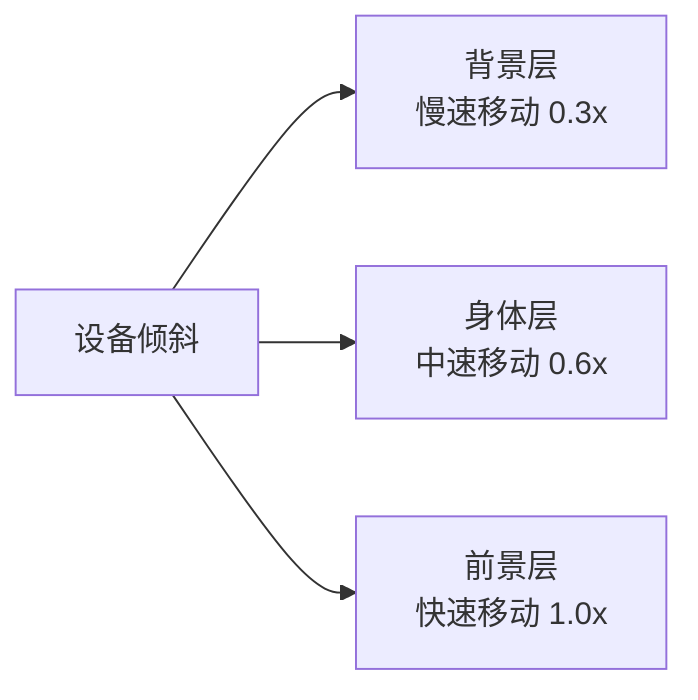
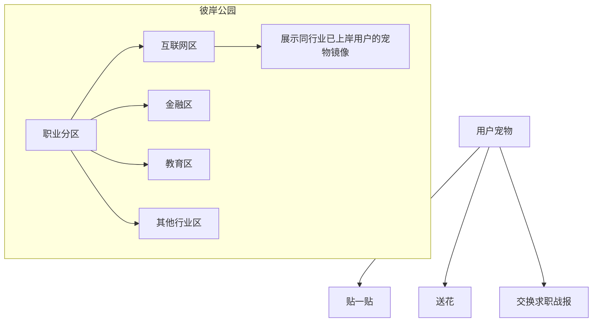
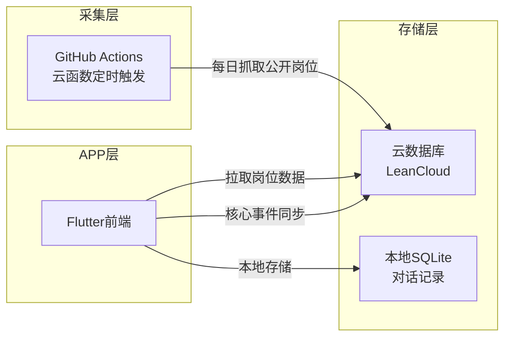
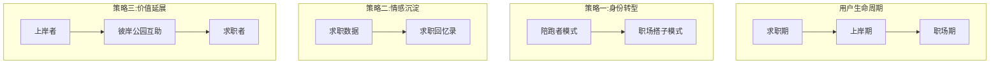

# 《职宠小窝》APP 产品全案（V3.1 迭代修订版）

**文档说明**：本版本（V3.1）在 V3.0 基础上，深度整合了"上岸公园"联机社交体系、云端化技术架构优化、用户全生命周期延长策略及宠物视觉升级方案，包含所有已确认的产品定位、功能设计、技术架构、商业模式及美术规范，无任何待定项，可直接用于开发、美术对接、项目落地及团队同步，兼容Word、WPS导出，支持编辑修改。

------

# 一、项目核心定位（V3.1 更新）

## 1.1 基础信息

- **产品名称**：职宠小窝（JobPet）
- **Slogan**：倾诉即记录，上岸不孤单
- **产品定位**：轻拟人电子宠物 + 自然语言倾诉 + 求职行为自动记录 + 上岸者低压力社交（治愈型求职陪伴APP）
- **目标人群**：22-35岁裸辞/待业/求职过渡期青年，及已通过本平台"上岸"的职场新兵

## 1.2 核心边界（明确不做）

- **不做招聘平台**：不搭建岗位流量池，不负责招聘对接
- **不做自动操作**：不代投简历、不模拟登录第三方招聘平台、不爬虫用户个人账号信息
- **不做职场培训**：不灌鸡汤、不做深度面试培训，仅提供轻量辅助工具
- **不做强制打卡**：无任何强制操作要求，完全以用户自愿倾诉为核心

## 1.3 核心价值

解决求职人群三大核心痛点：情绪低谷缺乏陪伴、求职过程无仪式感、投递进度管理混乱；以"无口萌系宠物"为载体，实现"倾诉即记录"，兼顾情绪治愈与轻量实用，打造高粘性、低压力的求职陪伴体验。

------

# 二、关键确认信息汇总（无待定项）

| 确认类别 | 最终确认内容 |
| --- | --- |
| 宠物形象 | 求职咕咕鸟（轻拟人，参考短视频《咕咕嘎嘎》《我的刀盾》，2-3头身，软萌Q版） |
| 气泡位置 | 宠物右侧贴边小气泡，不遮挡宠物主体，保证沉浸感 |
| 宠物表现形式 | 无口设计（不张嘴、不说话、无说话动画），仅靠动作+表情表达情绪，气泡仅1-3字/符号（不超过3字） |
| 倾诉容错机制 | 不支持撤回/修改，默认用户真诚倾诉，不增加额外操作成本 |
| 负面情绪处理 | 仅用温柔动作+极简气泡陪伴，不跳转外部心理资源、不做说教 |
| 宠物记忆长度 | Pro版：记住最近20轮对话的关键信息（求职相关，过滤无关废话） |
| 核心数据表 | interactions（对话记录）、job_applications（求职事件）、user_profile（用户画像+宠物记忆） |

------

# 三、核心功能架构（V3.1 完整版）

## 3.1 功能总览图



**核心逻辑**：用户倾诉 → 系统识别意图 → 宠物动作+极简气泡回应 → 自动记录求职行为 → 同步至进度看板

## 3.2 核心模块详细设计

### 模块一：宠物倾诉室（核心创新，APP唯一入口）

#### 3.2.1 交互逻辑（无按钮、无表单）

1. 用户通过打字/语音，向宠物自然倾诉求职相关的情绪、行为（如"今天投了3份简历""面试被拒了"）；
2. 系统通过关键词规则引擎，识别用户的求职行为（投递/面试/拒信等）和情绪（正向/负向/中性）；
3. 宠物触发对应动作+极简气泡，不进行任何长文本回复；
4. 系统自动将识别到的求职行为，静默写入后台数据库，无需用户手动操作。

#### 3.2.2 可识别求职行为（固定6类）

| 行为类别 | 触发关键词 |
| --- | --- |
| 简历投递 | 投了、投递、发简历、海投、投了几份 |
| 收到面试 | 面试、邀约、叫我去面试、进面 |
| 求职被拒 | 拒了、没通过、不合适、拒信、挂了 |
| 拿到Offer | offer、录用、录取、通过了、上班 |
| 摆烂/休息 | 没投、躺平、摆烂、没看、不想动 |
| 焦虑/低落 | 烦、难过、崩溃、焦虑、迷茫、没用 |

#### 3.2.3 宠物形象与交互规范（美术直接参考）

##### 1. 形象规范

- **风格**：Q版轻拟人咕咕鸟，2-3头身，身体圆润柔软，翅膀小巧，头部特征显著（鸟类嘴型、圆眼睛）；
- **颜色**：以浅色系为主（米白、浅蓝、浅黄），视觉柔和，符合治愈调性；
- **细节**：无复杂装饰，无多余肢体设计，动作低幅度、高情绪感。

##### 2. 动作与气泡映射表（核心，开发+美术直接用）

| 用户行为/情绪 | 宠物动作 | 气泡内容（≤3字/符号） |
| --- | --- | --- |
| 投递简历 | 翅膀拍拍、点头、递小信封 | 嗯！ |
| 收到面试 | 跳一下、翅膀张开、眼睛变亮 | ！！ |
| 求职被拒 | 低头、耳朵耷拉、蹭一蹭/抱手臂 | 呜… |
| 拿到Offer | 转圈、撒小花/星星、开心扑腾 | ♡♡♡ |
| 摆烂/休息 | 安静坐下、陪蹲、发呆 | … |
| 焦虑/低落 | 轻轻靠过来、摸头动作、温柔待机 | 🫂 |

##### 3. 动态进化机制（V3.1 新增）

宠物随求职进度进化，拿到 Offer 后，咕咕鸟可解锁"职场形态"（如领带、工位背景），实现从"陪跑者"向"职场搭子"的功能过渡。

#### 3.2.4 宠物视觉升级方案（伪3D效果）

##### 1. 方案概述

在不引入3D引擎的前提下，通过**阴影 + 视差 + 动态光照**组合方案，让2D宠物呈现立体感，提升视觉品质。

| 方案 | 效果评分 | 时间成本 | 技术难度 | 是否需要重制动画 |
| --- | --- | --- | --- | --- |
| 阴影+光照 | ⭐⭐⭐ | 1-2周 | 低 | 否（叠加层） |
| 视差效果 | ⭐⭐⭐⭐ | 1周 | 低 | 是（需分层） |
| 动态光照 | ⭐⭐⭐ | 3-5天 | 低 | 否 |
| **组合方案** | ⭐⭐⭐⭐⭐ | **2-3周** | **中** | **只需分层，无需重制** |

##### 2. 技术实现细节

**（1）阴影 + 光照系统**

通过动态阴影和光照，让2D宠物产生"立体感"：



Flutter实现示例：

```dart
Stack(
  children: [
    // 1. 阴影层 - 模拟地面投影
    Positioned(
      bottom: 0,
      child: Container(
        decoration: BoxDecoration(
          boxShadow: [
            BoxShadow(
              color: Colors.black.withOpacity(0.2),
              blurRadius: 20,
              spreadRadius: 5,
              offset: Offset(5, 10), // 光源方向
            ),
          ],
        ),
        child: Lottie.asset('assets/pet_shadow.json'),
      ),
    ),
    // 2. 宠物主体
    Lottie.asset('assets/pet_main.json'),
    // 3. 高光层 - 边缘光
    Positioned(
      top: 0,
      child: Lottie.asset('assets/pet_highlight.json'),
    ),
  ],
)
```

**（2）视差效果（Parallax）**

让宠物不同部位以不同速度响应设备倾斜，产生"立体感"：



Flutter实现示例：

```dart
class ParallaxPet extends StatefulWidget {
  @override
  State<ParallaxPet> createState() => _ParallaxPetState();
}

class _ParallaxPetState extends State<ParallaxPet> {
  double _offsetX = 0;
  double _offsetY = 0;
  
  @override
  void initState() {
    super.initState();
    // 监听设备陀螺仪
    accelerometerEvents.listen((event) {
      setState(() {
        _offsetX = event.x * 5; // 灵敏度调整
        _offsetY = event.y * 5;
      });
    });
  }
  
  @override
  Widget build(BuildContext context) {
    return Stack(
      children: [
        // 背景层 - 移动幅度小
        Transform.translate(
          offset: Offset(_offsetX * 0.3, _offsetY * 0.3),
          child: Lottie.asset('assets/pet_bg.json'),
        ),
        // 身体层 - 中等移动
        Transform.translate(
          offset: Offset(_offsetX * 0.6, _offsetY * 0.6),
          child: Lottie.asset('assets/pet_body.json'),
        ),
        // 前景层（眼睛/装饰）- 移动幅度大
        Transform.translate(
          offset: Offset(_offsetX, _offsetY),
          child: Lottie.asset('assets/pet_face.json'),
        ),
      ],
    );
  }
}
```

**（3）动态光照效果**

根据时间变化光源位置，模拟自然光照：

```dart
class DynamicLighting extends StatelessWidget {
  final double lightAngle; // 0-360度
  
  @override
  Widget build(BuildContext context) {
    return ShaderMask(
      shaderCallback: (bounds) {
        return LinearGradient(
          begin: Alignment(
            cos(lightAngle) * 0.5,
            sin(lightAngle) * 0.5,
          ),
          end: Alignment(-cos(lightAngle) * 0.5, -sin(lightAngle) * 0.5),
          colors: [
            Colors.white.withOpacity(0.3), // 高光
            Colors.transparent,
            Colors.black.withOpacity(0.2), // 阴影
          ],
        ).createShader(bounds);
      },
      child: Lottie.asset('assets/pet.json'),
    );
  }
}
```

##### 3. 实施步骤

| 阶段 | 工作内容 | 预计时间 |
| --- | --- | --- |
| 第一阶段 | 将现有Lottie动画拆分为3层（背景/身体/前景） | 3-5天 |
| 第二阶段 | 添加动态阴影组件 | 2-3天 |
| 第三阶段 | 接入陀螺仪实现视差效果 | 3-5天 |
| 第四阶段 | 添加动态光照效果 | 2-3天 |
| 第五阶段 | 整体调优与测试 | 2-3天 |

##### 4. 资源需求

- **动画分层**：需将现有6个动作动画拆分为3层（共18个动画文件）
- **依赖库**：`sensors_plus`（陀螺仪）、现有Lottie库
- **包体积增量**：约 +2-3MB

#### 3.2.5 宠物短期记忆功能（Pro版独占）

- **记忆范围**：记住最近20轮对话中的求职相关关键信息（过滤"喝水、吃饭"等无关内容）；
- **记忆内容**：面试时间/公司、求职方向、近期情绪状态、用户提及的小目标；
- **触发逻辑**：记忆不影响气泡内容，仅影响宠物动作倾向（例：用户说明天有面试，后续倾诉时，宠物会表现出"担心、鼓励"的动作）；
- **主动关怀**（V3.1 新增）：Pro版支持主动关怀提醒，如面试日提醒、投递鼓励等；
- **技术实现**：在user_profile表中增加memory字段，存储最近20轮对话的关键信息，每次对话后更新，回复前读取匹配。

### 模块二：求职进度看板（数据支撑）

- **数据来源**：基于用户倾诉自动生成，无需手动录入；
- **核心内容**：
  - **统计面板**：今日/本周/月度投递数、面试数、拒信数、Offer数；
  - **数据曲线**：周/月度求职行为趋势图，直观展示用户努力进度；
  - **成就徽章**：坚持投递（连续7天投递）、面试达人（累计5次面试）、Offer解锁（拿到1份Offer）等，强化用户自我认同。

### 模块三：岗位聚合馆（合规定稿）

- **数据来源**：从"本地脚本"升级为 **GitHub Actions / 云函数定时触发**，每日自动抓取公开岗位信息并写入云数据库，确保数据实时性与无人值守；
- **展示规则**：每日推送少量精准岗位，不轰炸用户，仅展示核心信息（岗位名称、公司名称、薪资范围、核心要求、官方跳转链接）；
- **跳转逻辑**：点击"查看详情"，直接跳转至第三方招聘平台官网，APP内不提供任何投递入口，规避合规风险；
- **合规说明**：仅抓取公开岗位列表，不爬取用户个人数据、聊天记录、简历信息，APP内添加免责声明（岗位信息来源于第三方公开平台，仅做展示）。

### 模块四：轻量工具库（增值服务）

- **简历关键词检测**（Pro版）：用户输入简历文本，系统通过关键词匹配，提示缺少的核心竞争力词（如"项目经验""技能亮点"）；
- **面试倒计时**（Pro版）：根据用户倾诉的面试时间，自动生成倒计时提醒，不强制弹窗，仅在首页轻微提示；
- **免费版限制**：不开放任何工具功能，仅保留核心陪伴与记录功能。

### 模块五：个人中心与付费体系

- **基础功能**：用户画像设置（求职意向、城市、薪资期望）、APP设置（消息提醒、气泡样式）、付费开通入口；
- **付费体系**：免费版 + Pro版（内购/订阅），具体权益见"商业模式"章节。

### 模块六：彼岸公园（Victory Park - V3.1 新增联机社交）

#### 3.2.6.1 解锁机制

用户识别到"拿到 Offer"关键词并同步至看板后开启，Pro版用户可通过"访客模式"提前进入公园汲取能量。

#### 3.2.6.2 电子遛弯（异步社交）



- 公园内展示同行业已上岸用户的宠物镜像，降低服务器同步压力；
- **职业分区**：根据用户画像中的"求职意向"进行区域分配，增加同频共鸣。

#### 3.2.6.3 无言交互

宠物间仅支持"贴一贴"、"送花"、"交换求职战报"等轻量肢体动作，延续"无口设计"。

#### 3.2.6.4 情感反哺

上岸用户可在公园"许愿树"下为求职中的咕咕们留下"鼓励信封"，随机掉落给处于"焦虑"状态的求职用户。

------

# 四、技术架构（V3.1 精准化升级）

## 4.1 整体架构



本地爬虫脚本 → 免费云数据库 → APP前端（双端兼容），无需自建服务器，降低开发与维护成本。

## 4.2 各环节技术实现

### 1. 岗位数据采集与存储

- **爬虫层**：GitHub Actions / 云函数定时（每日1次）抓取第三方招聘平台公开岗位信息，仅抓取岗位列表页核心内容（不深入个人中心）；
- **数据清洗**：脚本自动过滤无效岗位（过期、虚假），提取核心字段（岗位、公司、薪资、要求、链接）；
- **存储层**：上传至免费云数据库（推荐LeanCloud、Appwrite、腾讯云开发数据库），免费额度完全满足初期用户需求；
- **APP层**：仅从云数据库拉取数据展示，不进行任何网络爬取操作，规避反爬与合规风险。

### 2. 自然语言意图识别

- **初期方案**：关键词规则引擎，配置对应行为的关键词库，匹配成功后触发对应宠物动作与记录逻辑，开发难度极低，新手可快速实现；
- **V3.1 优化**：引入"前置否定词过滤"逻辑（如识别"没投"、"没过"），提升行为记录的准确性；
- **后期升级**：接入轻量级大模型（如通义千问-7B），优化语义理解精度（如识别模糊表述"今天投了几家"），不影响初期落地。

### 3. 宠物记忆实现

- **数据存储**：在user_profile表中新增memory字段，存储最近20轮对话的关键信息（结构化存储，如"面试时间：2026-04-01 15:00"）；
- **更新逻辑**：每次用户倾诉后，系统提取关键信息，更新memory字段，保留最后20轮内容，自动覆盖最早一轮；
- **匹配逻辑**：用户每次倾诉后，系统先读取memory字段，匹配相关信息，调整宠物动作倾向，不影响气泡内容。

### 4. 前端技术栈

推荐Flutter或React Native，实现iOS、安卓双端一致性，开发效率高，适配移动端交互，降低双端开发成本。

### 5. 本地优先存储策略（V3.1 新增）

采用 **SQLite 本地存储 + 差异化云端同步**。对话记录优先存在手机本地以保证交互零延迟，核心事件同步云端。

## 4.3 核心数据表设计（V3.1 扩充版）

### 表1：interactions（对话交互记录表）

| 字段名称 | 字段类型 | 字段说明 |
| --- | --- | --- |
| id | 字符串 | 对话唯一标识 |
| user_id | 字符串 | 用户唯一标识 |
| user_content | 文本 | 用户倾诉的原话 |
| action_type | 字符串 | 识别出的求职行为（投递/面试/拒信等） |
| emotion_type | 字符串 | 识别出的情绪（正向/负向/中性） |
| pet_action | 字符串 | 宠物触发的动作ID |
| pet_bubble | 字符串 | 宠物气泡内容 |
| create_time | 时间戳 | 对话发生时间 |

### 表2：job_applications（求职事件记录表）

| 字段名称 | 字段类型 | 字段说明 |
| --- | --- | --- |
| id | 字符串 | 事件唯一标识 |
| user_id | 字符串 | 用户唯一标识 |
| event_type | 字符串 | 事件类型（投递/面试/拒信/Offer/摆烂） |
| event_content | 文本 | 事件核心信息（如"面试公司：XX科技"） |
| event_time | 时间戳 | 事件发生时间 |

### 表3：user_profile（用户画像+宠物记忆表 - V3.1 扩充）

| 字段名称 | 字段类型 | 字段说明 |
| --- | --- | --- |
| user_id | 字符串 | 用户唯一标识 |
| user_name | 字符串 | 用户昵称 |
| job_intention | 字符串 | 求职意向（如"前端开发"） |
| city | 字符串 | 求职城市 |
| salary_expect | 字符串 | 薪资期望（如"8k-12k"） |
| pet_memory | 文本 | 宠物记忆内容（最近20轮对话关键信息） |
| vip_status | 布尔值 | 是否为Pro版用户（true/false） |
| vip_expire_time | 时间戳 | Pro版过期时间（非Pro用户为空） |
| **is_onboarded** | 布尔值 | **是否已上岸（V3.1新增）** |
| **industry_tag** | 字符串 | **行业标签，用于公园分区（V3.1新增）** |
| **onboarding_report** | 文本 | **求职阶段纪念总结数据（V3.1新增）** |

------

# 五、商业模式（V3.1 优化版）

## 5.1 盈利核心：从"工具付费"向"情感深度陪伴"转型

将 Pro 版定义为"深度陪伴版"，强调宠物的记忆力与主动关怀能力。

## 5.2 免费版 vs Pro版 权益对比

| 功能权益 | 免费版（基础陪伴） | Pro版（深度/社交增值） |
| --- | --- | --- |
| 基础宠物形象（咕咕鸟） | ✅ | ✅ |
| 自然语言倾诉+动作回应 | ✅ | ✅ |
| 求职行为自动记录 | ✅ | ✅ |
| 求职记录/岗位推送 | 5条/天，基础记录 | 20条/天 + 精准匹配 |
| 求职进度看板 | 基础统计（数量） | 完整统计（曲线+徽章） |
| 宠物短期记忆（最近20轮） | ❌ | ✅ **+ 主动关怀提醒**（如：面试日提醒） |
| 简历关键词检测 | ❌ | ✅ |
| 面试倒计时提醒 | ❌ | ✅ |
| 宠物皮肤/动态特效 | ❌ | ✅ **职场工位装扮 + 季节限定皮肤** |
| **彼岸公园** | 上岸后解锁 | **"访客模式"**：未上岸可提前进入公园汲取能量 |
| **情感档案馆** | ❌ | **《求职回忆录》自动生成与导出** |

## 5.3 定价建议（全平台通用）

- **月付**：¥9.9/月（低门槛，适合短期求职用户）
- **年付**：¥68/年（性价比最高，折合¥5.7/月，适合长期求职用户）
- **买断**：¥30/永久（一次付费，终身使用，适合偏好一次性付费的用户）

## 5.4 补充盈利渠道（后期拓展）

- **企业合作（CPS）**：与靠谱招聘平台、简历优化机构合作，用户通过APP跳转并完成转化（如简历优化、成功入职），赚取分成；
- **宠物皮肤单独售卖**：推出限定款宠物皮肤（如节日款），单独定价¥6.9/款，补充盈利。

------

# 六、开发排期建议（MVP+ 迭代版）

## 6.1 第一阶段（1-2周）：基础搭建

- 完成本地Python爬虫脚本开发（抓取公开岗位、清洗数据）；
- 搭建免费云数据库，完成数据表设计与数据同步测试；
- 完成APP前端基础框架搭建（首页、宠物展示页）；
- 完成基础咕咕鸟形象设计（静态图+核心动作）。

## 6.2 第二阶段（2-3周）：核心功能开发

- 开发自然语言关键词识别引擎，实现求职行为与情绪识别；
- 完成宠物动作与气泡的交互开发（匹配6类行为）；
- 开发求职行为自动记录逻辑，同步至后台数据库；
- 完成岗位聚合馆开发（从云数据库拉取数据、展示、跳转）。

## 6.3 第三阶段（2周）：联机社交与付费功能

- **"彼岸公园"异步社交模块开发**；
- Pro版付费接口与权限控制；
- 宠物记忆功能与主动关怀提醒开发。

## 6.4 第四阶段（1周）：增值功能与上线准备

- 情感回忆录生成逻辑编写；
- 多端兼容性测试与上线准备；
- 撰写APP内免责声明、用户协议；
- 提交iOS（App Store）、安卓（应用宝、华为应用市场等）审核；
- 准备冷启动运营素材（小红书、豆瓣求职社区引流）。

------

# 七、合规说明（必看，规避风险）

- **数据合规**：仅抓取第三方招聘平台公开岗位信息，不爬取用户个人数据、聊天记录、简历信息；APP内明确标注"岗位信息来源于第三方公开平台，仅做展示，不承担信息真实性责任"；
- **行为合规**：不提供自动投递、模拟登录、代操作等功能，所有求职行为记录均由用户自愿倾诉生成；
- **隐私合规**：用户数据仅用于APP内部功能（记录、统计、宠物记忆），不泄露、不转售给任何第三方；
- **内容合规**：宠物回应无任何不良导向，负面情绪仅做陪伴，不涉及心理治疗、引导等内容。

------

# 八、生命周期延长策略（V3.1 核心总结）

## 8.1 三大策略



| 策略 | 核心机制 | 效果 |
| --- | --- | --- |
| **身份转型** | 通过上岸后的"职场模式"切换 | 将工具留存转化为树洞留存 |
| **情感沉淀** | 利用Pro版的"回忆录"功能 | 将求职期的负面数据转化为具有纪念价值的人生勋章 |
| **价值延展** | 利用"彼岸公园"建立上岸者与求职者之间的轻量情感纽带 | 形成产品社区文化 |

## 8.2 抗流失能力提升

V3.1 版本已完全覆盖用户从求职焦虑到职场新人的全路径，具备更强的抗流失能力与更高的付费转化潜力。

------

# 九、项目总结

《职宠小窝》APP 是一款"小而美、有温度"的求职陪伴产品，核心优势在于"无口萌系宠物+自然倾诉+自动记录"，区别于传统招聘APP与工具类APP，精准击中求职人群的情绪需求与轻量管理需求。

V3.1 版本在原有基础上新增"彼岸公园"联机社交、宠物视觉升级（伪3D效果）、云端化架构优化及用户全生命周期延长策略，技术架构低成本可落地，商业模式清晰，美术与交互规范明确，无任何待定项，可直接交付开发团队启动项目，适合独立开发者或小团队快速落地、验证市场。

------

> **注**：文档部分内容可能由 AI 生成
