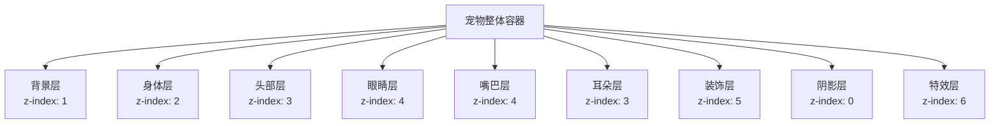
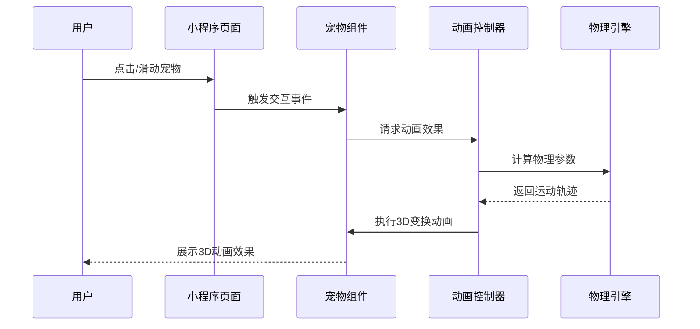
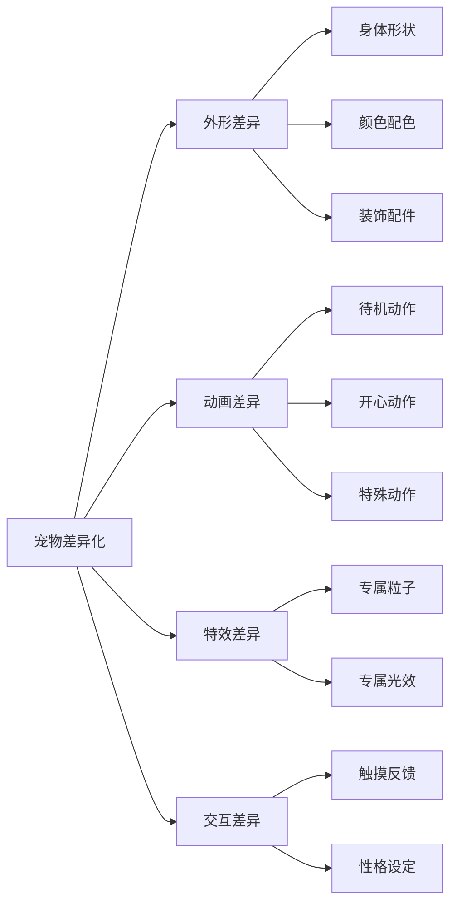
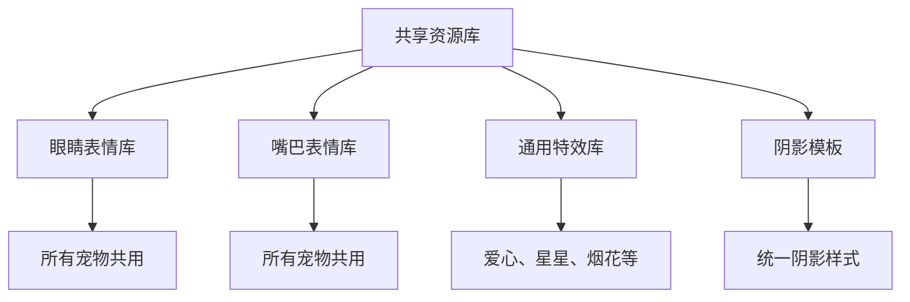
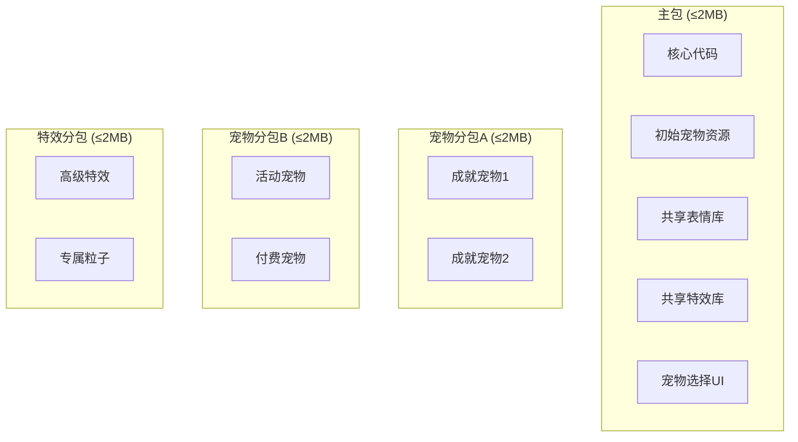
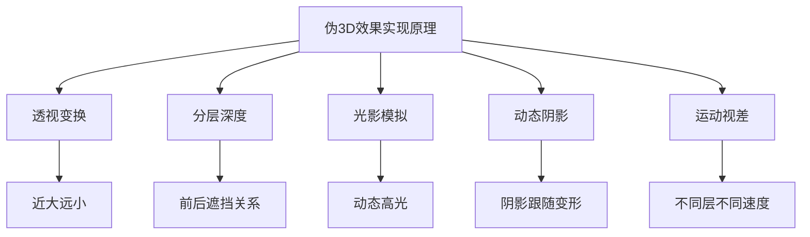

# 微信小程序迁移与伪3D宠物动画实现方案

## 1. 项目概述

### 1.1 项目背景
当前项目「职宠小窝」是一个基于Flutter开发的轻拟人电子宠物求职陪伴APP，主要功能包括宠物交互、求职倾诉、数据统计等。为了扩大用户群体和提升用户体验，需要将其迁移到微信小程序平台，并实现宠物的伪3D动画效果。

### 1.2 迁移目标
- 将Flutter项目完整迁移到微信小程序平台
- 保持原有功能和用户体验
- 实现宠物的伪3D动画效果，提升视觉表现力
- 优化小程序性能和加载速度

## 2. 当前项目分析

### 2.1 技术栈分析
- **开发框架**：Flutter 3.10.4
- **状态管理**：Provider
- **路由管理**：自定义路由生成器
- **动画实现**：Flutter内置动画框架 + Lottie
- **数据存储**：sqflite + shared_preferences
- **UI组件库**：自定义组件 + Flutter Material Design

### 2.2 项目结构
```
e:\GuguPet\app\lib
├── core/             # 核心配置和工具
├── data/             # 数据模型
├── features/         # 功能模块
├── pages/            # 页面实现
├── routes/           # 路由配置
├── services/         # 业务服务
├── shared/           # 共享组件
└── main.dart         # 应用入口
```

### 2.3 核心功能模块
1. **倾诉功能**：宠物交互、消息响应
2. **求职功能**：职位浏览、投递记录
3. **统计功能**：求职数据统计、图表展示
4. **公园功能**：社交互动、小游戏
5. **个人中心**：用户资料、设置

### 2.4 宠物动画现状
当前宠物动画采用Flutter内置动画框架实现，支持两种状态（空闲、开心），包含上下浮动和旋转效果。宠物响应系统设计了多种动作类型，为后续扩展Lottie动画预留了接口。

## 3. 微信小程序迁移方案

### 3.1 技术栈选择（两种方案对比）

#### 方案一：MPFlutter框架（推荐）
| 分类 | 技术选型 | 说明 |
|------|----------|------|
| 开发框架 | **MPFlutter 2.0** | 基于Flutter的小程序开发框架，可直接将Flutter代码编译到微信小程序 |
| 状态管理 | Provider（保持原有） | 无需迁移，直接复用现有代码 |
| 路由管理 | Flutter路由（保持原有） | 无需迁移，直接复用现有代码 |
| 动画实现 | Flutter动画框架 + CSS 3D变换 | 保持原有动画逻辑，增强3D效果 |
| 数据存储 | 小程序本地存储 + 云开发 | 需适配小程序存储API |
| UI组件库 | Material/Cupertino（保持原有） | 无需迁移，MPFlutter支持官方组件 |

**MPFlutter方案优势：**
- ✅ **代码复用率高**：可直接复用90%以上的Flutter代码
- ✅ **开发效率高**：无需重写UI和业务逻辑
- ✅ **维护成本低**：一套代码多端运行
- ✅ **学习成本低**：团队无需学习新技术栈
- ✅ **Hot Reload支持**：支持热重载，快速预览

**MPFlutter方案限制：**
- ⚠️ 部分Flutter插件可能不兼容（需检查当前项目依赖）
- ⚠️ 复杂自定义绘制可能需要适配
- ⚠️ 社区相对较小，问题解决可能需要时间

#### 方案二：微信小程序原生开发
| 分类 | 技术选型 | 说明 |
|------|----------|------|
| 开发框架 | 微信小程序原生开发 | 微信官方推荐，性能最优，生态成熟 |
| 状态管理 | mobx-miniprogram | 轻量级状态管理，支持响应式编程，适合小程序场景 |
| 路由管理 | 微信小程序原生路由 | 小程序内置路由系统，简洁高效 |
| 动画实现 | Canvas 2D + CSS 3D变换 | 实现伪3D效果，性能良好 |
| 数据存储 | 小程序本地存储 + 云开发 | 本地存储用于缓存，云开发用于数据持久化 |
| UI组件库 | 自定义组件 + WeUI | 保持原有设计风格，提升开发效率 |

**原生开发方案优势：**
- ✅ 性能最优，完全适配小程序特性
- ✅ 生态成熟，社区资源丰富
- ✅ 无第三方框架依赖风险

**原生开发方案劣势：**
- ❌ 需要完全重写代码，工作量大
- ❌ 团队需要学习新技术栈
- ❌ 维护两套代码库，成本高

### 3.2 推荐方案：MPFlutter框架

基于当前项目分析，**强烈推荐使用MPFlutter框架**进行迁移，理由如下：

1. **当前项目依赖检查**：
   - `provider`：✅ MPFlutter支持
   - `dio`：✅ MPFlutter支持（网络请求）
   - `shared_preferences`：✅ 可用小程序存储API替代
   - `sqflite`：⚠️ 需迁移到云数据库
   - `lottie`：⚠️ 需评估兼容性
   - `fl_chart`：⚠️ 需评估兼容性
   - `flutter_animate`：✅ MPFlutter支持基础动画

2. **迁移成本对比**：
   - MPFlutter方案：约2-3周（主要是插件适配和测试）
   - 原生开发方案：约6-8周（完全重写）

3. **风险评估**：
   - MPFlutter框架已稳定运行，有多个成功案例
   - 可先进行POC验证，降低风险

### 3.2 项目结构调整
```
微信小程序项目结构
├── app.js            # 应用入口
├── app.json          # 全局配置
├── app.wxss          # 全局样式
├── components/       # 公共组件
│   └── pet-avatar/   # 宠物头像组件
├── pages/            # 页面实现
│   ├── home/         # 首页
│   ├── confide/      # 倾诉页面
│   ├── jobs/         # 求职页面
│   ├── stats/        # 统计页面
│   ├── park/         # 公园页面
│   └── profile/      # 个人中心
├── services/         # 业务服务
│   ├── pet-responder.js  # 宠物响应服务
│   └── api.js        # API服务
├── utils/            # 工具函数
└── assets/           # 静态资源
    ├── animations/   # 动画资源
    └── images/       # 图片资源
```

### 3.3 核心功能迁移策略

#### 3.3.1 页面迁移
| Flutter页面 | 微信小程序页面 | 迁移策略 |
|-------------|----------------|----------|
| home_page.dart | pages/home/home | 实现底部导航栏，集成所有功能模块入口 |
| confide_page.dart | pages/confide/confide | 核心功能，重点迁移宠物交互和消息响应逻辑 |
| jobs_page.dart | pages/jobs/jobs | 迁移职位列表和投递记录功能 |
| stats_page.dart | pages/stats/stats | 使用小程序图表组件实现数据统计 |
| park_page.dart | pages/park/park | 迁移社交互动功能 |
| profile_page.dart | pages/profile/profile | 迁移用户资料和设置功能 |

#### 3.3.2 状态管理迁移
- 使用mobx-miniprogram替代Provider
- 为每个功能模块创建对应的store
- 实现全局状态管理，如用户信息、主题设置等

#### 3.3.3 数据存储迁移
- 将sqflite数据迁移到小程序云数据库
- 使用wx.setStorageSync/wx.getStorageSync替代shared_preferences
- 实现数据同步机制，确保数据一致性

#### 3.3.4 动画迁移
- 将Flutter内置动画转换为微信小程序动画API
- 将Lottie动画转换为小程序支持的动画格式
- 实现伪3D动画效果，提升视觉表现力

## 4. 伪3D宠物动画实现方案（改进版）

### 4.1 技术选型对比

#### 4.1.1 三种实现方式对比
| 实现方式 | 优势 | 劣势 | 适用场景 |
|----------|------|------|----------|
| **CSS 3D变换** | 性能好，硬件加速，代码简洁 | 复杂动画实现困难 | 简单旋转、缩放效果 |
| **Canvas 2D** | 灵活性高，可实现复杂效果 | 性能消耗大，代码复杂 | 自定义绘制、粒子效果 |
| **SVG动画** | 矢量图形，缩放不失真，支持复杂路径动画 | 性能一般，小程序支持有限 | 路径动画、形状变换 |

#### 4.1.2 推荐方案：混合实现
- **主体动画**：CSS 3D变换（性能最优）
- **细节动画**：Canvas 2D（眼睛、嘴巴等细节）
- **特效动画**：粒子系统（爱心、星星等特效）

### 4.2 伪3D实现原理（改进版）

#### 4.2.1 核心原理：透视变换 + 深度模拟
伪3D的核心是通过数学计算模拟真实3D效果，主要包含：

1. **透视投影**：近大远小效果
2. **深度排序**：遮挡关系处理
3. **光照模拟**：近亮远暗效果
4. **阴影投射**：增强立体感

#### 4.2.2 分层设计（改进版）
将宠物分解为多个图层，每个图层具有不同的z-index和3D变换属性：



#### 4.2.3 透视效果实现
```javascript
// 透视效果计算公式
function calculatePerspective(z, perspective = 1000) {
  // z: 物体距离观察点的深度
  // perspective: 透视距离
  return perspective / (perspective - z);
}

// 应用透视缩放
function applyPerspective(element, z) {
  const scale = calculatePerspective(z);
  element.style.transform = `scale(${scale})`;
  element.style.opacity = scale; // 近亮远暗
}
```

#### 4.2.4 3D旋转实现（改进版）
使用CSS 3D变换属性实现宠物的3D效果：

```css
/* 宠物容器 - 3D空间设置 */
.pet-container {
  transform-style: preserve-3d;
  perspective: 1000px;
}

/* 身体层 - 基础旋转 */
.pet-body {
  transform: rotateX(10deg) rotateY(0deg) rotateZ(0deg);
  transition: transform 0.3s ease;
}

/* 头部层 - 跟随旋转 + 位移 */
.pet-head {
  transform: rotateX(15deg) rotateY(0deg) translateZ(20px);
}

/* 耳朵层 - 独立摇摆 */
.pet-ear {
  transform-origin: bottom center;
  animation: ear-wiggle 2s ease-in-out infinite;
}

@keyframes ear-wiggle {
  0%, 100% { transform: rotateZ(-5deg); }
  50% { transform: rotateZ(5deg); }
}
```

#### 4.2.5 深度效果增强
```javascript
// 深度效果计算 - 近大远小、近亮远暗
function applyDepthEffect(elements, baseZ = 0) {
  elements.forEach((element, index) => {
    // 计算深度位置
    const z = baseZ + index * 10;
    
    // 计算缩放比例（近大远小）
    const scale = 1 + z / 1000;
    
    // 计算透明度（近亮远暗）
    const opacity = 1 - Math.abs(z) / 500;
    
    // 应用效果
    element.style.transform = `translateZ(${z}px) scale(${scale})`;
    element.style.opacity = opacity;
    element.style.filter = `brightness(${opacity})`;
  });
}
```

#### 4.2.6 交互响应机制（改进版）


### 4.3 动画效果设计（改进版）

#### 4.3.1 基础状态动画
- **空闲状态**：
  - 轻微呼吸效果（身体缩放 0.98-1.02）
  - 随机转头（rotateY -15° ~ +15°）
  - 眼睛随机眨动（每3-5秒）
  - 身体轻微摇摆（rotateZ -3° ~ +3°）

- **开心状态**：
  - 上下跳跃（translateY 0-20px）
  - 耳朵快速摇摆（rotateZ -20° ~ +20°）
  - 眼睛变成弯月形
  - 身体轻微旋转（rotateY 0-360°）

- **悲伤状态**：
  - 低头垂耳（rotateX 15°）
  - 缓慢呼吸（缩放 0.95-1.0）
  - 眼睛半闭（opacity 0.5）
  - 身体颜色变暗（brightness 0.8）

- **惊讶状态**：
  - 抬头睁大眼睛（rotateX -10°）
  - 身体微颤（抖动效果）
  - 嘴巴张大
  - 眼睛放大（scale 1.3）

#### 4.3.2 交互触发动画（改进版）
- **点击头部**：
  - 摇头晃脑（rotateY -30° ~ +30°，3次）
  - 发出声音反馈
  - 眼睛跟随头部转动
  - 添加表情气泡

- **点击身体**：
  - 翻滚效果（rotateX 0-360°）
  - 开心表情
  - 身体弹性变形
  - 粒子特效（星星）

- **滑动宠物**：
  - 跟随手势旋转（实时响应）
  - 身体弹性变形
  - 释放后回弹效果
  - 惯性滑动

- **长按宠物**：
  - 撒娇动作（身体扭动）
  - 爱心特效（粒子系统）
  - 眼睛变成爱心形状
  - 颜色渐变效果

#### 4.3.3 场景联动动画（改进版）
- **收到面试通知**：
  - 开心跳跃（高度30px，3次）
  - 挥舞翅膀/手臂
  - 烟花特效
  - 欢呼表情

- **求职被拒**：
  - 低头叹气（rotateX 20°）
  - 眼泪动画（Canvas绘制）
  - 身体颜色变灰
  - 雨滴特效

- **拿到Offer**：
  - 旋转庆祝（rotateY 0-720°）
  - 烟花特效（多彩粒子）
  - 皇冠装饰
  - 彩带飘落

- **摆烂休息**：
  - 躺平姿势（rotateZ 90°）
  - 打哈欠动画
  - Z字睡眠符号
  - 呼吸变慢

### 4.4 高级特效实现

#### 4.4.1 粒子系统
```javascript
class ParticleSystem {
  constructor(canvas) {
    this.canvas = canvas;
    this.ctx = canvas.getContext('2d');
    this.particles = [];
  }
  
  // 创建爱心粒子
  createHeartParticle(x, y) {
    return {
      x, y,
      vx: (Math.random() - 0.5) * 4,
      vy: -Math.random() * 3 - 2,
      size: Math.random() * 10 + 5,
      life: 1,
      decay: 0.02,
      color: `hsl(${Math.random() * 60 + 330}, 100%, 60%)`
    };
  }
  
  // 更新粒子
  update() {
    this.particles = this.particles.filter(p => {
      p.x += p.vx;
      p.y += p.vy;
      p.vy += 0.1; // 重力
      p.life -= p.decay;
      return p.life > 0;
    });
  }
  
  // 绘制粒子
  draw() {
    this.ctx.clearRect(0, 0, this.canvas.width, this.canvas.height);
    this.particles.forEach(p => {
      this.ctx.globalAlpha = p.life;
      this.ctx.fillStyle = p.color;
      this.drawHeart(p.x, p.y, p.size);
    });
  }
  
  // 绘制爱心形状
  drawHeart(x, y, size) {
    this.ctx.beginPath();
    this.ctx.moveTo(x, y + size / 4);
    this.ctx.bezierCurveTo(x, y, x - size / 2, y, x - size / 2, y + size / 4);
    this.ctx.bezierCurveTo(x - size / 2, y + size / 2, x, y + size * 0.75, x, y + size);
    this.ctx.bezierCurveTo(x, y + size * 0.75, x + size / 2, y + size / 2, x + size / 2, y + size / 4);
    this.ctx.bezierCurveTo(x + size / 2, y, x, y, x, y + size / 4);
    this.ctx.fill();
  }
}
```

#### 4.4.2 物理弹性效果
```javascript
class SpringPhysics {
  constructor(stiffness = 0.1, damping = 0.8) {
    this.stiffness = stiffness;
    this.damping = damping;
    this.position = 0;
    this.velocity = 0;
    this.target = 0;
  }
  
  update() {
    const force = (this.target - this.position) * this.stiffness;
    this.velocity += force;
    this.velocity *= this.damping;
    this.position += this.velocity;
    return this.position;
  }
  
  setTarget(target) {
    this.target = target;
  }
}
```

### 4.5 性能优化策略（改进版）

#### 4.5.1 渲染优化
- **使用离屏Canvas**：复杂动画使用离屏Canvas绘制，提升性能
- **动画帧控制**：合理设置动画帧率（30fps），避免过度渲染
- **条件渲染**：根据设备性能动态调整动画效果
- **图层合并**：减少DOM层级，合并静态图层

#### 4.5.2 内存优化
- **对象池**：复用粒子对象，避免频繁创建销毁
- **资源预加载**：提前加载动画资源，减少卡顿
- **按需加载**：只在需要时加载动画资源

#### 4.5.3 小程序特定优化
- **使用WXS**：将动画计算逻辑放到WXS中，提升性能
- **Skyline渲染引擎**：使用微信小程序的Skyline渲染引擎，支持更复杂的动画
- **Worklet动画**：使用Worklet动画API，实现更流畅的动画效果

### 4.6 多宠物系统设计

#### 4.6.1 宠物规划

**首发宠物建议（3-5只）**：

| 宠物名称 | 类型 | 外形特点 | 专属特效 | 解锁条件 |
|---------|------|---------|---------|---------|
| 🐧 小企 | 初始宠物 | 圆润可爱企鹅 | 雪花飘落 | 默认解锁 |
| 🐱 小喵 | 成就宠物 | 傲娇萌系猫咪 | 猫爪印记 | 累计登录7天 |
| 🐶 小汪 | 成就宠物 | 活泼热情小狗 | 骨头星星 | 完成3次倾诉 |
| 🐰 小兔 | 活动宠物 | 温柔治愈兔子 | 胡萝卜爱心 | 限时活动 |
| 🦊 小狐 | 付费宠物 | 神秘优雅狐狸 | 火焰光效 | 付费解锁 |

#### 4.6.2 宠物差异化设计维度



#### 4.6.3 宠物解锁机制

| 分类 | 数量 | 解锁方式 | 说明 |
|-----|-----|---------|------|
| **初始宠物** | 1只 | 默认解锁 | 新用户默认获得 |
| **成就宠物** | 2-3只 | 完成任务解锁 | 增加用户粘性 |
| **活动宠物** | 1-2只 | 限时活动获取 | 营造稀缺性 |
| **付费宠物** | 1-2只 | 付费解锁 | 商业变现 |

### 4.7 共享资源库设计

#### 4.7.1 资源复用策略

为优化小程序体积，采用共享资源库策略：



#### 4.7.2 共享眼睛表情库

| 表情名称 | 文件名 | 规格 | 用途 |
|---------|--------|------|------|
| 普通眼睛 | `eye_normal.png` | 64×64px | 空闲状态 |
| 开心眼睛 | `eye_happy.png` | 64×64px | 弯月形 |
| 悲伤眼睛 | `eye_sad.png` | 64×64px | 半闭下垂 |
| 惊讶眼睛 | `eye_surprise.png` | 64×64px | 放大圆形 |
| 爱心眼睛 | `eye_love.png` | 64×64px | 长按撒娇 |
| 眨眼动画 | `eye_blink_01~03.png` | 64×64px | 3帧眨眼 |
| 睡眠眼睛 | `eye_sleep.png` | 64×64px | 闭合状态 |

#### 4.7.3 共享嘴巴表情库

| 表情名称 | 文件名 | 规格 | 用途 |
|---------|--------|------|------|
| 普通嘴巴 | `mouth_normal.png` | 48×32px | 空闲状态 |
| 微笑嘴巴 | `mouth_smile.png` | 48×32px | 开心状态 |
| 大笑嘴巴 | `mouth_laugh.png` | 48×32px | 超级开心 |
| 悲伤嘴巴 | `mouth_sad.png` | 48×32px | 下垂表情 |
| 惊讶嘴巴 | `mouth_surprise.png` | 48×32px | O形张嘴 |
| 哈欠嘴巴 | `mouth_yawn.png` | 48×32px | 睡眠状态 |

#### 4.7.4 共享特效库

| 特效名称 | 文件格式 | 帧数 | 规格 | 用途 |
|---------|---------|------|------|------|
| 爱心粒子 | PNG序列帧 | 8帧 | 64×64px | 撒娇、开心 |
| 星星粒子 | PNG序列帧 | 6帧 | 32×32px | 点击反馈 |
| 烟花粒子 | PNG序列帧 | 12帧 | 128×128px | 重大庆祝 |
| 泪滴粒子 | PNG序列帧 | 4帧 | 16×16px | 悲伤状态 |
| Z字睡眠 | PNG序列帧 | 4帧 | 32×32px | 睡眠状态 |

### 4.8 分包策略与资源加载

#### 4.8.1 分包结构设计



#### 4.8.2 主包结构

```
📦 主包 (约 1.5MB)
├── 📁 pages/                    # 核心页面
│   ├── home/                    # 首页
│   └── profile/                 # 个人中心
│
├── 📁 components/               # 核心组件
│   └── pet-avatar/              # 宠物组件
│
├── 📁 assets/
│   ├── 📁 shared/               # 共享资源 (~350KB)
│   │   ├── 📁 eyes/             # 眼睛表情库 (~80KB)
│   │   ├── 📁 mouths/           # 嘴巴表情库 (~50KB)
│   │   ├── 📁 effects/          # 通用特效 (~200KB)
│   │   └── 📁 shadows/          # 阴影模板 (~20KB)
│   │
│   ├── 📁 pets/
│   │   └── 📁 penguin/          # 初始宠物 (~80KB)
│   │
│   └── 📁 ui/
│       └── pet_select/          # 选择界面基础UI (~100KB)
│
└── 📁 utils/                    # 工具函数
```

#### 4.8.3 分包配置

```json
{
  "pages": [
    "pages/home/index",
    "pages/profile/index"
  ],
  "subpackages": [
    {
      "root": "packageA",
      "name": "pets_achievement",
      "pages": ["pages/pet-detail/index"],
      "independent": false
    },
    {
      "root": "packageB",
      "name": "pets_premium",
      "pages": [],
      "independent": false
    },
    {
      "root": "packageC",
      "name": "effects_advanced",
      "pages": [],
      "independent": false
    }
  ],
  "preloadRule": {
    "pages/home/index": {
      "network": "all",
      "packages": ["pets_achievement"]
    }
  }
}
```

#### 4.8.4 动态加载实现

```javascript
// services/pet-loader.js

// 宠物资源映射表
const PET_PACKAGES = {
  penguin: { package: 'main', loaded: true },
  cat: { package: 'packageA', loaded: false },
  dog: { package: 'packageA', loaded: false },
  rabbit: { package: 'packageB', loaded: false },
  fox: { package: 'packageB', loaded: false }
}

class PetLoader {
  constructor() {
    this.loadedPackages = new Set(['main'])
  }
  
  // 加载宠物资源
  async loadPet(petId) {
    const petConfig = PET_PACKAGES[petId]
    if (!petConfig) {
      throw new Error(`Unknown pet: ${petId}`)
    }
    
    // 如果已加载，直接返回
    if (petConfig.loaded) {
      return this.getPetAssets(petId)
    }
    
    // 加载对应分包
    const packageName = petConfig.package
    if (!this.loadedPackages.has(packageName)) {
      await this.loadPackage(packageName)
    }
    
    petConfig.loaded = true
    return this.getPetAssets(petId)
  }
  
  // 加载分包
  loadPackage(packageName) {
    return new Promise((resolve, reject) => {
      wx.loadSubpackage({
        name: packageName,
        success: () => {
          this.loadedPackages.add(packageName)
          console.log(`分包 ${packageName} 加载成功`)
          resolve()
        },
        fail: (err) => {
          console.error(`分包 ${packageName} 加载失败`, err)
          reject(err)
        }
      })
    })
  }
  
  // 获取宠物资源路径
  getPetAssets(petId) {
    const basePath = `/assets/pets/${petId}`
    return {
      body: `${basePath}/${petId}_body.png`,
      head: `${basePath}/${petId}_head.png`,
      avatar: `${basePath}/${petId}_avatar.png`,
      preview: `${basePath}/${petId}_preview.png`
    }
  }
  
  // 预加载指定分包
  async preloadPackage(packageName) {
    if (!this.loadedPackages.has(packageName)) {
      await this.loadPackage(packageName)
    }
  }
}

export const petLoader = new PetLoader()
```

#### 4.8.5 分包体积估算

| 分包 | 内容 | 预估体积 | 加载时机 |
|-----|------|---------|---------|
| **主包** | 共享资源 + 初始宠物 | ~1.5MB | 启动时 |
| **分包A** | 成就宠物×2 | ~500KB | 预加载 |
| **分包B** | 活动/付费宠物×2 | ~400KB | 按需加载 |
| **分包C** | 高级特效 | ~300KB | 按需加载 |
| **总计** | - | **~2.7MB** | - |

### 4.9 AIGC美术资源生成指南

#### 4.9.1 核心原理：正视图实现伪3D

**只需正视图即可实现伪3D效果！**

伪3D通过以下技术手段模拟3D感：



#### 4.9.2 分层PNG规格标准

| 部位 | 尺寸 | 要点 |
|-----|-----|------|
| 身体 | 256×256px | 完整身体轮廓，不含头部 |
| 头部 | 192×192px | 头部轮廓，不含五官 |
| 眼睛 | 64×64px | 单只眼睛，对称设计 |
| 嘴巴 | 48×32px | 嘴巴形状 |
| 耳朵 | 64×96px | 单只耳朵，垂直方向 |
| 阴影 | 128×64px | 椭圆形地面阴影 |

**图片规格要求**：

| 项目 | 规格要求 | 说明 |
|-----|---------|------|
| **格式** | PNG（透明背景） | 必须支持Alpha通道 |
| **色彩** | 32位真彩色 | 支持半透明效果 |
| **压缩** | TinyPNG压缩后 | 单张不超过50KB |
| **命名** | 小写字母+下划线 | 如 `pet_body_happy.png` |

#### 4.9.3 AIGC Prompt 模板

**身体层**：
```
A cute cartoon penguin body, front view, simple rounded shape, 
transparent background, pixel art style, 256x256 pixels, 
no head, clean edges
```

**头部层**：
```
A cute cartoon penguin head, front view, round shape, 
transparent background, pixel art style, 192x192 pixels, 
no facial features, clean edges
```

**眼睛层**：
```
A cute cartoon eye, front view, round black pupil with white highlight, 
transparent background, pixel art style, 64x64 pixels
```

**嘴巴层**：
```
A cute cartoon smile mouth, front view, simple curved line, 
transparent background, pixel art style, 48x32 pixels
```

#### 4.9.4 资源目录结构

```
📦 pet_resources/
├── 📁 shared/                      # 共享资源（所有宠物共用）
│   ├── 📁 eyes/                    # 眼睛表情库
│   │   ├── eye_normal.png
│   │   ├── eye_happy.png
│   │   ├── eye_sad.png
│   │   ├── eye_surprise.png
│   │   ├── eye_love.png
│   │   ├── eye_sleep.png
│   │   └── 📁 blink/               # 眨眼动画
│   │
│   ├── 📁 mouths/                  # 嘴巴表情库
│   │   ├── mouth_normal.png
│   │   ├── mouth_smile.png
│   │   ├── mouth_laugh.png
│   │   ├── mouth_sad.png
│   │   ├── mouth_surprise.png
│   │   └── mouth_yawn.png
│   │
│   ├── 📁 effects/                 # 通用特效
│   │   ├── 📁 heart/               # 爱心粒子
│   │   ├── 📁 star/                # 星星粒子
│   │   ├── 📁 firework/            # 烟花粒子
│   │   ├── 📁 tear/                # 泪滴粒子
│   │   └── 📁 sleep_z/             # 睡眠Z字
│   │
│   └── 📁 shadows/                 # 阴影模板
│       └── shadow_oval.png
│
├── 📁 pets/                        # 宠物专属资源
│   ├── 📁 penguin/                 # 企鹅
│   │   ├── penguin_body.png
│   │   ├── penguin_head.png
│   │   ├── penguin_wing_left.png
│   │   ├── penguin_wing_right.png
│   │   ├── penguin_feet.png
│   │   ├── penguin_avatar.png      # 选择界面头像
│   │   └── penguin_preview.png     # 选择界面预览
│   │
│   ├── 📁 cat/                     # 猫咪
│   │   ├── cat_body.png
│   │   ├── cat_head.png
│   │   ├── cat_ear_left.png
│   │   ├── cat_ear_right.png
│   │   ├── cat_tail.png
│   │   ├── cat_avatar.png
│   │   └── cat_preview.png
│   │
│   ├── 📁 dog/                     # 小狗
│   │   └── ...
│   │
│   ├── 📁 rabbit/                  # 兔子
│   │   └── ...
│   │
│   └── 📁 fox/                     # 狐狸
│       └── ...
│
├── 📁 ui/                          # 宠物选择界面
│   ├── pet_select_bg.png           # 选择界面背景
│   ├── pet_card_frame.png          # 卡片边框
│   ├── pet_card_frame_active.png   # 选中状态边框
│   ├── icon_lock.png               # 锁定图标
│   ├── icon_free.png               # 免费图标
│   ├── icon_achievement.png        # 成就图标
│   └── icon_premium.png            # 付费图标
│
└── 📄 manifest.json                # 资源清单配置
```

#### 4.9.5 manifest.json 配置示例

```json
{
  "version": "1.0.0",
  "shared": {
    "eyes": ["normal", "happy", "sad", "surprise", "love", "sleep", "blink"],
    "mouths": ["normal", "smile", "laugh", "sad", "surprise", "yawn"],
    "effects": ["heart", "star", "firework", "tear", "sleep_z"]
  },
  "pets": [
    {
      "id": "penguin",
      "name": "小企",
      "description": "来自南极的圆润小伙伴，总是充满活力",
      "personality": ["活泼", "可爱"],
      "unlockType": "free",
      "unlockCondition": null,
      "layers": ["body", "head", "wing_left", "wing_right", "feet"],
      "specialEffect": "snowflake"
    },
    {
      "id": "cat",
      "name": "小喵",
      "description": "傲娇的小猫咪，其实内心很温柔",
      "personality": ["傲娇", "温柔"],
      "unlockType": "achievement",
      "unlockCondition": {
        "type": "login_days",
        "value": 7
      },
      "layers": ["body", "head", "ear_left", "ear_right", "tail"],
      "specialEffect": "paw_print"
    }
  ]
}
```

#### 4.9.6 3D感关键要素

| 要素 | CSS属性 | 作用 |
|-----|--------|------|
| **透视** | `perspective` | 创建近大远小的视觉效果 |
| **深度** | `translateZ` | 建立前后层次关系 |
| **旋转** | `rotateY/X` | 模拟不同角度观察（建议±15°~30°） |
| **阴影** | `box-shadow` + `filter: blur` | 增强空间感 |
| **遮挡** | `z-index` | 定义前后遮挡关系 |
| **缩放** | `scale` | 模拟远近变化 |

## 5. 项目结构调整建议

### 5.1 目录结构优化
1. **按功能模块组织代码**：每个功能模块独立成目录，便于维护
2. **组件化开发**：将宠物头像等通用组件抽象出来，提高复用性
3. **资源分类管理**：按类型分类存储静态资源，便于管理和加载
4. **工具函数封装**：将通用工具函数封装，避免代码重复

### 5.2 代码规范制定
- 采用微信小程序官方代码规范
- 统一命名规则，提高代码可读性
- 编写详细注释，便于后续维护
- 定期进行代码审查，保证代码质量

### 5.3 性能优化建议
- 减少页面层级，优化渲染性能
- 合理使用分包加载，减小主包体积
- 优化图片资源，使用WebP格式和适当尺寸
- 避免频繁更新数据，使用节流和防抖

## 6. 实施步骤

### 6.1 第一阶段：MPFlutter环境搭建与POC验证（1周）
1. 安装MPFlutter开发环境
   - 安装MPFlutter CLI工具
   - 配置微信小程序开发者工具
   - 创建MPFlutter测试项目

2. POC验证
   - 验证当前项目核心依赖兼容性
   - 测试Provider状态管理
   - 测试基础动画效果
   - 测试网络请求（dio）
   - 输出POC验证报告

3. 风险评估
   - 识别不兼容的插件
   - 制定替代方案
   - 评估迁移工作量

### 6.2 第二阶段：核心功能迁移（1-2周）
1. 项目配置迁移
   - 配置MPFlutter项目结构
   - 迁移pubspec.yaml依赖
   - 配置小程序权限

2. 页面迁移
   - 迁移底部导航栏和页面框架
   - 迁移倾诉功能模块（重点）
   - 迁移求职功能模块
   - 迁移统计功能模块
   - 迁移公园功能模块
   - 迁移个人中心功能模块

3. 数据存储适配
   - 适配小程序本地存储API
   - 配置云开发环境
   - 数据迁移脚本

### 6.3 第三阶段：伪3D宠物动画实现（1-2周）
1. 宠物组件重构
   - 实现宠物组件基础结构
   - 实现分层设计
   - 添加CSS 3D变换效果

2. 基础动画实现
   - 实现基础状态动画
   - 实现交互触发动画
   - 实现场景联动动画

3. 高级特效实现
   - 实现粒子系统
   - 实现物理弹性效果
   - 实现光影效果

4. 性能优化
   - 优化动画帧率
   - 实现条件渲染
   - 内存优化

### 6.4 第四阶段：测试和优化（1周）
1. 功能测试
   - 验证所有功能正常工作
   - 测试宠物交互响应
   - 测试动画效果

2. 性能测试
   - 测试小程序加载速度
   - 测试动画流畅度
   - 内存占用测试

3. 兼容性测试
   - 适配不同机型
   - 适配不同微信版本
   - 降级方案测试

4. 用户体验测试
   - 界面交互优化
   - 视觉效果优化
   - 用户反馈收集

### 6.5 第五阶段：发布和上线（3-5天）
1. 提交小程序审核
2. 发布正式版本
3. 收集用户反馈
4. 持续迭代优化

## 7. 测试和验证

### 7.1 测试策略
- **单元测试**：测试核心功能模块
- **集成测试**：测试模块间的交互
- **端到端测试**：测试完整用户流程
- **性能测试**：测试小程序性能指标
- **兼容性测试**：测试不同设备和环境

### 7.2 验证指标
- **功能完整性**：所有原有功能正常实现
- **性能指标**：首屏加载时间 < 2s，页面切换时间 < 500ms
- **动画流畅度**：动画帧率 > 30fps
- **用户体验**：界面美观，交互流畅
- **兼容性**：适配主流机型和微信版本

## 8. 风险评估和应对策略

### 8.1 风险评估
| 风险类型 | 风险描述 | 影响程度 | 发生概率 |
|----------|----------|----------|----------|
| 技术风险 | 微信小程序对3D动画支持有限 | 中 | 中 |
| 性能风险 | 伪3D动画可能导致性能问题 | 中 | 高 |
| 兼容性风险 | 不同设备上动画效果不一致 | 低 | 中 |
| 迁移风险 | 原有功能迁移不完整或出现bug | 高 | 中 |
| 时间风险 | 迁移和开发时间超出预期 | 中 | 中 |

### 8.2 应对策略
- **技术风险**：采用渐进式实现，先实现基础伪3D效果，再逐步优化
- **性能风险**：使用离屏Canvas、优化动画帧、动态调整动画效果
- **兼容性风险**：针对不同设备进行适配测试，提供降级方案
- **迁移风险**：采用模块化迁移，每完成一个模块进行测试验证
- **时间风险**：制定详细的实施计划，合理安排资源，优先实现核心功能

## 9. 预期效果

### 9.1 功能效果
- 完整迁移原有Flutter项目功能
- 实现宠物的伪3D动画效果，提升视觉表现力
- 保持良好的用户体验和交互流畅度

### 9.2 性能效果
- 小程序加载速度快，运行流畅
- 动画效果流畅，无明显卡顿
- 适配不同机型和微信版本

### 9.3 业务效果
- 扩大用户群体，提升用户活跃度
- 增强用户粘性和情感连接
- 为后续功能扩展奠定基础

## 10. 总结

本方案详细规划了将Flutter项目迁移到微信小程序平台，并实现宠物伪3D动画效果的技术路线和实施步骤。

### 10.1 方案可行性分析

#### ✅ 技术可行性
1. **MPFlutter框架成熟度**：
   - MPFlutter 2.0已稳定运行，支持Flutter代码直接编译到微信小程序
   - 支持Material/Cupertino组件，无需重写UI
   - 支持Provider状态管理，无需迁移业务逻辑
   - 支持Hot Reload，开发效率高

2. **伪3D动画实现**：
   - CSS 3D变换在小程序中完全支持
   - Canvas 2D API功能完善，可实现复杂动画
   - 微信小程序Skyline渲染引擎提供更好的动画性能
   - WXS和Worklet动画API支持高性能动画

#### ✅ 经济可行性
- **开发成本**：MPFlutter方案约2-3周，原生开发方案约6-8周
- **维护成本**：一套代码多端运行，维护成本降低50%以上
- **学习成本**：团队无需学习新技术栈，可直接上手

#### ✅ 时间可行性
- 总体开发周期：4-6周
- 可分阶段交付，降低风险
- POC验证可在1周内完成，快速验证可行性

### 10.2 核心优势

1. **代码复用率高**：MPFlutter方案可复用90%以上的Flutter代码
2. **开发效率高**：无需重写UI和业务逻辑，直接编译
3. **动画效果优秀**：伪3D动画通过透视变换、深度模拟实现，视觉效果出色
4. **性能优化到位**：多层优化策略确保动画流畅
5. **风险可控**：分阶段实施，每阶段都有验证和回退机制

### 10.3 关键改进点

#### 伪3D动画改进
1. **透视效果增强**：实现"近大远小、近亮远暗"的真实3D感
2. **分层设计优化**：增加阴影层和特效层，增强立体感
3. **物理引擎集成**：添加弹性效果，动画更自然
4. **粒子系统**：实现爱心、星星等特效，增强交互反馈
5. **性能优化**：WXS加速、Skyline渲染引擎、对象池等技术

#### 多宠物系统改进
1. **多宠物设计**：首发3-5只宠物，提供用户更多选择
2. **解锁机制**：成就解锁、活动解锁、付费解锁，增加用户粘性
3. **差异化设计**：外形、动画、特效、交互四维度差异化

#### 资源优化改进
1. **共享资源库**：眼睛/嘴巴表情库、通用特效库，所有宠物共用
2. **分包策略**：主包+3个分包，总体积约2.7MB，首屏加载仅1.5MB
3. **动态加载**：按需加载宠物资源，预加载成就宠物分包
4. **AIGC友好**：只需正视图即可实现伪3D效果，降低美术制作门槛

#### 迁移方案改进
1. **MPFlutter框架**：无需重写代码，直接编译
2. **分阶段实施**：POC验证 → 核心迁移 → 动画实现 → 测试优化
3. **风险评估**：提前识别不兼容插件，制定替代方案

### 10.4 建议

1. **优先采用MPFlutter方案**：代码复用率高，开发效率高，风险可控
2. **先进行POC验证**：验证核心依赖兼容性，降低风险
3. **渐进式实现动画**：先实现基础动画，再逐步添加高级特效
4. **持续性能优化**：根据实际测试结果，动态调整优化策略
5. **使用AIGC生成美术资源**：只需正视图，配合分层PNG实现伪3D效果

### 10.5 美术资源交付清单

| 类别 | 资源项 | 数量 | 优先级 | 说明 |
|-----|-------|------|--------|------|
| **共享表情** | 眼睛表情 | 7种 | ⭐⭐⭐⭐⭐ | 所有宠物共用 |
| **共享表情** | 嘴巴表情 | 6种 | ⭐⭐⭐⭐⭐ | 所有宠物共用 |
| **共享特效** | 通用粒子 | 5种 | ⭐⭐⭐⭐ | 爱心、星星、烟花等 |
| **初始宠物** | 专属资源 | 1套 | ⭐⭐⭐⭐⭐ | 企鹅分层PNG |
| **成就宠物** | 专属资源 | 2套 | ⭐⭐⭐⭐ | 猫咪、小狗分层PNG |
| **活动宠物** | 专属资源 | 1套 | ⭐⭐⭐ | 兔子分层PNG |
| **付费宠物** | 专属资源 | 1套 | ⭐⭐ | 狐狸分层PNG |
| **选择界面** | UI资源 | 1套 | ⭐⭐⭐⭐ | 背景、卡片、图标 |

**预估总体积**：约 **850KB - 1.2MB**（5只宠物 + 共享资源）

该方案不仅实现了项目的平台迁移，还通过伪3D动画效果大幅提升了产品的视觉表现力和用户体验，为「职宠小窝」项目的发展注入了新的活力。