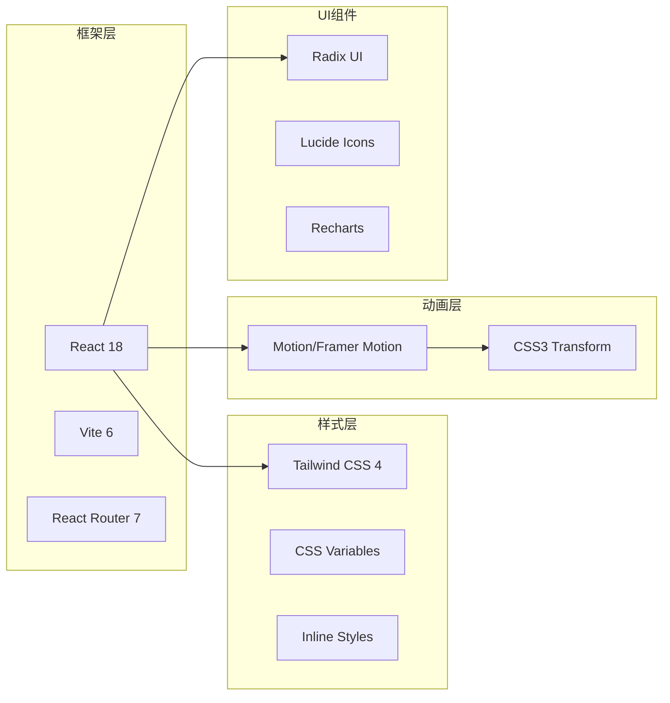
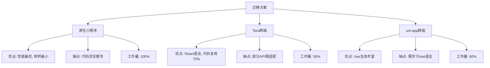
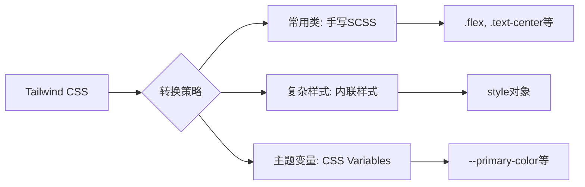
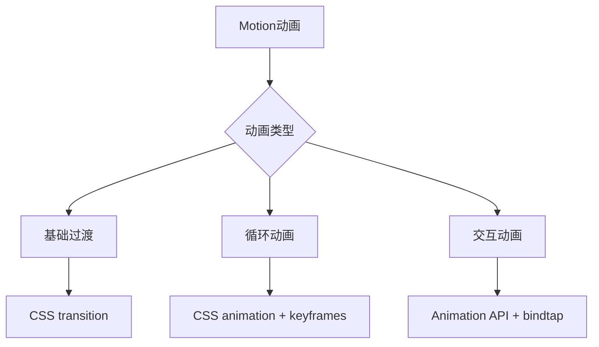
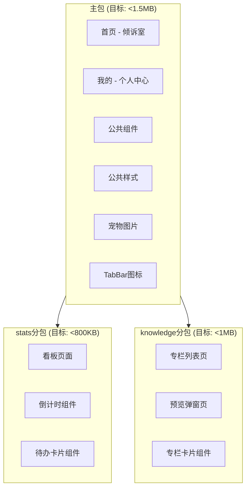
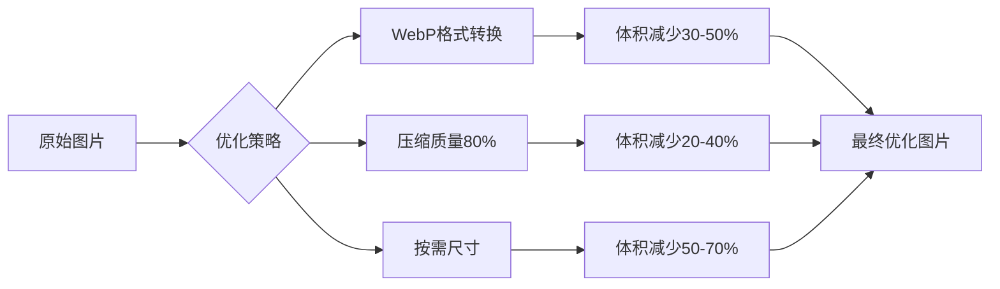
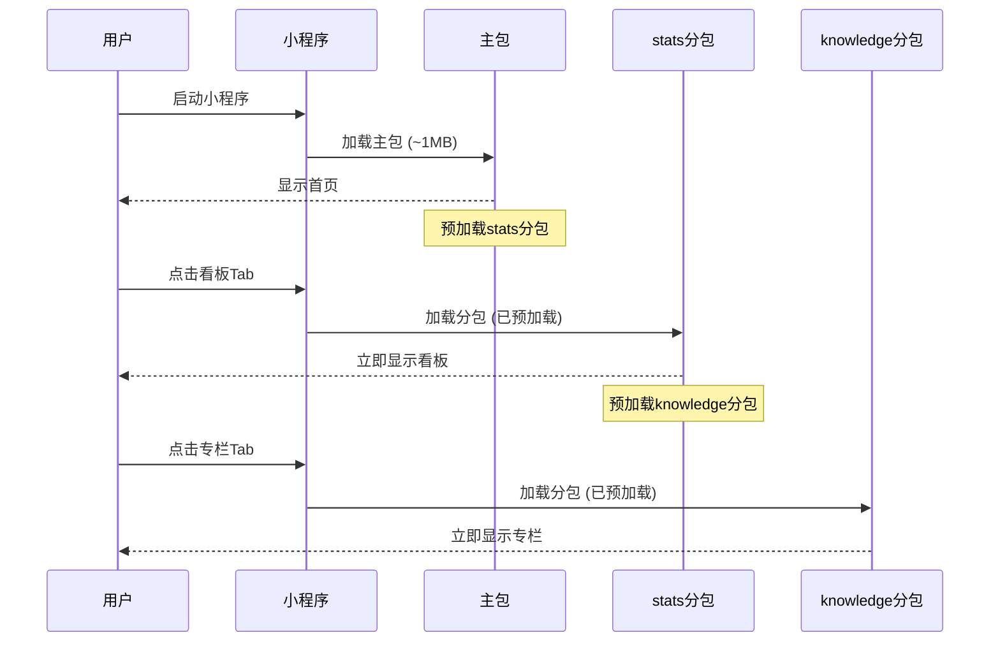
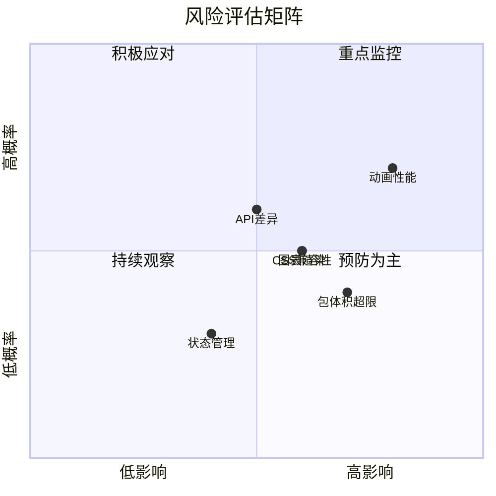
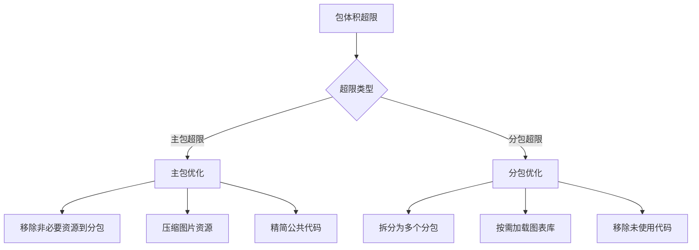
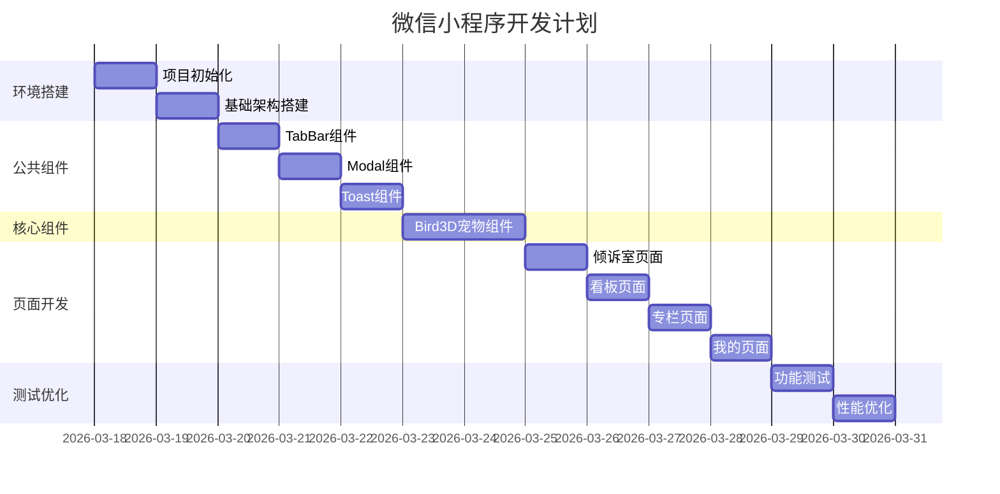

# 职宠小窝微信小程序迁移技术方案

> 基于 suchAs React 参考版迁移至微信小程序
> 文档版本：v1.0
> 创建日期：2026-03-17

---

## 目录

1. [项目概述](#1-项目概述)
2. [技术栈分析](#2-技术栈分析)
3. [迁移方案选择](#3-迁移方案选择)
4. [项目结构设计](#4-项目结构设计)
5. [核心技术转换](#5-核心技术转换)
6. [分包策略设计](#6-分包策略设计)
7. [风险与注意事项](#7-风险与注意事项)
8. [开发计划](#8-开发计划)
9. [附录](#9-附录)

---

## 1. 项目概述

### 1.1 项目背景

当前 `suchAs` 文件夹是一个基于 **React + Vite + Tailwind CSS + Motion** 的Web应用，模拟了微信小程序的UI界面，实现了「职宠小窝」的核心功能原型。现需将其迁移为真正的微信小程序。

### 1.2 现有功能模块

| 模块 | 页面 | 功能描述 |
|------|------|----------|
| 倾诉室 | HomeScreen | 宠物交互、情感倾诉、伪3D动画 |
| 看板 | StatsScreen | 倒计时面板、高频待办、智能推荐 |
| 专栏 | KnowledgeScreen | 知识付费内容、预览购买 |
| 我的 | ProfileScreen | 个人中心、宠物中心、毕业进度 |

### 1.3 迁移目标

- 将 React Web 应用完整迁移到微信小程序
- 保持原有UI设计和用户体验
- 实现伪3D宠物动画效果
- 优化小程序性能和加载速度
- 符合微信小程序包体积限制

---

## 2. 技术栈分析

### 2.1 当前技术栈



### 2.2 技术依赖清单

| 分类 | 依赖 | 版本 | 用途 |
|------|------|------|------|
| 核心 | react | 18.3.1 | UI框架 |
| 构建 | vite | 6.3.5 | 构建工具 |
| 样式 | tailwindcss | 4.1.12 | 原子化CSS |
| 动画 | motion | 12.23.24 | 动画库 |
| 路由 | react-router | 7.13.0 | 路由管理 |
| 图标 | lucide-react | 0.487.0 | SVG图标 |
| 图表 | recharts | 2.15.2 | 数据可视化 |
| UI | @radix-ui/* | 多个 | 无障碍组件 |

### 2.3 核心动画实现分析

当前伪3D宠物动画使用 Motion 实现，核心参数：

```javascript
// 空闲状态动画
animate={{
  y: [0, -10, 0],           // 垂直浮动
  rotateY: [-13, 13, -13],  // Y轴旋转
  rotateX: [5, -5, 5],      // X轴旋转
  filter: [                 // 阴影变化
    "brightness(0.96) drop-shadow(-5px 18px 28px rgba(100,80,200,0.22))",
    "brightness(1.05) drop-shadow(5px 18px 28px rgba(100,80,200,0.14))",
    "brightness(0.96) drop-shadow(-5px 18px 28px rgba(100,80,200,0.22))"
  ]
}}
transition={{ duration: 4, repeat: Infinity, ease: "easeInOut" }}
```

---

## 3. 迁移方案选择

### 3.1 方案对比



### 3.2 推荐方案：Taro 3.x + React

**选择理由：**

| 维度 | 评估 | 说明 |
|------|------|------|
| 代码复用 | ⭐⭐⭐⭐⭐ | React语法，组件逻辑可直接复用 |
| 学习成本 | ⭐⭐⭐⭐⭐ | 无需学习新框架 |
| 社区支持 | ⭐⭐⭐⭐ | 活跃社区，文档完善 |
| 多端支持 | ⭐⭐⭐⭐⭐ | 支持微信、H5、App等多端 |
| TypeScript | ⭐⭐⭐⭐⭐ | 完整类型支持 |

### 3.3 目标技术栈

| 分类 | 技术选型 | 说明 |
|------|----------|------|
| 框架 | Taro 3.6+ | React语法跨端框架 |
| 样式 | SCSS + 原子类 | 替代Tailwind CSS |
| 动画 | CSS3 + 小程序Animation API | 替代Motion |
| 状态管理 | Zustand | 轻量级状态管理 |
| 图标 | Iconfont / 内联SVG | 替代Lucide React |
| 图表 | wx-charts / ECharts小程序版 | 替代Recharts |

---

## 4. 项目结构设计

### 4.1 目录结构

```
miniprogram/
├── config/                     # Taro配置
│   ├── index.ts               # 主配置
│   ├── dev.ts                 # 开发配置
│   └── prod.ts                # 生产配置
├── src/
│   ├── app.config.ts          # 全局配置（含分包配置）
│   ├── app.tsx                # 入口文件
│   ├── app.scss               # 全局样式
│   │
│   ├── pages/                 # 主包页面
│   │   ├── home/              # 倾诉室（首页）
│   │   │   ├── index.tsx
│   │   │   ├── index.scss
│   │   │   └── index.config.ts
│   │   └── profile/           # 我的（个人中心）
│   │       ├── index.tsx
│   │       ├── index.scss
│   │       └── index.config.ts
│   │
│   ├── subpackages/           # 分包页面
│   │   ├── stats/             # 看板分包
│   │   │   ├── pages/
│   │   │   │   └── index.tsx
│   │   │   └── components/
│   │   └── knowledge/         # 专栏分包
│   │       ├── pages/
│   │       │   ├── index.tsx
│   │       │   └── preview.tsx
│   │       └── components/
│   │
│   ├── components/            # 公共组件
│   │   ├── Bird3D/            # 伪3D宠物组件
│   │   │   ├── index.tsx
│   │   │   ├── index.scss
│   │   │   └── animations.ts  # 动画配置
│   │   ├── TabBar/            # 底部导航
│   │   ├── Modal/             # 弹窗组件
│   │   ├── Toast/             # 提示组件
│   │   ├── CountdownCard/     # 倒计时卡片
│   │   ├── ColumnCard/        # 专栏卡片
│   │   └── ActionSheet/       # 动作面板
│   │
│   ├── store/                 # 状态管理
│   │   ├── index.ts           # Store入口
│   │   ├── userStore.ts       # 用户状态
│   │   ├── petStore.ts        # 宠物状态
│   │   └── countdownStore.ts  # 倒计时状态
│   │
│   ├── services/              # API服务
│   │   ├── api.ts             # API封装
│   │   ├── request.ts         # 请求封装
│   │   └── storage.ts         # 本地存储
│   │
│   ├── utils/                 # 工具函数
│   │   ├── date.ts            # 日期处理
│   │   ├── animation.ts       # 动画工具
│   │   └── response.ts        # 响应匹配
│   │
│   ├── constants/             # 常量定义
│   │   ├── theme.ts           # 主题配置
│   │   ├── responses.ts       # 宠物响应文案
│   │   └── countdowns.ts      # 默认倒计时
│   │
│   └── assets/                # 静态资源
│       ├── images/            # 图片资源
│       │   └── bird.png       # 宠物图片
│       └── icons/             # 图标资源
│
├── project.config.json        # 小程序配置
├── package.json
└── tsconfig.json
```

### 4.2 页面路由配置

```typescript
// src/app.config.ts
export default defineAppConfig({
  pages: [
    'pages/home/index',      // 首页（主包）
    'pages/profile/index',   // 我的（主包）
  ],
  subpackages: [
    {
      root: 'subpackages/stats',
      pages: ['pages/index'],
    },
    {
      root: 'subpackages/knowledge',
      pages: ['pages/index', 'pages/preview'],
    },
  ],
  window: {
    backgroundTextStyle: 'light',
    navigationBarBackgroundColor: '#FFF8EF',
    navigationBarTitleText: '职宠小窝',
    navigationBarTextStyle: 'black',
  },
  tabBar: {
    color: '#B0A8C8',
    selectedColor: '#6C5CE7',
    backgroundColor: '#FFFFFF',
    borderStyle: 'white',
    list: [
      { pagePath: 'pages/home/index', text: '倾诉室', iconPath: 'assets/icons/home.png', selectedIconPath: 'assets/icons/home-active.png' },
      { pagePath: 'subpackages/stats/pages/index', text: '看板', iconPath: 'assets/icons/stats.png', selectedIconPath: 'assets/icons/stats-active.png' },
      { pagePath: 'subpackages/knowledge/pages/index', text: '专栏', iconPath: 'assets/icons/knowledge.png', selectedIconPath: 'assets/icons/knowledge-active.png' },
      { pagePath: 'pages/profile/index', text: '我的', iconPath: 'assets/icons/profile.png', selectedIconPath: 'assets/icons/profile-active.png' },
    ],
  },
});
```

---

## 5. 核心技术转换

### 5.1 样式系统转换

#### 5.1.1 Tailwind CSS → SCSS 原子类



**转换示例：**

```scss
// _atomic.scss - 常用原子类
.flex { display: flex; }
.flex-col { flex-direction: column; }
.items-center { align-items: center; }
.justify-center { justify-content: center; }
.text-center { text-align: center; }
.rounded-2xl { border-radius: 16px; }
.rounded-full { border-radius: 9999px; }

// 主题变量
:root {
  --primary-color: #6C5CE7;
  --primary-light: #A084E8;
  --text-primary: #2a1a4a;
  --text-secondary: #B0A0C8;
  --bg-card: rgba(255,255,255,0.88);
  --shadow-card: 0 4px 20px rgba(100,80,200,0.1);
}
```

#### 5.1.2 内联样式迁移

```typescript
// React原实现
<div style={{
  background: "linear-gradient(175deg, #FFF8EF 0%, #EEF2FF 48%, #F0EBFF 100%)",
  borderRadius: "28px",
  boxShadow: "0 8px 32px rgba(100,80,200,0.1)"
}}>

// Taro实现（保持一致）
<View style={{
  background: "linear-gradient(175deg, #FFF8EF 0%, #EEF2FF 48%, #F0EBFF 100%)",
  borderRadius: "28px",
  boxShadow: "0 8px 32px rgba(100,80,200,0.1)"
}}>
```

### 5.2 动画系统转换

#### 5.2.1 Motion → 小程序动画



**伪3D宠物动画实现：**

```scss
// _bird-animation.scss
.bird-container {
  perspective: 700px;
  transform-style: preserve-3d;
}

.bird-idle {
  animation: bird-float 4s ease-in-out infinite;
}

@keyframes bird-float {
  0%, 100% {
    transform: translateY(0) rotateY(-13deg) rotateX(5deg);
    filter: brightness(0.96) drop-shadow(-5px 18px 28px rgba(100,80,200,0.22));
  }
  50% {
    transform: translateY(-10px) rotateY(13deg) rotateX(-5deg);
    filter: brightness(1.05) drop-shadow(5px 18px 28px rgba(100,80,200,0.14));
  }
}

.bird-happy {
  animation: bird-happy 1.8s ease-in-out;
}

@keyframes bird-happy {
  0% { transform: translateY(0) rotateY(0) rotateX(-2deg); }
  25% { transform: translateY(-26px) rotateY(22deg) rotateX(6deg); }
  50% { transform: translateY(-10px) rotateY(-16deg) rotateX(-5deg); }
  75% { transform: translateY(-20px) rotateY(12deg) rotateX(4deg); }
  100% { transform: translateY(0) rotateY(0) rotateX(0); }
}

// 地面阴影
.bird-shadow {
  animation: shadow-pulse 4s ease-in-out infinite;
}

@keyframes shadow-pulse {
  0%, 100% {
    transform: scaleX(0.95) translateX(-8px);
    opacity: 0.4;
  }
  50% {
    transform: scaleX(0.62) translateX(8px);
    opacity: 0.18;
  }
}
```

**Taro组件实现：**

```typescript
// components/Bird3D/index.tsx
import { View, Image } from '@tarojs/components';
import { useState, useEffect } from 'react';
import './index.scss';

interface Bird3DProps {
  isHappy?: boolean;
  onHappyEnd?: () => void;
}

export default function Bird3D({ isHappy = false, onHappyEnd }: Bird3DProps) {
  const [animationClass, setAnimationClass] = useState('bird-idle');
  
  useEffect(() => {
    if (isHappy) {
      setAnimationClass('bird-happy');
      const timer = setTimeout(() => {
        setAnimationClass('bird-idle');
        onHappyEnd?.();
      }, 1800);
      return () => clearTimeout(timer);
    }
  }, [isHappy, onHappyEnd]);
  
  return (
    <View className="bird-container">
      {/* 地面阴影 */}
      <View className={`bird-shadow ${isHappy ? 'shadow-happy' : ''}`} />
      
      {/* 3D宠物 */}
      <View className={`bird-wrapper ${animationClass}`}>
        <Image 
          src={require('@/assets/images/bird.png')} 
          className="bird-image"
          mode="widthFix"
        />
      </View>
      
      {/* 侧边气泡 */}
      <View className="side-bubble">
        {isHappy ? '🥰' : '🫂'}
      </View>
    </View>
  );
}
```

### 5.3 图标系统转换

```typescript
// utils/icons.ts
// Lucide图标 → SVG路径

export const Icons = {
  home: `<svg viewBox="0 0 24 24"><path d="M3 9l9-7 9 7v11a2 2 0 0 1-2 2H5a2 2 0 0 1-2-2z"/></svg>`,
  chart: `<svg viewBox="0 0 24 24"><path d="M18 20V10M12 20V4M6 20v-6"/></svg>`,
  book: `<svg viewBox="0 0 24 24"><path d="M4 19.5A2.5 2.5 0 0 1 6.5 17H20"/><path d="M6.5 2H20v20H6.5A2.5 2.5 0 0 1 4 19.5v-15A2.5 2.5 0 0 1 6.5 2z"/></svg>`,
  user: `<svg viewBox="0 0 24 24"><path d="M20 21v-2a4 4 0 0 0-4-4H8a4 4 0 0 0-4 4v2"/><circle cx="12" cy="7" r="4"/></svg>`,
  plus: `<svg viewBox="0 0 24 24"><path d="M12 5v14M5 12h14"/></svg>`,
  close: `<svg viewBox="0 0 24 24"><path d="M18 6L6 18M6 6l12 12"/></svg>`,
};

// 使用方式
// <RichText nodes={Icons.home} />
```

### 5.4 图表系统转换

```typescript
// 使用 wx-charts 或 ECharts小程序版
import * as echarts from 'echarts-for-weixin';

// 周数据图表
export function renderWeeklyChart(canvas, width, height, data) {
  const chart = echarts.init(canvas, null, { width, height });
  
  chart.setOption({
    grid: { top: 10, right: 10, bottom: 20, left: 30 },
    xAxis: {
      type: 'category',
      data: ['周一', '周二', '周三', '周四', '周五', '周六', '周日'],
    },
    yAxis: { type: 'value' },
    series: [{
      data,
      type: 'bar',
      itemStyle: {
        color: '#6C5CE7',
        borderRadius: [4, 4, 0, 0],
      },
    }],
  });
  
  return chart;
}
```

---

## 6. 分包策略设计

### 6.1 微信小程序包体积限制

| 类型 | 限制 | 说明 |
|------|------|------|
| 主包 | ≤ 2MB | 包含首页和公共资源 |
| 单个分包 | ≤ 2MB | 每个分包独立大小限制 |
| 整体大小 | ≤ 20MB | 主包+所有分包总大小 |

### 6.2 分包策略规划



### 6.3 资源分配详细规划

#### 6.3.1 主包内容（目标 < 1.5MB）

| 资源类型 | 大小估算 | 说明 |
|----------|----------|------|
| 代码文件 | ~300KB | 页面、组件、工具 |
| 宠物图片 | ~150KB | bird.png (已压缩) |
| TabBar图标 | ~30KB | 8个图标 (4个状态×2) |
| 公共样式 | ~50KB | SCSS编译后 |
| Taro运行时 | ~400KB | 框架基础 |
| **合计** | **~930KB** | **预留安全空间** |

#### 6.3.2 stats分包内容（目标 < 800KB）

| 资源类型 | 大小估算 | 说明 |
|----------|----------|------|
| 页面代码 | ~100KB | 看板页面 |
| 组件代码 | ~80KB | 倒计时、待办卡片 |
| 图表库 | ~200KB | wx-charts 按需引入 |
| **合计** | **~380KB** | |

#### 6.3.3 knowledge分包内容（目标 < 1MB）

| 资源类型 | 大小估算 | 说明 |
|----------|----------|------|
| 页面代码 | ~120KB | 列表页、预览页 |
| 组件代码 | ~100KB | 专栏卡片、弹窗 |
| Banner图片 | ~200KB | 顶部Banner |
| **合计** | **~420KB** | |

### 6.4 分包预加载策略

```typescript
// app.config.ts
export default defineAppConfig({
  // ... 其他配置
  preloadRule: {
    // 首页加载完成后预加载看板分包
    'pages/home/index': {
      network: 'all',
      packages: ['subpackages/stats'],
    },
    // 看板页面加载完成后预加载专栏分包
    'subpackages/stats/pages/index': {
      network: 'all',
      packages: ['subpackages/knowledge'],
    },
  },
});
```

### 6.5 资源优化策略

#### 6.5.1 图片优化



**具体措施：**

| 图片类型 | 原格式 | 优化后 | 尺寸 |
|----------|--------|--------|------|
| 宠物图片 | PNG | WebP | 215×200px |
| TabBar图标 | PNG | WebP | 28×28px |
| Banner | PNG | WebP | 390×188px |
| 卡片装饰 | PNG | SVG | 矢量 |

#### 6.5.2 代码优化

```typescript
// 1. 按需引入组件
import { View, Text, Image } from '@tarojs/components';
// 而非 import { View, Text, Image, ... } from '@tarojs/components';

// 2. 按需引入图标
import { Home, Chart, Book, User } from '@/utils/icons';
// 而非 import * as Icons from '@/utils/icons';

// 3. 分包独立依赖
// 在分包package.json中声明分包专属依赖
```

### 6.6 分包加载流程



---

## 7. 风险与注意事项

### 7.1 风险评估矩阵



### 7.2 动画性能风险（高优先级）

#### 7.2.1 风险描述

| 问题 | 影响 | 原因 |
|------|------|------|
| CSS filter性能差 | 动画卡顿 | 小程序对filter支持有限 |
| 复杂transform | 帧率下降 | GPU渲染压力大 |
| 同时多动画 | 内存占用高 | 多个动画实例并行 |

#### 7.2.2 解决方案

```typescript
// 1. 降级策略：检测设备性能
function getDevicePerformance(): 'high' | 'medium' | 'low' {
  const systemInfo = Taro.getSystemInfoSync();
  const { benchmarkLevel } = systemInfo;
  
  if (benchmarkLevel >= 20) return 'high';
  if (benchmarkLevel >= 10) return 'medium';
  return 'low';
}

// 2. 根据性能调整动画
function getAnimationConfig() {
  const level = getDevicePerformance();
  
  const configs = {
    high: {
      enableFilter: true,
      enableShadow: true,
      fps: 60,
    },
    medium: {
      enableFilter: false,
      enableShadow: true,
      fps: 30,
    },
    low: {
      enableFilter: false,
      enableShadow: false,
      fps: 24,
    },
  };
  
  return configs[level];
}

// 3. 使用WXS优化动画计算
// animations.wxs
var animations = {
  calculateTransform: function(progress, type) {
    if (type === 'float') {
      return 'translateY(' + (progress * -10) + 'px)';
    }
    return '';
  }
};
module.exports = animations;
```

#### 7.2.3 性能监控

```typescript
// 性能监控工具
export class PerformanceMonitor {
  private frameCount = 0;
  private lastTime = Date.now();
  
  start() {
    this.frameCount = 0;
    this.lastTime = Date.now();
  }
  
  tick() {
    this.frameCount++;
    const now = Date.now();
    const elapsed = now - this.lastTime;
    
    if (elapsed >= 1000) {
      const fps = Math.round(this.frameCount * 1000 / elapsed);
      console.log(`FPS: ${fps}`);
      
      // 低于25fps触发降级
      if (fps < 25) {
        this.triggerDowngrade();
      }
      
      this.frameCount = 0;
      this.lastTime = now;
    }
  }
  
  triggerDowngrade() {
    Taro.eventCenter.trigger('animation:downgrade');
  }
}
```

### 7.3 CSS兼容性风险（中优先级）

#### 7.3.1 不兼容属性清单

| CSS属性 | 支持情况 | 替代方案 |
|---------|----------|----------|
| `backdrop-filter` | ❌ 不支持 | 使用半透明背景色 |
| `filter: blur()` | ⚠️ 部分支持 | 使用静态模糊图片 |
| `filter: drop-shadow()` | ⚠️ 性能差 | 使用 `box-shadow` |
| `mix-blend-mode` | ❌ 不支持 | 使用预合成图片 |
| `clip-path` | ⚠️ 有限支持 | 使用SVG或图片 |
| `background-blend-mode` | ❌ 不支持 | 使用预合成背景 |

#### 7.3.2 兼容性处理

```scss
// 毛玻璃效果降级
.glass-container {
  // 原始效果（Web支持）
  // backdrop-filter: blur(24px);
  
  // 小程序降级方案
  background: rgba(255, 255, 255, 0.88);
  border: 1px solid rgba(255, 255, 255, 0.9);
}

// 阴影效果降级
.card-shadow {
  // 原始效果
  // filter: drop-shadow(0 18px 28px rgba(100,80,200,0.18));
  
  // 小程序替代方案
  box-shadow: 0 18px 28px rgba(100,80,200,0.18);
}

// 渐变背景兼容
.gradient-bg {
  // 标准写法
  background: linear-gradient(175deg, #FFF8EF 0%, #EEF2FF 48%, #F0EBFF 100%);
  
  // 兼容性写法（部分旧版本需要）
  background: -webkit-linear-gradient(175deg, #FFF8EF 0%, #EEF2FF 48%, #F0EBFF 100%);
}
```

### 7.4 包体积风险（中优先级）

#### 7.4.1 监控与预警

```typescript
// 构建时体积分析
// config/prod.ts
const config = {
  mini: {
    webpackChain(chain) {
      chain.plugin('bundleAnalyzer').use(require('webpack-bundle-analyzer').BundleAnalyzerPlugin, [{
        analyzerMode: 'static',
        reportFilename: 'bundle-report.html',
      }]);
    },
  },
};

// 运行时体积检查
function checkPackageSize() {
  const accountInfo = Taro.getAccountInfoSync();
  // 开发环境提示
  if (process.env.NODE_ENV === 'development') {
    console.log('建议定期检查包体积，确保不超过限制');
  }
}
```

#### 7.4.2 超限应对策略



### 7.5 API差异风险（中优先级）

#### 7.5.1 API差异对照表

| 功能 | Web API | 小程序API | 处理方式 |
|------|---------|-----------|----------|
| 路由跳转 | `react-router` | `Taro.navigateTo` | 封装路由工具 |
| 本地存储 | `localStorage` | `Taro.setStorageSync` | 封装存储工具 |
| 网络请求 | `fetch` / `axios` | `Taro.request` | 封装请求工具 |
| 定时器 | `setTimeout` | `setTimeout` | 无需处理 |
| 动画 | `requestAnimationFrame` | `Taro.nextTick` | 适配封装 |

#### 7.5.2 适配层封装

```typescript
// services/storage.ts
export const storage = {
  get<T>(key: string): T | null {
    try {
      const value = Taro.getStorageSync(key);
      return value ? JSON.parse(value) : null;
    } catch {
      return null;
    }
  },
  
  set<T>(key: string, value: T): void {
    Taro.setStorageSync(key, JSON.stringify(value));
  },
  
  remove(key: string): void {
    Taro.removeStorageSync(key);
  },
};

// services/router.ts
export const router = {
  navigateTo(url: string, params?: Record<string, any>) {
    const queryString = params 
      ? '?' + Object.entries(params).map(([k, v]) => `${k}=${encodeURIComponent(v)}`).join('&')
      : '';
    Taro.navigateTo({ url: url + queryString });
  },
  
  navigateBack(delta = 1) {
    Taro.navigateBack({ delta });
  },
  
  switchTab(url: string) {
    Taro.switchTab({ url });
  },
};
```

### 7.6 状态管理风险（低优先级）

#### 7.6.1 注意事项

| 问题 | 说明 | 解决方案 |
|------|------|----------|
| 状态丢失 | 小程序切后台后状态可能丢失 | 持久化关键状态 |
| 跨页面状态 | 页面间状态共享 | 使用全局Store |
| 分包状态 | 分包间状态隔离 | 主包管理全局状态 |

#### 7.6.2 状态持久化

```typescript
// store/index.ts
import { create } from 'zustand';
import { persist, createJSONStorage } from 'zustand/middleware';
import { storage } from '@/services/storage';

// 自定义存储适配器
const customStorage = {
  getItem: (name: string) => storage.get(name),
  setItem: (name: string, value: any) => storage.set(name, value),
  removeItem: (name: string) => storage.remove(name),
};

// 带持久化的Store
export const useStore = create(
  persist(
    (set, get) => ({
      // 用户状态
      user: null,
      setUser: (user) => set({ user }),
      
      // 宠物状态
      petMood: 'idle',
      setPetMood: (mood) => set({ petMood: mood }),
      
      // 倒计时数据
      countdowns: [],
      addCountdown: (countdown) => set((state) => ({
        countdowns: [...state.countdowns, countdown]
      })),
    }),
    {
      name: 'gugupet-storage',
      storage: createJSONStorage(() => customStorage),
    }
  )
);
```

### 7.7 风险应对汇总

| 风险类型 | 影响程度 | 发生概率 | 应对策略 | 责任人 |
|----------|----------|----------|----------|--------|
| 动画性能 | 高 | 高 | 降级策略、性能监控、WXS优化 | 前端开发 |
| CSS兼容性 | 中 | 中 | 降级方案、兼容性测试 | 前端开发 |
| 包体积超限 | 高 | 中 | 分包策略、资源优化、持续监控 | 前端开发 |
| API差异 | 中 | 中 | 适配层封装、单元测试 | 前端开发 |
| 状态管理 | 低 | 低 | 持久化策略、全局Store | 前端开发 |
| 图表渲染 | 中 | 中 | 按需加载、简化图表 | 前端开发 |

---

## 8. 开发计划

### 8.1 整体时间规划



### 8.2 详细任务分解

#### Phase 1: 项目初始化（1天）

| 任务 | 预计时间 | 产出 |
|------|----------|------|
| 创建Taro项目 | 0.5h | 项目骨架 |
| 配置TypeScript | 0.5h | tsconfig.json |
| 配置分包结构 | 1h | app.config.ts |
| 配置全局样式 | 1h | app.scss |
| 配置状态管理 | 1h | store/index.ts |
| 配置API封装 | 1h | services/api.ts |

#### Phase 2: 公共组件开发（2天）

| 组件 | 预计时间 | 功能描述 |
|------|----------|----------|
| TabBar | 2h | 底部导航栏 |
| Modal | 2h | 通用弹窗 |
| Toast | 1h | 提示组件 |
| ActionSheet | 2h | 动作面板 |
| CountdownCard | 3h | 倒计时卡片 |
| ColumnCard | 3h | 专栏卡片 |

#### Phase 3: 核心组件开发（1.5天）

| 组件 | 预计时间 | 功能描述 |
|------|----------|----------|
| Bird3D基础结构 | 2h | 宠物容器、分层设计 |
| 空闲动画 | 2h | 浮动、旋转、阴影 |
| 开心动画 | 2h | 跳跃、旋转、特效 |
| 交互响应 | 2h | 点击、长按响应 |
| 状态切换 | 2h | 动画状态管理 |

#### Phase 4: 页面开发（4天）

| 页面 | 预计时间 | 功能描述 |
|------|----------|----------|
| 倾诉室 | 6h | 宠物交互、消息响应 |
| 看板 | 6h | 倒计时、待办、推荐 |
| 专栏 | 6h | 列表、预览、购买 |
| 我的 | 6h | 个人中心、设置 |

#### Phase 5: 测试与优化（2天）

| 任务 | 预计时间 | 内容 |
|------|----------|------|
| 功能测试 | 4h | 所有功能验证 |
| 兼容性测试 | 3h | 多机型测试 |
| 性能优化 | 4h | 动画、加载优化 |
| 包体积优化 | 2h | 资源压缩、代码精简 |

### 8.3 里程碑节点

| 里程碑 | 预计日期 | 交付物 |
|--------|----------|--------|
| M1: 项目框架完成 | Day 2 | 可运行的空项目 |
| M2: 公共组件完成 | Day 4 | 组件库文档 |
| M3: 核心组件完成 | Day 5.5 | Bird3D演示 |
| M4: 页面开发完成 | Day 9.5 | 完整功能演示 |
| M5: 测试通过 | Day 11 | 测试报告 |

---

## 9. 附录

### 9.1 依赖清单

```json
{
  "dependencies": {
    "@tarojs/components": "^3.6.0",
    "@tarojs/helper": "^3.6.0",
    "@tarojs/plugin-framework-react": "^3.6.0",
    "@tarojs/plugin-platform-weapp": "^3.6.0",
    "@tarojs/react": "^3.6.0",
    "@tarojs/runtime": "^3.6.0",
    "@tarojs/shared": "^3.6.0",
    "@tarojs/taro": "^3.6.0",
    "zustand": "^4.5.0",
    "dayjs": "^1.11.0"
  },
  "devDependencies": {
    "@tarojs/cli": "^3.6.0",
    "@tarojs/webpack5-runner": "^3.6.0",
    "@types/react": "^18.2.0",
    "sass": "^1.69.0",
    "typescript": "^5.2.0"
  }
}
```

### 9.2 主题配置

```typescript
// constants/theme.ts
export const theme = {
  colors: {
    primary: '#6C5CE7',
    primaryLight: '#A084E8',
    primaryDark: '#5040A0',
    
    textPrimary: '#2a1a4a',
    textSecondary: '#B0A0C8',
    textMuted: '#D0C8E0',
    
    background: {
      primary: '#FFF8EF',
      secondary: '#EEF2FF',
      tertiary: '#F0EBFF',
    },
    
    card: {
      bg: 'rgba(255,255,255,0.88)',
      border: 'rgba(255,255,255,0.9)',
      shadow: 'rgba(100,80,200,0.1)',
    },
    
    countdown: {
      pink: { bg: '#FFE2EE', text: '#C05A78' },
      blue: { bg: '#E2EEFF', text: '#4A68C8' },
      green: { bg: '#E2FFE8', text: '#3A8A50' },
      purple: { bg: '#F0E8FF', text: '#7040C0' },
    },
  },
  
  spacing: {
    xs: '4px',
    sm: '8px',
    md: '16px',
    lg: '24px',
    xl: '32px',
  },
  
  borderRadius: {
    sm: '8px',
    md: '12px',
    lg: '16px',
    xl: '20px',
    full: '9999px',
  },
  
  shadows: {
    card: '0 4px 20px rgba(100,80,200,0.1)',
    modal: '0 8px 32px rgba(100,80,200,0.15)',
    button: '0 4px 12px rgba(108,92,231,0.35)',
  },
};
```

### 9.3 宠物响应配置

```typescript
// constants/responses.ts
export const petResponses = [
  { pattern: /累|疲|倦|撑|崩|烦|难|苦|压力/, text: '累了就歇歇，你已经很努力了 🤍 轻轻抱抱你~' },
  { pattern: /面试|hr|HR|笔试|offer|Offer|OFFER/, text: '面试官看到你一定会心动的！咕咕为你加油 ✨' },
  { pattern: /拒|没过|挂|凉|凉凉|拒绝|失败/, text: '他们眼光有问题！你是最棒的，咕咕最喜欢你 🫂' },
  { pattern: /开心|高兴|棒|好消息|发|拿到|通过|过了/, text: '太好了！咕咕也为你感到超级开心~ 🎉🎊' },
  { pattern: /不知道|迷茫|迷失|找不到|方向/, text: '迷茫也没关系，每一步都算数的，我一直陪着你 🌟' },
];

export const defaultResponses = [
  '嗯嗯，我都听到了，说出来感觉好一点了吗？ 🐧',
  '你已经很棒了，不管怎样咕咕都支持你 ✨',
  '今天的委屈，明天变成铠甲，加油！',
  '咕咕在这里，轻轻抱抱你 🤍',
];
```

### 9.4 参考资源

| 资源 | 链接 | 说明 |
|------|------|------|
| Taro官方文档 | https://taro-docs.jd.com/ | 框架使用指南 |
| 微信小程序文档 | https://developers.weixin.qq.com/miniprogram/dev/framework/ | 小程序开发指南 |
| 小程序分包加载 | https://developers.weixin.qq.com/miniprogram/dev/framework/subpackages.html | 分包配置说明 |
| 小程序性能优化 | https://developers.weixin.qq.com/miniprogram/dev/framework/performance/ | 性能优化指南 |

---

## 文档修订记录

| 版本 | 日期 | 修订内容 | 作者 |
|------|------|----------|------|
| v1.0 | 2026-03-17 | 初始版本，完整技术方案 | Claude |

---

**文档状态：待确认**

请确认本技术方案后，即可开始执行开发工作。
