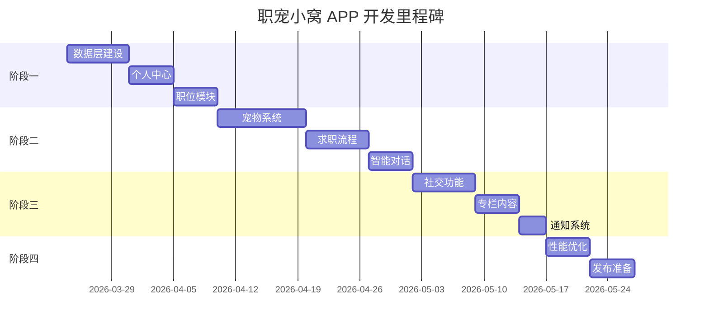

# 职宠小窝 (GuguPet) APP 项目推进计划

## 项目概述

**职宠小窝**是一款轻拟人的电子宠物求职陪伴APP，旨在为求职者提供情感支持和求职辅助。通过与虚拟宠物的互动，缓解求职压力，提供求职建议和激励。

### 技术栈
- **框架**: Flutter 3.10.4+
- **状态管理**: Provider
- **本地存储**: Sqflite + SharedPreferences
- **网络请求**: Dio
- **动画**: Lottie + Flutter Animate
- **图表**: FL Chart

---

## 当前项目状态

### 已完成模块

| 模块 | 状态 | 完成度 | 说明 |
|------|------|--------|------|
| 项目架构搭建 | ✅ 完成 | 100% | 路由、主题、基础组件、依赖注入 |
| 倾诉室(Confide) | ✅ 完成 | 95% | 宠物互动、智能回复、输入处理、宠物系统集成 |
| 看板(Stats) | ✅ 完成 | 85% | 数据统计、成就徽章、趋势图表 |
| 公园(Park) | ✅ 完成 | 80% | 社交场景、区域切换、宠物展示 |
| 专栏(Columns) | ✅ 完成 | 90% | 文章列表、预览弹窗、详情页、购买流程、收藏 |
| 职位(Jobs) | ✅ 完成 | 90% | 职位列表、详情页、收藏、筛选、推荐算法 |
| 个人中心(Profile) | ✅ 完成 | 85% | 用户信息、求职意向、设置、VIP升级 |
| 数据持久化 | ✅ 完成 | 100% | SQLite + DAO + 数据迁移 |
| 宠物系统(Pet) | ✅ 完成 | 90% | 成长系统、情感状态机、记忆系统、互动服务 |
| 通知系统(Notification) | ✅ 完成 | 80% | 通知中心、设置、本地推送 |
| 职位爬虫(Crawler) | ✅ 完成 | 85% | Boss直聘、智联、前程无忧爬虫 |

### 核心服务

| 服务 | 状态 | 说明 |
|------|------|------|
| IntentEngine | ✅ 完成 | 意图识别、情感分析 |
| ResponseService | ✅ 完成 | 回复生成 |
| PetResponder | ✅ 完成 | 宠物响应逻辑 |
| 数据持久化 | ✅ 完成 | SQLite存储 |
| LLMService | ✅ 完成 | 大模型服务接口（OpenAI兼容） |
| PetStateMachine | ✅ 完成 | 宠物情感状态机 |
| PetGrowthService | ✅ 完成 | 宠物成长服务 |
| PetMemoryService | ✅ 完成 | 宠物记忆服务 |
| PetInteractionService | ✅ 完成 | 宠物互动服务 |
| PetResponseGenerator | ✅ 完成 | 宠物回复生成（混合模式） |

---

## 推进计划

### 阶段一：基础功能完善 (预计 1-2 周) - ✅ 完成 (100%)

#### 1.1 数据层建设 ✅ 完成
- [x] 设计数据库表结构 (用户、交互记录、求职事件、收藏职位)
- [x] 实现 SQLite 数据库帮助类 (DatabaseHelper)
- [x] 实现数据模型 DAO 层 (UserDAO, InteractionDAO, JobEventDAO, FavoriteJobDAO)
- [x] 编写数据库迁移脚本 (SharedPreferences → SQLite)
- [x] 数据迁移事务保护

#### 1.2 个人中心开发 ✅ 完成
- [x] 用户信息展示页面 (ProfilePage)
- [x] 求职意向设置 (JobIntentionPage + 城市选择器 + 薪资选择器)
- [x] VIP 会员状态展示 (VipStatusCard + VipUpgradePage)
- [x] 设置页面 (通知、隐私、关于)

#### 1.3 职位模块完善 ✅ 完成
- [x] 职位详情页面 (JobDetailPage)
- [x] 收藏/申请职位功能 (FavoriteJobsPage + FavoriteProvider)
- [x] 职位筛选功能 (JobFilterProvider + JobFilterBottomSheet)
- [x] 职位推荐算法 (JobRecommendationService + JobRecommendationProvider)

### 阶段二：核心功能增强 (预计 2-3 周) - ✅ 完成 (100%)

#### 2.1 宠物系统升级 ✅ 完成
- [x] 宠物成长系统 (PetGrowthService - 羁绊等级、经验值)
- [x] 宠物情感状态机 (PetStateMachine - 6种情感状态)
- [x] 宠物互动动画 (Flame引擎 - pet_animation_widget.dart)
- [x] 宠物记忆系统 (PetMemoryService - 短期/长期/关键事件)

#### 2.2 求职流程闭环 ✅ 完成
- [x] 求职进度追踪 (JobEvent模型)
- [x] ~~面试提醒功能~~ (已取消 - 外部招聘APP已有此功能，避免冗余)
- [x] 投递记录管理 (InteractionDAO)
- [x] 求职数据分析 (Stats模块)

#### 2.3 智能对话增强 ✅ 完成
- [x] 上下文感知回复 (PetMemoryService)
- [x] 求职建议生成 (LLMService集成)
- [x] 情感支持话术库 (PetResponseGenerator)
- [x] 多轮对话支持 (记忆系统)

### 阶段三：社交与扩展 (预计 2 周) - ✅ 完成 (100%)

#### 3.1 公园社交功能 ✅ 完成
- [x] 宠物互动功能 (InteractionSheet + ParkInteraction模型)
- [x] 好友系统 (FriendProvider + FriendRepository)
- [x] 求职经验分享 (PostProvider + UserPost模型)
- [x] 点赞/评论功能 (PostLike + PostComment模型)
- [x] 数据库表迁移 (版本4新增5张社交表)
- [x] Mock社交服务 (MockSocialService - 预留后端接口)

#### 3.2 专栏内容 ✅ 完成
- [x] 文章详情页 (ColumnDetailPage)
- [x] 收藏/分享功能 (FavoriteButton, FavoriteColumnsPage)
- [x] 内容推荐 (ColumnProvider)
- [x] 购买流程 (PurchaseDialog)

#### 3.3 通知系统 ✅ 完成
- [x] 本地推送 (LocalPushService)
- [x] 求职提醒 (NotificationService)
- [x] 宠物互动提醒
- [x] 通知中心页面 (NotificationCenterPage)

### 阶段四：硬编码改良 (预计 2-3 周) - 🟡 进行中

#### 4.1 UI文本配置化 - 🟡 进行中
- [x] 创建配置服务基础设施 (ConfigService)
- [x] 创建UI文本配置文件 (ui_strings.json)
- [ ] 实现AppStrings服务
- [ ] 迁移现有UI文本
- [ ] 集成到应用启动流程

#### 4.2 业务数据配置化
- [ ] 创建业务配置文件 (business_config.json)
- [ ] 实现BusinessConfigService
- [ ] 迁移业务配置数据

#### 4.3 主题系统优化
- [ ] 创建主题配置文件 (theme_config.json)
- [ ] 实现ThemeService
- [ ] 集成主题切换功能

#### 4.4 国际化支持（可选）
- [ ] 配置Flutter国际化
- [ ] 迁移UI文本到ARB
- [ ] 测试多语言切换

**详细计划**: [硬编码改良实施计划](docs/plans/2026-03-25-hardcode-refactor-plan.md)

---

### 阶段五：优化与发布 (预计 1-2 周)

#### 5.1 性能优化
- [ ] 启动速度优化
- [ ] 内存占用优化
- [ ] 图片缓存优化
- [ ] 动画性能优化

#### 5.2 体验优化
- [ ] 空状态设计
- [ ] 加载状态统一
- [ ] 错误处理完善
- [ ] 无障碍支持

#### 5.3 发布准备
- [ ] 应用图标/启动图
- [ ] 应用商店素材
- [ ] 隐私政策
- [ ] 用户协议

---

## 技术债务

| 问题 | 优先级 | 状态 | 解决阶段 |
|------|--------|------|----------|
| 硬编码数据需替换为真实数据源 | 高 | ✅ 已解决 | 阶段一 |
| UI文本硬编码 | 高 | 🟡 进行中 | 阶段四 |
| 业务配置硬编码 | 中 | 🔴 待解决 | 阶段四 |
| 缺少 Repository 数据抽象层 | 高 | ✅ 已解决 | 阶段一 |
| 缺少单元测试 | 高 | 🔴 待解决 | 阶段五 |
| 错误处理不完善 | 中 | ✅ 已解决 | 阶段一 |
| 主题系统需完善深色模式 | 中 | 🔴 待解决 | 阶段四 |
| 缺少日志系统 | 低 | ✅ 已解决 | 阶段一 |
| 缺少依赖注入 | 中 | ✅ 已解决 | 阶段二 |
| 宠物动画资源不完整 | 中 | 🟡 进行中 | 阶段二 |

---

## 风险与依赖

| 风险 | 影响 | 缓解措施 |
|------|------|----------|
| 后端API未就绪 | 高 | 先使用Mock数据，定义好接口契约 |
| 第三方服务接入 | 中 | 提前申请账号，测试接入 |
| 审核问题 | 中 | 提前准备资质材料 |

---

## 里程碑

---

*最后更新: 2026-03-24 深夜*
